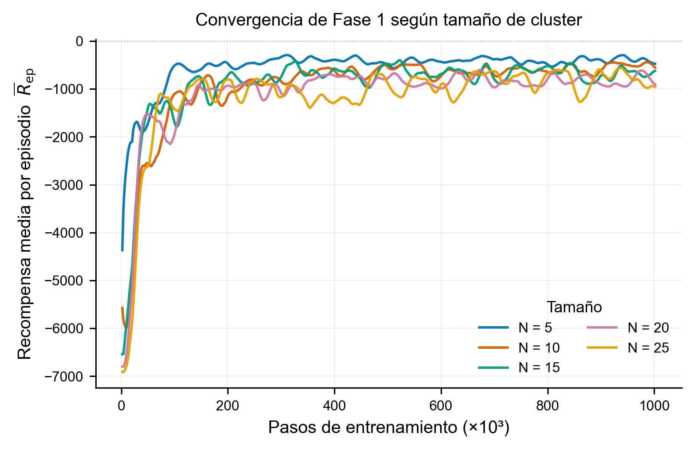
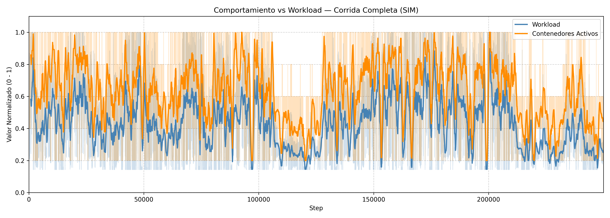
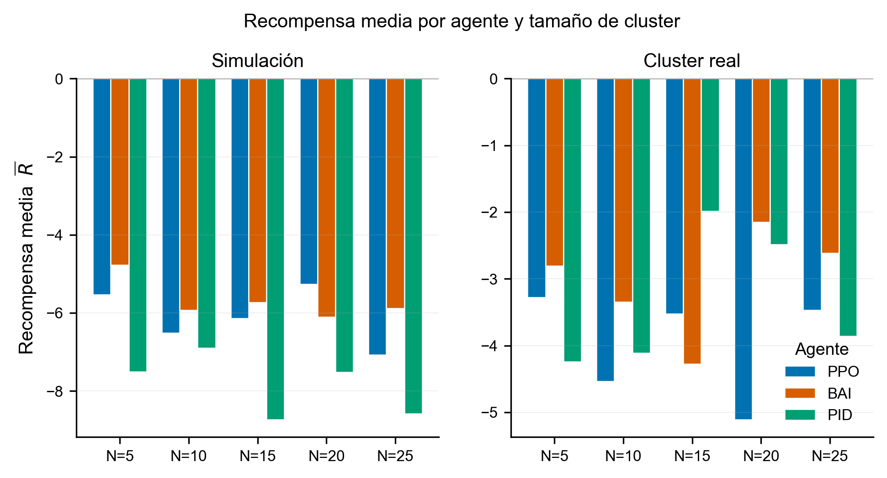
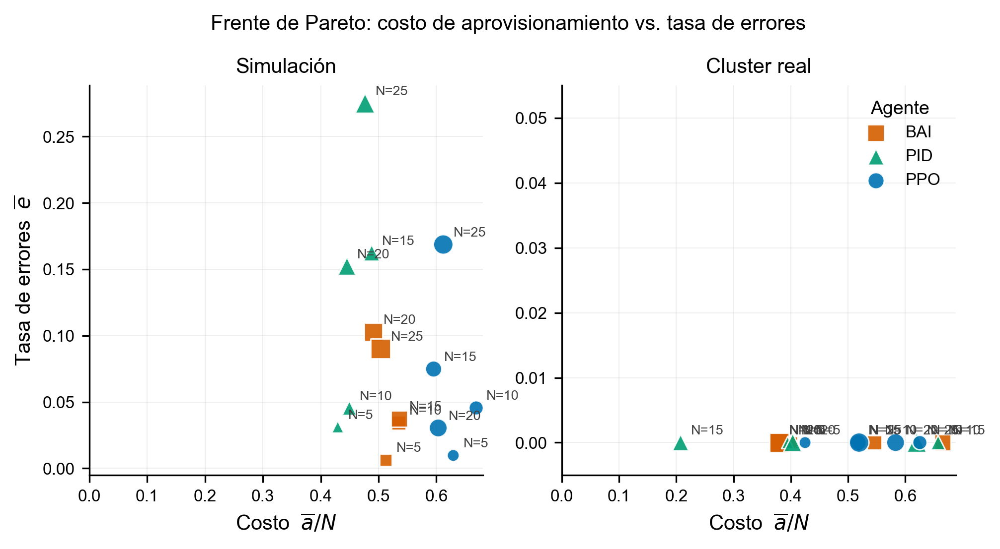

<div align="center">

# Load Balancer Auto-Scaler with Deep Reinforcement Learning (PPO)

**Joint load balancing and horizontal auto-scaling of a Docker microservice cluster, learned end-to-end with Proximal Policy Optimization.**

[](https://www.python.org/)
[](https://stable-baselines3.readthedocs.io/)
[](https://www.docker.com/)

</div>

An autonomous cluster orchestration system that uses **Proximal Policy Optimization (PPO)** to simultaneously manage **load balancing** and **horizontal auto-scaling** for a Docker-based microservice cluster. Instead of hand-tuned Round Robin routing and static CPU thresholds, a single learned policy observes per-container CPU/RAM/latency/error/queue metrics and outputs both routing weights and a scale decision every step, trained first on a mathematical M/M/1 queueing simulation and then fine-tuned on a live Docker + HAProxy + Locust cluster.

This is the code companion to a research report ([`proyecto_final/proyecto_final.md`](proyecto_final/proyecto_final.md)) that evaluates the agent against two industry baselines (static-threshold scaling and a PID controller) across five cluster sizes, in both simulation and real infrastructure, including a candid look at where the learned policy still falls short. See [Results](#results) below for a summary.

---

## Table of Contents

- [Architecture Overview](#architecture-overview)
- [Training Pipeline](#training-pipeline)
- [Results](#results)
- [Project Structure](#project-structure)
- [Prerequisites](#prerequisites)
- [Quick Start](#quick-start)
- [`main.py` Arguments Reference](#mainpy-arguments-reference)
- [Running Scripts Directly](#running-scripts-directly)
- [Bridge API Endpoints](#bridge-api-endpoints)
- [Observation Space and Action Space](#observation-space-and-action-space)
- [Reward Function](#reward-function)
- [Reward Weight Sensitivity Analysis (Saltelli/Sobol)](#reward-weight-sensitivity-analysis)
- [Monitoring](#monitoring)
- [Cleanup](#cleanup)
- [Baselines for Comparison](#baselines-for-comparison)
- [Bibliography](#bibliography)

---

## Architecture Overview


The system is composed of four layers:

1. **Control Plane** - The PPO agent sends an action vector (routing weights + scale decision) to the Bridge API, and receives back the current observation space (per-container metrics).
2. **Infrastructure Management** - The Bridge uses the Docker SDK to start/stop containers and reads hardware metrics via Linux cgroups.
3. **L7 Routing & Monitoring** - HAProxy distributes traffic according to the weights set by the agent and reports latency, HTTP error rates, and per-server queue depth.
4. **Data Plane** - Locust generates realistic, variable HTTP traffic patterns against the cluster entry point.

---

## Training Pipeline

Training is split into two phases to maximize sample efficiency:

| Phase       | Mode               | Description                                                                                         |
| ----------- | ------------------ | --------------------------------------------------------------------------------------------------- |
| **Phase 1** | Simulated          | Pre-trains the agent using a mathematical M/M/1 queueing model. Fast iteration, no Docker required. |
| **Phase 2** | Real (Fine-Tuning) | Fine-tunes the pre-trained model on a live Docker cluster with real Locust traffic.                 |

The simulated environment models CPU, RAM and queue depth (Little's Law), latency (M/M/1), and error rate (Sigmoid overflow) with Gaussian noise and stochastic traffic patterns (double wave, linear, exponential, step functions).

---

## Results

The final policy (`ppo_lb_production_ready_N_nodes.zip`) was benchmarked against two classical baselines: a static CPU-threshold scaler (**BAI**) and a **PID controller** regulating CPU to a 60% setpoint, across five cluster sizes (`N ∈ {5, 10, 15, 20, 25}`), in both the simulated environment (250k steps) and the real Docker cluster (2k steps). All three agents ran the same `TrafficGenerator` patterns so differences are attributable to the control policy alone. Full derivations, per-agent metric tables, and discussion live in [`proyecto_final/proyecto_final.md`](proyecto_final/proyecto_final.md) (§4.3-§4.5).

### Phase 1 converges for every cluster size



All five cluster sizes converge within ~200k of the ~1M training steps, despite starting from very different reward floors (both the operational-cost penalty and the action-space dimensionality scale with `n_max`). Once converged, mean CPU usage stays within 40-48% for every size, inside the reward function's efficient band.

### The agent learns to track workload with an anticipatory margin



Active containers (orange) follow the incoming workload (blue) with a small positive margin, scaling ahead of demand rather than reacting after saturation, the intended effect of the CPU dead-zone and queue-backpressure reward terms.

### PPO vs. industry baselines



| Environment  | Best avg. reward | Failed requests (total, sim)                                   | Cost efficiency (avg. users served per active node) |
| ------------ | ----------------- | ---------------------------------------------------------------- | ----------------------------------------------------- |
| Simulated    | BAI (-5.68)       | BAI leads for N ≤ 15; PPO edges ahead at N=20; PPO collapses at N=25 (42.2k vs BAI's 22.6k) | BAI ~10-10.7 usr/node, PID ~12-14 usr/node, PPO 7.3-9.7 usr/node |
| Real cluster | BAI (-3.04)       | 0 failed requests for all three agents (short 2k-step window)     | BAI and PID are more cost-efficient under the light real-world traffic regime |



No agent strictly dominates in simulation: PPO occupies the low-error/higher-cost region, PID the low-cost/high-error region, and BAI sits in between, so the Pareto front is made up of points from all three agents. On the real cluster, all three collapse to zero error and cost becomes the only discriminating axis; the report flags this as partly a telemetry-capture limitation compounded by the short evaluation horizon, not solid evidence that PPO matches the baselines there.

**Key takeaways** (see §4.5 and Conclusions in the report for the full discussion):

- The learned policy generalizes across cluster sizes with no retraining: CPU stays in the reward's efficient band and latency stays under 16% of the SLA ceiling at every `N`, in both environments.
- The anti-chattering friction term ($\delta$) does not fully do its job in practice: PPO changes fleet size in more than 70% of evaluation steps, versus under 10% for BAI, because the reward's heavy error penalty pushes the policy toward a reactive, twitchy scaling behavior.
- Routing precision degrades as the action space grows: PPO is competitive with BAI on failed requests up to N=20, then collapses at N=25 (26-dimensional continuous routing weights), the case where the reward's fine-grained load-balancing decision breaks down fastest.
- PPO is consistently less cost-efficient than BAI: its learned safety margin means fewer served users per active container across every cluster size.
- Sim-to-real transfer works structurally (Phase 2 starts inside the Phase 1 asymptotic reward range with no cold-start collapse), but the real-cluster comparison itself is inconclusive: the short 2,000-step evaluation window and a suspected telemetry-capture gap mean zero measured errors for all three agents, hiding whatever real advantage or disadvantage PPO has under real hardware.
- Identified next steps: temporal smoothing of observations (e.g. frame stacking) to curb chattering, a hierarchical actor that separates the scaling decision from routing weights, and a longer/more punishing Phase 2 + evaluation budget to get a real read on real-cluster performance.

---

## Project Structure

```
.
├── main.py                          # Main entrypoint - run all pipelines from here
├── requirements.txt
├── cleanup.sh                       # Kill orphan processes and Docker containers
│
├── API/
│   ├── bridge.py                    # FastAPI bridge between agent and Docker cluster
│   ├── ClusterOrchestration.py      # Docker SDK + HAProxy + cgroups metrics collector
│   ├── schemas.py                   # Pydantic models (AgentAction, ContainerMetrics)
│   ├── haproxy.cfg                  # Auto-generated HAProxy configuration
│   ├── locust.py                    # Locust load generator with dynamic traffic shapes
│   └── dummy_server/
│       ├── app.py                   # Flask server with /, /cpu, /ram endpoints
│       ├── dockerfile
│       └── requirements.txt
│
├── utils/
│   ├── config.py                    # Central tunables (TOTAL_USERS, CPU/RAM limits, queue ceiling, seed, reward weights)
│   ├── traffic_generator.py         # Stochastic workload pattern generator (shared by sim + Locust)
│   ├── calibrate_node_capacity.py   # Standalone probe that measures NODE_CAPACITY on a real node
│   └── sensitivity_analysis.py      # Saltelli/Sobol sensitivity analysis of the reward weights (see below)
│
└── environment/
    ├── environment.py               # Gymnasium environment (real + simulated modes)
    ├── train_agent.py               # Phase 1 & Phase 2 training scripts
    ├── test_agent.py                # Run inference with a trained PPO model
    ├── baseline_agent.py            # Industry baseline (Round Robin + CPU thresholds)
    ├── baseline_PID.py              # Classical control baseline (PID controller)
    ├── callbacks.py                 # Custom SB3 callback - logs metrics to CSV + TensorBoard
    ├── visualizer.py                # Plots learning curves and testing summary tables
    └── test_env.py                  # Gymnasium environment sanity checker
```

---

## Prerequisites

- Python 3.10+
- Docker Engine running (the Bridge uses the Docker socket)
- Build the dummy server image before running in real mode:

```bash
cd API/dummy_server
docker build -t dummy_server:latest .
```

- Install Python dependencies:

```bash
pip install -r requirements.txt
```

> **Note:** Container resource limits, workload scale, and reward weights are centralized in
> [`utils/config.py`](utils/config.py) (`CONTAINER_CPU_CORES`, `MAX_MEMORY`, `TOTAL_USERS`, `MAX_QUEUE_DEPTH`,
> `SEED`, `REWARD_WEIGHTS`, `REWARD_WEIGHT_BOUNDS`, `USERS_PER_NODE`). Edit them there rather than hunting
> through the codebase.

---

## Quick Start

All pipelines are launched through `main.py`.

```bash
python main.py --pipeline <PIPELINE> [OPTIONS]
```

### Run the full pipeline (recommended first run)

```bash
python main.py --pipeline all
```

This executes in sequence: simulated pre-training → real fine-tuning → all three comparison tests in **simulated** mode → all three comparison tests in **real** mode.

---

<a id="mainpy-arguments-reference"></a>
## `main.py` - Arguments Reference

| Argument                 | Short  | Type  | Default                | Description                                                                  |
| ------------------------ | ------ | ----- | ---------------------- | ---------------------------------------------------------------------------- |
| `--pipeline`             | `-p`   | `str` | `all`                  | Which pipeline to run. See options below.                                    |
| `--nodes`                | `-n`   | `int` | `5`                    | Number of Docker containers in the cluster. Must be ≤ 10.                    |
| `--file`                 | `-f`   | `str` | `training_metrics.csv` | Output CSV filename for metrics (a prefix is auto-appended).                  |
| `--iterations`           | `-i`   | `int` | per-pipeline           | **Unified** iteration/timestep count for the selected pipeline.              |
| `--simulated_iterations` | `-si`  | `int` | `None`                 | Phase 1 simulated-training steps (`simulado` / `all`). Overrides `-i`.       |
| `--real_iterations`      | `-ri`  | `int` | `None`                 | Phase 2 real-training steps (`real` / `all`). Overrides `-i`.                |
| `--testing_iterations`   | `-ti`  | `int` | `None`                 | PPO agent test steps (`test_ppo`). Overrides `-i`.                           |
| `--pid_iterations`       | `-pi`  | `int` | `None`                 | PID baseline test steps (`test_pid`). Overrides `-i`.                        |
| `--agent_iterations`     | `-ai`  | `int` | `None`                 | Industry baseline test steps (`test_baseline`). Overrides `-i`.             |
| `--sim_test_iterations`  | `-sti` | `int` | `None`                 | Simulated test-battery steps (`tests_sim` / `all` sim tests). Overrides `-i`.|
| `--real_test_iterations` | `-rti` | `int` | `None`                 | Real test-battery steps (`tests_real` / `all` real tests). Overrides `-i`.   |

### Iteration count precedence

For any run, the step count is resolved as: **pipeline-specific flag → `-i/--iterations` → per-pipeline default.**
So `-i` is a convenient single knob, while the specific flags (`-si`, `-ri`, …) override it for fine control.

| Pipeline                                    | Specific flag | Default |
| ------------------------------------------- | ------------- | ------- |
| `simulado` (Phase 1 training)               | `-si`         | `200000`|
| `real` (Phase 2 training)                   | `-ri`         | `5000`  |
| `tests_sim`                                 | `-sti`        | `1000`  |
| `tests_real`                                | `-rti`        | `1000`  |
| `test_ppo`                                  | `-ti`         | `1000`  |
| `test_baseline`                             | `-ai`         | `1000`  |
| `test_pid`                                  | `-pi`         | `1000`  |
| `sweep`                                     | -             | `200000`|

> The `all` pipeline is multi-phase, so a single `-i` can't map to its different phases - it **ignores `-i`**
> and uses each phase's specific flag (`-si`/`-ri`/`-sti`/`-rti`) or that phase's default.

### `--pipeline` options

| Value           | Description                                                                                                   |
| --------------- | ------------------------------------------------------------------------------------------------------------ |
| `simulado`      | Phase 1 only - trains the agent in the fast mathematical simulator. No Docker required.                       |
| `real`          | Phase 2 only - fine-tunes an existing model on a live Docker cluster. Requires Phase 1 model.                 |
| `tests_sim`     | Runs all three comparison tests (BAI, PID, PPO) in **simulated** mode only. No Docker required.               |
| `tests_real`    | Runs all three comparison tests (BAI, PID, PPO) in **real** mode only (each spins up its own Docker cluster). |
| `test_ppo`      | Evaluates the trained PPO model in both simulated and real modes, generating a metrics summary table for each.|
| `test_baseline` | Evaluates the industry baseline (Round Robin + static CPU thresholds) in both simulated and real modes.       |
| `test_pid`      | Evaluates the PID controller baseline in both simulated and real modes.                                       |
| `all`           | Full pipeline: Phase 1 → Phase 2 → all three tests in simulated mode → all three tests in real mode.          |
| `sweep`         | Launches a W&B Bayesian hyperparameter sweep.                                                                 |

### Common Commands

| Command                                         | What it does                                                              |
| ----------------------------------------------- | ------------------------------------------------------------------------- |
| `python main.py -p all -n 5`                    | Full pipeline (Phase 1 → Phase 2 → sim tests → real tests) with defaults.  |
| `python main.py -p simulado -n 5 -si 200000`    | Phase 1 only - simulated training. No Docker needed.                       |
| `python main.py -p real -n 5 -ri 5000`          | Phase 2 only - real Docker-cluster fine-tuning. Requires a Phase 1 model.  |
| `python main.py -p tests_sim -n 5 -sti 1000`    | All three agents (BAI, PID, PPO) evaluated in simulated mode only.         |
| `python main.py -p tests_real -n 5 -rti 1000`   | All three agents evaluated in real mode only.                             |
| `python main.py -p test_ppo -n 5 -ti 3000`      | Evaluate the trained PPO agent (both sim and real).                       |
| `python main.py -p test_baseline -n 5 -ai 1000` | Evaluate the industry baseline (Round Robin + CPU thresholds).            |
| `python main.py -p test_pid -n 5 -pi 1000`      | Evaluate the PID controller baseline.                                     |
| `python main.py -p sweep -n 5`                  | Launch a W&B Bayesian hyperparameter sweep.                              |
| `tensorboard --logdir ./logs_tensorboard/`      | Monitor training curves at <http://localhost:6006>.                       |
| `bash cleanup.sh`                               | Kill orphaned processes and remove all `lbas_*` containers + network.     |

> `-i/--iterations` works as a shortcut in place of the specific flag for single-pipeline runs
> (e.g. `-p simulado -i 100000` ≡ `-p simulado -si 100000`).

### Examples

```bash
# Fast simulated pre-training only, 10 nodes, 100k steps
python main.py -p simulado -n 10 -i 100000

# Real fine-tuning only, 5 nodes, 2000 steps
python main.py -p real -n 5 -i 2000

# Run all three comparison tests in simulated mode, 5 nodes, 5k steps each
python main.py -p tests_sim -n 5 -i 5000

# Run all three comparison tests in real mode, 5 nodes, 2k steps each
python main.py -p tests_real -n 5 -i 2000

# Evaluate just the PPO agent (both modes), 3k steps
python main.py -p test_ppo -n 5 -i 3000

# Full pipeline with per-phase defaults (200k sim / 5k real / 1k tests)
python main.py -p all -n 10
```

---

## Running Scripts Directly

Each script in `environment/` can also be run standalone.

### Train - Phase 1 (Simulated)

```bash
python environment/train_agent.py train_phase_1_simulation \
  --nodes 5 \
  --iterations 50000 \
  --file training_metrics.csv
```

### Train - Phase 2 (Real Docker cluster)

> Requires the Bridge API and Docker cluster to be running first.

```bash
python environment/train_agent.py train_phase_2_real_world \
  --nodes 5 \
  --iterations 5000 \
  --file training_metrics.csv
```

### Test the PPO Agent

```bash
# Simulated mode (no Docker required)
python environment/test_agent.py --nodes 5 --iterations 5000 --simulated

# Real mode (Bridge API + Docker cluster must be running)
python environment/test_agent.py --nodes 5 --iterations 5000
```

### Test Baselines

```bash
# Industry baseline - simulated
python environment/baseline_agent.py --nodes 5 --iterations 5000 --simulated

# Industry baseline - real
python environment/baseline_agent.py --nodes 5 --iterations 5000

# PID controller baseline - simulated
python environment/baseline_PID.py --nodes 5 --iterations 5000 --simulated

# PID controller baseline - real
python environment/baseline_PID.py --nodes 5 --iterations 5000
```

### Verify the Gymnasium Environment

```bash
python environment/test_env.py
```

---

## Bridge API Endpoints

The Bridge (`API/bridge.py`) exposes a FastAPI server on port `8000` that acts as the middleware between the PPO agent and the Docker cluster.

| Method | Endpoint    | Description                                                                          |
| ------ | ----------- | ------------------------------------------------------------------------------------ |
| `POST` | `/init`     | Initializes the cluster. Starts all containers and HAProxy.                          |
| `POST` | `/action`   | Receives the agent's action (weights + scale decision) and applies it.               |
| `GET`  | `/metrics`  | Returns the current `ContainerMetrics` for all N containers + global `workload_norm`. |
| `POST` | `/workload` | Called by Locust each tick to report the current user count (sets `workload_norm`).  |
| `GET`  | `/reset`    | Resets the cluster to its initial state (1 active container).                        |
| `POST` | `/cleanup`  | Stops and removes all managed Docker containers.                                     |

#### `/init` parameters (query string)

| Parameter    | Default     | Description                                                              |
| ------------ | ----------- | ------------------------------------------------------------------------ |
| `n_max`      | `10`        | Maximum number of containers to provision.                               |
| `max_memory` | `512`       | Memory limit per container in MB (defaults to `MAX_MEMORY` in config).   |
| `node_name`  | `lbas_node` | Prefix name for container instances.                                     |

#### `/action` body (`AgentAction`)

```json
{
  "weights": [0.5, 0.3, 0.2, 0.0, ...],
  "decision": 0.8
}
```

- `weights`: List of N floats `[0.0, 1.0]`. Routing weights for each container slot. Values are scaled to HAProxy's 0–256 weight range internally.
- `decision`: Float `[0.0, 1.0]`. Scale-up if `≥ 0.7`, scale-down if `≤ 0.3`, hold otherwise.

---

## Observation Space and Action Space

### Observation Space

A flat vector of shape `(n_max × 6 + 1,)`: six values per container slot, followed by a single global
workload value. All values are normalized to `[0, 1]`.

Per-container block (offset relative to slot start `i × 6`):

| Index (offset) | Metric         | Range    | Description                                                        |
| -------------- | -------------- | -------- | ------------------------------------------------------------------ |
| `+0`           | `cpu_usg`      | `[0, 1]` | CPU utilization                                                    |
| `+1`           | `ram_usg_pct`  | `[0, 1]` | RAM usage as % of the container memory limit                       |
| `+2`           | `queue_depth`  | `[0, 1]` | Fleet-wide queue depth, normalized by `n_max × MAX_QUEUE_DEPTH`. **Real:** HAProxy backend `qcur`. **Sim:** Little's-law `L`. |
| `+3`           | `latency`      | `[0, 1]` | Response time (normalized to 1000 ms)                             |
| `+4`           | `error_rate`   | `[0, 1]` | HTTP 5xx error rate                                               |
| `+5`           | `status`       | `{0, 1}` | Container active (1) or off (0)                                   |

Global tail value:

| Index           | Metric          | Range    | Description                                            |
| --------------- | --------------- | -------- | ------------------------------------------------------ |
| `n_max × 6`     | `workload_norm` | `[0, 1]` | Current cluster workload (users / `TOTAL_USERS`)       |

### Action Space

A flat vector of shape `(n_max + 1,)`:

| Indices         | Content                       | Range    |
| --------------- | ----------------------------- | -------- |
| `[0 … n_max-1]` | Routing weights per container | `[0, 1]` |
| `[n_max]`       | Scale decision                | `[0, 1]` |

---

## Reward Function

The reward is a penalty-based signal designed to balance service quality against infrastructure cost.
All penalties are summed and negated; the agent maximizes by minimizing the total penalty:

```
R = -(latency + errors + cost + cpu_saturation + ram_saturation + queue + overprovision) - scale_friction
```

| Component             | Weight | Penalizes                                                                 |
| --------------------- | ------ | ------------------------------------------------------------------------- |
| Latency               | 10.0   | High response times (squared; free below a 0.1 normalized floor)          |
| Errors                | 50.0   | HTTP 5xx responses                                                        |
| Cost                  | 5.0    | Active containers (`active / n_max`)                                      |
| CPU hard saturation   | 15.0   | Per-node CPU above 92% (added on top of the preventive penalty)          |
| RAM saturation        | 15.0   | Per-node RAM above 85%                                                    |
| Overprovision         | 4.0    | Idle containers (per-node CPU below the 40% target)                       |
| Preventive saturation | 5.0    | Per-node CPU above the 85% safe ceiling (soft pre-collapse penalty)       |
| Queue Backpressure    | 15.0   | Request queue depth (early indicator of impending latency and errors)     |
| Scale friction        | 1.0    | Reversing scale direction (up→down / down→up) to suppress chattering      |
| Total failure         | −200.0 | All containers offline (terminal)                                         |

> Weights default to `REWARD_WEIGHTS` in [`utils/config.py`](utils/config.py) (the single source of
> truth) and are applied in `reward_function` in [`environment/environment.py`](environment/environment.py).
> `LoadBalancerEnv` accepts an optional `reward_weights` override for sensitivity analysis, see the
> next section.

---

<a id="reward-weight-sensitivity-analysis"></a>
## Reward Weight Sensitivity Analysis (Saltelli / Sobol)

The 8 reward weights above (`REWARD_WEIGHTS` in `utils/config.py`; `W_SATURATION` appears twice in the
table since it drives both the CPU and RAM saturation terms, and "Total failure" is a fixed terminal
penalty rather than a sampled weight) were hand-tuned, with no systematic evidence for their relative
magnitudes. `utils/sensitivity_analysis.py` runs a two-stage, data-driven study to determine which
weights actually matter and, given a target range of cluster sizes, which combination of values
generalizes best. Full methodology, every design decision and its rationale, and how to interpret
the output live in [`SALTELLI_SENSITIVITY.md`](SALTELLI_SENSITIVITY.md); this section is a quick
reference for running it. No Docker required, it only uses the simulated environment.

| Stage | Command | What it does |
| ----- | ------- | ------------- |
| **1. Sensitivity** | `sensitivity_analysis.py sensitivity` | At one fixed cluster size, Saltelli-samples the 8 weights, mini-trains a fresh PPO per sample, and computes Sobol indices (S1/ST) per KPI (latency, error rate, SLA violations, cost, scaling events) to rank which weights matter most. |
| **2. Robust search** | `sensitivity_analysis.py robust-search` | Given the influential weights from Stage 1, searches for the combination that best generalizes across several cluster sizes (`FLEET_SIZES = [5, 10, 15, 20, 25]` by default), ranking candidates by a composite score. |

```bash
pip install -r requirements.txt   # adds SALib and scipy

# Optional smoke test (a few minutes) to validate the pipeline runs end-to-end:
python utils/sensitivity_analysis.py sensitivity --n 2 --train-timesteps 500 --eval-steps 200 --no-second-order

# Stage 1: sensitivity at a reference cluster size (N=8 -> 144 mini-trainings, ~1-3.5h on CPU)
python utils/sensitivity_analysis.py sensitivity --n 8 --nodes 5 --train-timesteps 20000 --eval-steps 2000

# Inspect resultados_graficos/sensitivity_analysis/sobol_ST_{kpi}_n8.png, or pick the top-K
# influential weights programmatically:
python -c "
import pandas as pd
from utils.sensitivity_analysis import select_influential_weights
df = pd.read_csv('training_results/sensitivity_analysis/sobol_indices_summary_n8_nodes5_tt20000.csv')
print(select_influential_weights(df, top_k=4))
"

# Stage 2: robust search over the influential weights, across all 5 cluster sizes
python utils/sensitivity_analysis.py robust-search --active-weights W_ERRORS,W_LATENCY,W_QUEUE,W_SATURATION --n 8
```

Both stages checkpoint after every sample to a deterministic CSV path, so an interrupted run resumes
automatically instead of recomputing already-evaluated samples. Results land in
`training_results/sensitivity_analysis/` and `training_results/robust_weight_search/` (the `_ranked.csv`
from Stage 2 has the best combination in its first row), with figures in the matching
`resultados_graficos/` subfolders.

---

## Monitoring

### TensorBoard

```bash
tensorboard --logdir ./logs_tensorboard/
# Open http://localhost:6006
```

Training curves, policy loss, and value loss are logged automatically during both training phases.

### Output Files

Paths are suffixed with the node count (`N` = value of `--nodes`):

| Path                                          | Contents                                                  |
| --------------------------------------------- | --------------------------------------------------------- |
| `./training_results/phase1_N_nodes/`          | Phase 1 training metrics CSV                              |
| `./training_results/phase2_N_nodes/`          | Phase 2 fine-tuning metrics CSV                           |
| `./training_results/testing_results_N_nodes/` | Per-run test metrics CSVs                                 |
| `./training_results/sensitivity_analysis/`    | Saltelli/Sobol Stage 1 samples + KPI CSVs                  |
| `./training_results/robust_weight_search/`    | Stage 2 multi-scale search samples + ranked CSVs           |
| `./resultados_graficos/`                      | Learning curve PNGs and summary table images              |
| `./logs_checkpoints/N_nodes/`                 | SB3 model checkpoints (saved every 2000 steps in Phase 2) |
| `ppo_lb_simulated_base_N_nodes.zip`           | Saved Phase 1 model                                       |
| `ppo_lb_production_ready_N_nodes.zip`         | Saved Phase 2 model                                       |

---

## Cleanup

If processes or containers are left behind after a crash or manual interruption:

```bash
bash cleanup.sh
```

This will kill any orphaned `uvicorn`, `locust`, `tensorboard`, and training processes, free ports `8000`, `6006`, and `8089`, and remove all `lbas_*` Docker containers and the `lbas_network`.

---

## Baselines for Comparison

Two baselines are implemented for benchmarking against the PPO agent:

**Industry Baseline** (`baseline_agent.py`) - Replicates the most common production approach:

- Load balancing: Round Robin (equal weights for all active nodes)
- Auto-scaling: Static CPU thresholds (scale up if CPU > 75%, scale down if CPU < 25%)

**PID Controller Baseline** (`baseline_PID.py`) - Classical control theory approach:

- Maintains average CPU usage at a 60% setpoint using a PID controller (Kp=1.5, Ki=0.1, Kd=0.5)
- Load balancing: Round Robin

---

## Bibliography

1. Sutton, R. S., & Barto, A. G. (2018). _Reinforcement Learning: An Introduction_ (2nd ed.). The MIT Press.
2. Russell, S., & Norvig, P. (2010). _Artificial Intelligence: A Modern Approach_ (3rd ed.). Prentice Hall.
3. Harchol-Balter, M. (2013). _Performance Modeling and Design of Computer Systems: Queueing Theory in Action_. Cambridge University Press.
4. Tesauro, G. et al. (2006). A hybrid reinforcement learning approach to autonomic resource allocation. _IEEE ICAC 2006_.
5. Menascé, D. A., & Almeida, V. A. F. (2001). _Capacity Planning for Web Services_. Prentice Hall.
