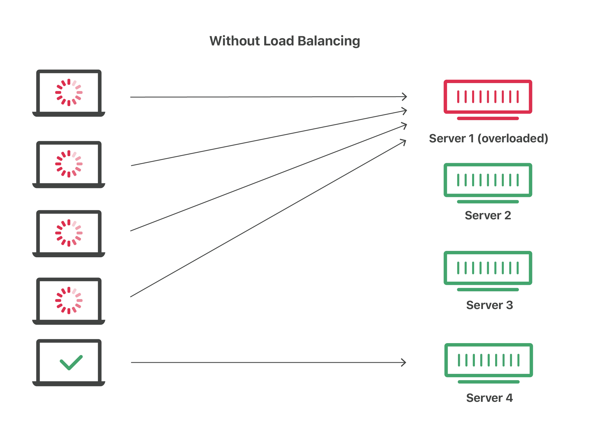
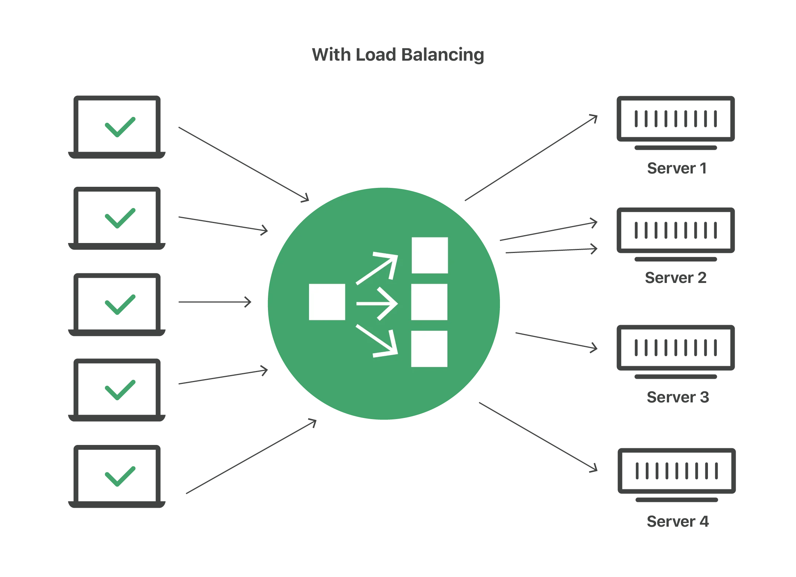

# Introducción

En el despliegue de microservicios y aplicaciones modernas, la eficiencia operativa depende de la capacidad del sistema para adaptarse a la demanda variable. Docker se ha consolidado como una herramienta fundamental para la contenerización y gestión de entornos de desarrollo y producción debido a su simplicidad y portabilidad. Sin embargo, un reto crítico dentro de estos entornos es el autoescalado y el balanceo de cargas. El autoescalado es la capacidad de ajustar dinámicamente el número de contenedores en ejecución para responder a picos de tráfico o carga de procesamiento. Por su parte, el balanceo de cargas consiste en la distribución eficiente del tráfico entrante entre los servidores o nodos disponibles.

En la industria, se suelen emplear algoritmos estándar para resolver estos problemas. _Round Robin_, _Weighted Round Robin_ y _Least Connections_ son soluciones muy comunes en el ámbito tecnológico para lidiar con el balanceo de cargas. Por otro lado, el escalado de servicios suele basarse en la definición de umbrales estáticos que condicionan el aumento o la retracción de los recursos. Ante las limitaciones de estos enfoques rígidos, este proyecto propone la incorporación de modelos de aprendizaje automático (_Machine Learning_) para buscar una mejora sobre las soluciones tradicionales. Para ello, se ha empleado un modelo de aprendizaje por refuerzo, el cual permite al agente aprender a optimizar sus acciones en un entorno cambiante, maximizando las recompensas obtenidas. De esta forma, el agente toma decisiones para aumentar o reducir la cantidad de contenedores disponibles y balancear la carga entre ellos, evitando así la saturación de los servicios.

Este tipo de problemas cuenta con la dificultad inherente de tener que obtener, en tiempo real, métricas correspondientes a los contenedores, tales como el uso de CPU, memoria RAM, latencia de red y la tasa de errores. Para simular y evaluar este proceso, se ha utilizado la biblioteca Gymnasium de OpenAI, creando un entorno personalizado que integra el vector de observaciones del sistema, el espacio de acciones del orquestador y una función de recompensa diseñada específicamente para este ecosistema.

## Marco teórico

### Escalado automático y Balanceo de Cargas en arquitecturas de microservicios

Si bien el escalado automático está estrechamente relacionado con el balanceo de cargas, no son el mismo concepto, aunque a menudo operan en conjunto. Ambos procesos afectan la asignación de recursos de un sistema para lidiar con la carga de trabajo, velando siempre por la optimización y evitando tanto las sobrecargas como los estados pasivos (desperdicio de recursos).

#### Auto Scaler (Autoescalador)

El _auto-scaling_, conocido comúnmente como "escalado automático", es una característica de la computación en la nube que asigna dinámicamente los recursos computacionales en función de la demanda del sistema. Se utiliza para garantizar que las aplicaciones cuenten con los recursos necesarios para mantener una disponibilidad constante y alcanzar los objetivos de rendimiento, promoviendo además un uso eficiente del hardware y minimizando los costos operativos (IBM)[https://www.ibm.com/mx-es/think/topics/autoscaling].

Existen varias estrategias de escalado: horizontal, vertical, dinámico, predictivo y programado. Sin embargo, este proyecto se enfocará principalmente en dos enfoques: el escalado horizontal y el escalado dinámico.

El **escalado horizontal** (también conocido como _scale-out/scale-in_) es la acción de instanciar o eliminar más nodos, contenedores o máquinas virtuales a un entorno de computación. A diferencia del escalado vertical (que implica añadir más recursos de hardware como RAM o CPU a un servidor ya existente), el escalado horizontal es una solución enfocada en la replicación y la arquitectura distribuida, ideal para contenedores Docker.

El **escalado dinámico** es una política que reacciona a las necesidades de recursos a medida que ocurren, ajustando la asignación en función de la utilización en tiempo real. Con esta política, los sistemas pueden activar instancias adicionales de forma automática cuando se alcanza un umbral específico de estrés, como un alto porcentaje de uso de la CPU o un incremento brusco en la latencia de las peticiones.

#### Load Balancer (Balanceador de Carga)

El _Load Balancing_ es la práctica de distribuir el trabajo computacional entre dos o más computadoras. En el mundo de la infraestructura de redes, se utiliza principalmente para dividir el tráfico entrante (como peticiones HTTP) entre varios servidores. De esta forma, se busca reducir el estrés sobre cada nodo individual, haciendo que el clúster sea más eficiente, aumente su rendimiento general, reduzca la latencia y minimice la tasa de errores provocada por la saturación de los servicios [https://www.cloudflare.com/learning/performance/what-is-load-balancing/].

La acción de balancear la carga la lleva a cabo una herramienta o aplicación denominada _Load Balancer_ (LB), la cual puede ser un dispositivo físico en la red o, como es tendencia actual, un componente basado completamente en software (como HAProxy o Nginx). El funcionamiento en ambos casos es idéntico: cuando llega una petición de un usuario, el LB decide a qué servidor activo enviarla, repitiendo este proceso para cada conexión nueva. Para determinar el destino de cada petición, el LB se rige por algoritmos que pueden clasificarse en estáticos o dinámicos.

Los **Load Balancers estáticos** distribuyen la carga de trabajo de forma predeterminada sin tomar en consideración el estado real de los servidores. Por ejemplo, un nodo puede estar procesando una carga del 80% de su CPU, mientras que su vecino tiene solo un 20% ocupado; sin embargo, un LB estático ignorará estas métricas. En este grupo destaca el algoritmo _Round Robin_, el cual es un método de distribución que envía las peticiones de forma equitativa y secuencial al siguiente servidor en la lista.

Los **Load Balancers dinámicos**, en cambio, monitorean continuamente la telemetría y el rendimiento de los servidores (como el uso de CPU, memoria o el tiempo de respuesta) antes de enrutar el tráfico. Estos algoritmos buscan inteligentemente las instancias menos saturadas o con conexiones más rápidas para asignarles el trabajo, garantizando así una distribución adaptativa que responde a los cuellos de botella del sistema en tiempo real.

### Aprendizaje por Refuerzo (Reinforcement Learning)

El Aprendizaje por Refuerzo (RL) constituye un paradigma del aprendizaje automático en el que un agente aprende a mapear situaciones a acciones con el objetivo de maximizar una señal de recompensa numérica acumulada a lo largo del tiempo (Sutton & Barto, 2018). A diferencia del aprendizaje supervisado, donde el sistema recibe ejemplos etiquetados provistos por un supervisor externo, el agente de RL no es instruido sobre qué acciones tomar, sino que debe descubrir cuáles producen mayor recompensa mediante un proceso iterativo de prueba y error (Russell & Norvig, 2010).

En el contexto del presente trabajo, estos componentes se instancian de la siguiente manera.

El **agente** constituye la entidad lógica responsable de observar el estado del sistema y seleccionar las acciones de escalado a ejecutar. Su dominio de actuación es el **entorno (environment)**, conformado por el cluster de contenedores y la infraestructura Docker sobre la que operan los servicios.

Para tomar decisiones, el agente percibe el **estado ($S$)** del entorno, una representación cuantitativa de la situación actual del sistema, compuesta por métricas como el porcentaje de uso de CPU y memoria reportadas por la API de Docker. A partir de dicha representacion, selecciona una de las **acciones ($A$)** disponibles: Incrementar el numero de réplicas, reducirlo, mantener la configuracion actual o balancear la carga entre los nodos activos.

Tras ejecutar cada acción, el agente recibe una **recompensa ($R$)** que retroalimenta al agente. Un valor negativo pero cercano a cero indica una gestión eficiente de los recursos mientras que, un valor lejano a cero refleja condiciones indeseables como la saturación del servicio o la subutilización del hardware. Este mecanismo de retroalimentación es el que permite al agente ajustar su comportamiento sin requerir ejemplos supervisados (Sutton & Barto, 2018).

El nucleo de nuestro agente es su **política ($\pi$)**, ésta representa la estrategia o "mapeo" que el agente sigue para determinar qué acción tomar ante un estado determinado. El objetivo del entrenamiento es encontrar una política óptima ($\pi^*$) que maximice la recompensa acumulada esperada bajo cualquier escenario de carga, garantizando así la estabilidad del cluster (Russell & Norvig, 2010).

Para alcanzar este nivel de optimización en entornos de alta dimensionalidad, se recurre a algoritmos avanzados como Q-Learning, Deep Q-Network (DQN) y Proximal Policy Optimization (PPO).

### Proximal Policy Optimization (PPO)

Proximal Policy Optimization (PPO) es un algoritmo de aprendizaje por refuerzo encuadrado en los métodos de policy gradient.

A diferencia de los algoritmos basados en valores (como Q-Learning), PPO optimiza directamente la política del agente, mediante una red neuronal que produce una distribución de probabilidades sobre el espacio de acciones para cada estado observado.Este algoritmo pertenece a la familia de los métodos Actor-Critic, donde el aprendizaje se divide en dos estructuras complementarias:

- **Actor:** Una red neuronal encargada de generar la política $\pi(a|s)$, determinando la probabilidad de seleccionar cada acción ante un estado dado.
- **Critic:** Una red que estima la función de valor $V(s)$, proporcionando una evaluación del estado actual que sirve para calcular la ventaja (advantage), guiando así la dirección y magnitud de las actualizaciones del actor.

La principal innovación de PPO radica en su función objetivo de proximidad (clipped surrogate objective). Está diseñada para resolver el problema de la inestabilidad en el entrenamiento, evitando que la política sufra cambios bruscos entre iteraciones.
Para ello, el algoritmo calcula un ratio de probabilidad entre la política nueva y la anterior:

$$r_t(\theta) = \frac{\pi_\theta(a_t|s_t)}{\pi_{\theta_{old}}(a_t|s_t)}$$

En lugar de maximizar este ratio sin restricciones, PPO aplica un recorte que limita el valor de $r_t(\theta)$ dentro de un rango determinado. Este proceso asegura que las actualizaciones sean pequeñas y controladas, manteniendo la nueva política "cerca" de la anterior, garantizando una convergencia más estable y robusta.

### Justificacion

#### Nota: Mejorar la redaccion, haciendo uso de parrafos corto y claros. Minimizar el uso de listas

Para este proyecto se ha decidido utilizar el algoritmo PPO:

- **DQN** originalmente trabaja con estados discretos, a diferencia de **PPO** tiene una mejor reaccion ante metricas continuas como uso porcentual
- La politica de recorte para que los cambios no sean tan abruptos permiten que las acciones del cluster no oscilen levantando y dando de baja muchos contenedores continuamente
- Mientras que **DQN** se limita a estimar el valor de una accion, **PPO**, utiliza una arquitectura Actor-Critic, lo cual permite que el agente aprenda no solo a maximizar el rendimiento, sino a reducir la varianza, lo que se traduce en un escalado mucho más predecible y menos errático.

### Modelado Matemático del Entorno Simulado

#### Teoría de Colas (M/M/1)

Para garantizar que el preentrenamiento del agente en la Fase 1 fuese representativo de un clúster real, las dinámicas de estrés del contenedor se modelaron basándose en la Teoría de Colas, adoptando el modelo M/M/1 (llegadas Markovianas, tiempo de servicio Markoviano, 1 servidor) .

La tasa de llegada de peticiones λ al nodo i se determinó multiplicando la carga total de usuarios por el peso de ruteo asignado por el orquestador. Definiendo la capacidad máxima de procesamiento del nodo como μ, se obtuvo el factor de utilización del sistema ρ:

$$\rho = \frac{\lambda}{\mu}$$

[3]

_Donde:_

- **$\lambda$ (Lambda):** Es la tasa de llegada de peticiones (carga de usuarios asignada al nodo).
- **$\mu$ (Mu):** Es la tasa de servicio (capacidad máxima de peticiones que el nodo puede procesar por segundo).

El uso de CPU se consideró directamente proporcional al factor ρ, al cual se le inyectó un ruido Gaussiano N(0,σ2) para emular la interferencia natural de los procesos del Sistema Operativo host.

Por otro lado, la latencia (Tiempo de Respuesta Esperado E[T]) se calculó utilizando el comportamiento asintótico característico de los sistemas informáticos, donde la cola de espera crece exponencialmente a medida que la utilización se acerca al 100%:

$$E[T] = \frac{S}{1 - \rho} \quad \text{para} \quad \rho < 1$$

[3]

_Donde:_

- **$S$:** Es el tiempo base de servicio (la latencia natural de procesar una petición cuando el servidor está completamente vacío y no hay cola).

Finalmente, la tasa de errores de red (peticiones rechazadas o HTTP 5xx) se modeló mediante una función de activación Sigmoide desplazada:

$$E_{rate} = \frac{1}{1 + e^{-k(\rho - \rho_0)}}$$

[3]

_Donde:_

- **$k$:** Es la pendiente de la curva (determina qué tan abrupto es el colapso del contenedor).
- **$\rho_0$:** Es el punto de inflexión (el nivel de sobrecarga, por ejemplo 1.05 o 105%, donde la mitad de las peticiones empiezan a fallar irremediablemente).

Esto simuló el desbordamiento del búfer (Queue overflow), manteniendo una tasa de error de 0 mientras ρ<1.0, pero elevándose rápidamente al 100% cuando la tasa de llegada sobrepasó permanentemente la capacidad de servicio del contenedor [3].

#### Simulación del Consumo de Memoria RAM (Ley de Little)

En los servidores de aplicaciones web modernos, el consumo de memoria volátil (RAM) presenta un comportamiento mixto: un piso de memoria estática requerido por el entorno de ejecución y un consumo dinámico proporcional a la cantidad de conexiones activas que el contenedor debe mantener.

Para modelar el consumo dinámico en el entorno simulado, se utilizó la **Ley de Little** ($L = \lambda W$), un teorema fundamental de la teoría de colas que establece que el número promedio de elementos en un sistema estable ($L$) es igual a la tasa promedio de llegada ($\lambda$) multiplicada por el tiempo promedio que un elemento pasa en el sistema ($W$). Simplificando la ecuación para el modelo M/M/1 implementado en el entorno, el número de peticiones concurrentes en la memoria del servidor se modeló como:

$$L = \frac{\rho}{1 - \rho} \quad \text{para} \quad \rho < 1$$

[6]

El uso total de la RAM ($RAM_{usg}$) se definió como la suma de la huella de memoria base del contenedor ($RAM_{base}$) más el costo en memoria individual de cada petición ($RAM_{req}$) multiplicado por el número de peticiones concurrentes ($L$), agregando un factor de ruido estocástico para simular el comportamiento del _Garbage Collector_:

$$RAM_{usg} = RAM_{base} + (L \times RAM_{req}) + \mathcal{N}(0, \sigma^2)$$

[5]

_Donde:_

- **$L$:** Es el número de peticiones concurrentes dentro del contenedor (procesándose + en cola).
- **$RAM_{base}$:** Representa la memoria ocupada por el sistema operativo y el entorno de ejecución (Python/Flask) sin tráfico.
- **$RAM_{req}$:** Es el consumo de memoria adicional por cada petición activa en el sistema.

Esta integración permite que el agente PPO aprenda que un aumento en la utilización ($\rho$) no solo afecta la latencia, sino que dispara exponencialmente el consumo de RAM, permitiéndole anticipar riesgos de saturación o fallos por falta de memoria (_Out of Memory_). En la fase de entrenamiento real, estas métricas se extraen directamente de los _cgroups_ de Docker para validar la precisión del modelo simulado.

# Diseño Experimental

- En aquellos casos en donde resulte adecuado, se deberá indicar todo el proceso realizado para la obtención y adecuación del conjunto de datos.
- Un detalle y justificación de los experimentos realizados a fin de determinar los resultados. Este deberá incluir tablas y/o gráficos que resuman los resultados.

## Métricas de Desempeño

Para evaluar la efectividad del autoscaler y el comportamiento del algoritmo PPO, se han definido cinco métricas principales que permiten medir tanto la calidad del servicio como la eficiencia de los recursos:

**Uso de la CPU (cpu_usg):** Representa el uso de CPU consumida por cada contenedor respecto al total disponible en el intervalo de muestreo.

$$\text{cpu\_usg} = \frac{\Delta \text{CPU}_{ns}}{\Delta t_{ns}} + \mathcal{N}(0, \sigma^2)$$
Donde:

- $\Delta \text{CPU}_{ns}$ = CPU usado en el intervalo (nanosegundos)
- $\Delta t_{ns}$ = Tiempo real transcurrido (nanosegundos)
- $\mathcal{N}(0, \sigma^2)$ = Ruido Gaussiano introducido en el entorno simulado
  para representar la variabilidad natural del sistema

Se encuentra normalizado para el rango $[0, 1]$, lo que permite comparar porcentualmente la carga computacional entre contenedores independientemente de su capacidad.

**Uso de memoria RAM (ram_usg_pct y ram_total_normalize):** Representa el consumo de memoria de cada contenedor respecto al límite configurado, normalizado en $[0, 1]$.

$$\text{ram\_usg\_pct} = \frac{\text{RAM}_{usada}}{\text{RAM}_{límite}}$$

Donde:

- $\text{RAM}_{\text{usada}}$ = memoria consumida por el contenedor (bytes)
- $\text{RAM}_{\text{límite}}$ = límite configurado para el contenedor
  $(1024 \times 1024 \times 1024 \text{ bytes})$

En el entorno real, esta métrica se extrae directamente de los _cgroups_ de Docker.
En el entorno simulado, se deriva del modelo de Ley de Little descrito en el Marco
Teórico, incorporando una huella base del contenedor y ruido gaussiano que aproxima
el comportamiento del recolector de basura de Python. Valores cercanos a $1$ indican
riesgo de saturación de memoria (OOM), condición que el agente debe anticipar para
evitar la caída del servicio.

**Latencia (latency):** Representa el tiempo de respuesta promedio de las
peticiones HTTP procesadas por cada contenedor, normalizado respecto a un timeout
máximo de 2000 ms.

$$\text{latency} = \frac{t_{\text{respuesta}}}{t_{\text{timeout}}}$$

Donde:

- $t_{\text{respuesta}}$ = tiempo de respuesta observado (ms)
- $t_{\text{timeout}}$ = límite máximo configurado de 2000 ms

En el entorno real, el valor de $t_{\text{respuesta}}$ se extrae directamente de
las estadísticas de _HAProxy_. En el entorno simulado, se deriva del modelo de
colas descrito en el Marco Teórico. En ambos casos el resultado queda normalizado
en $[0, 1]$.

**Ratio de Errores (error_rate):** Porcentaje de respuestas fallidas (ej. HTTP 5xx), que indica si el cluster está sobrepasado. En el entorno real, se extrae directamente de las estadísticas de _HAProxy_. En el entorno simulado, se deriva del modelo de saturación descrito en el Marco Teórico, permaneciendo en $0$ para valores de utilización $\rho < 0.9$ y creciendo hacia $1$ a medida que el nodo supera su capacidad. Se encuentra normalizado en $[0, 1]$.

**Estado (status):** Indicador binario o categórico de la disponibilidad del servicio.

$$\text{status}_i = \begin{cases} 1 & \text{si el contenedor recibe tráfico} \\ 0 & \text{si el contenedor está inactivo} \end{cases}$$

En el entorno real, el valor se determina a partir del peso asignado por _HAProxy_, un contenedor con peso mayor a $0$ es considerado activo, mientras que un peso igual a $0$ lo marca como inactivo. En el entorno simulado, un contenedor es activo o inactivo sin estados intermedios, omitiendo el caso real en que HAProxy puede mantener un contenedor encendido pero sin asignarle tráfico.

## Herramientas Utilizadas

La implementación del sistema integra herramientas encargadas tanto de la gestión de la infraestructura de contenedores, el entrenamiento del agente mediante aprendizaje por refuerzo, y la validación del comportamiento bajo condiciones de carga representativas.

Para el desarrollo e implementación del sistema se utilizó **Python** como lenguaje principal. La contenerización de los servicios backend y la gestión del cluster fueron realizadas mediante **Docker**, administrado programáticamente a través de su SDK oficial, junto a **HAProxy 3.0** como balanceador de carga.

La interfaz entre el agente y la infraestructura fue definida utilizando **Gymnasium**, con el tipo `spaces.Box` es posible abstraer el cluster como un entorno de RL compatible con bibliotecas de entrenamiento. El entrenamiento del agente PPO se implementó sobre **Stable-Baselines3**, seleccionado para proveer una implementación optimizada y validada del algoritmo sobre **PyTorch**.

La integridad de las métricas fue asegurada con **Pydantic**, que valida los esquemas de los modelos `ContainerMetrics` y `AgentAction` antes de que ingresen al pipeline de entrenamiento. Finalmente, la evaluación del agente bajo condiciones realistas se realizó utilizando **Locust** como herramienta de generación de carga para simular patrones de tráfico durante la fase de fine-tuning sobre infraestructura real.

## Proceso de entrenamiento

Para el entrenamiento del agente no nos basamos en datos estaticos preestablecidos si no que se opto por el uso de datos generados de manera aleatoria para mejorar los resultados del proceso de aprendizaje.

### Generación de datos y entornos de entrenamiento

Para el desarrollo del agente, se definieron dos fuentes de datos distintas que permitieron una evolución progresiva del aprendizaje:

- _Entorno Simulado:_ En la fase inicial de entrenamiento, se utilizaron funciones matemáticas con ruido gaussiano para generar señales de carga sintéticas. Este enfoque permitió simular comportamientos estocásticos del sistema, proporcionando al agente un entorno controlado pero variable donde aprender las políticas de escalado sin depender de la infraestructura física acelerando el proceso de preentrenamiento.

- _Entorno Real con Locust:_ Una vez que el agente demostró estabilidad en la simulación, se pasó a un "cluster funcional". En esta etapa, se utilizó Locust para generar tráfico de usuarios auténtico. Esto permitió recolectar métricas de rendimiento reales extraídas de la API de Docker, enfrentando al agente a la latencia real de red y a los tiempos de respuesta del motor de contenedores.

## Diseño de la funcion de recompensa

## Infraestructura de Telemetría y Monitoreo

# Análisis y discusión de resultados

## Resultados de la Optimización (Hiperparámetros)

### Analisis de Importancia y Coorelacion

(va imagen de correlacion entre las metricas y la recompensa)

### Estudio de convergencia

(va grafico de las lineas agrupadas)

### Justificacion de la estabilidad

(clip_range)

### Justificacion de la seleccion de Hiperparametros

(va grafico coordenadas paralelas)

## Evaluación del escalamiento (Runs: 3,5,10,20 nodos)

### Comportamiento del agente ante el aumento de la complejidad del entorno

### Métricas de desempeño del cluster

## Comparativa vs. baselines de la industria

### vs. Umbrales clasicos (Static thresholds)

### vs. Controlador PID

### Resumen de resultados

# Conclusiones finales

Observaciones finales sobre el tema y es muy importante indicar aquellas tareas o experimentos que quedaron sin realizar, pero que eventualmente podrían realizarse en el futuro.

## Bibliografía

\[1] Sutton, R. S., & Barto, A. G. (2018). _Reinforcement Learning: An Introduction_
(2nd ed.). The MIT Press.

\[2] Russell, S., & Norvig, P. (2010). _Artificial Intelligence: A Modern Approach_
(3rd ed.). Prentice Hall.

\[3] Harchol-Balter, M. (2013). Performance Modeling and Design of Computer Systems: Queueing Theory in Action. Cambridge University Press.

\[4] Tesauro, G., Jong, N. K., Das, R., & Bennani, M. N. (2006). A hybrid reinforcement learning approach to autonomic resource allocation. In Proceedings of the 2006 IEEE International Conference on Autonomic Computing.

\[5] Menascé, D. A., & Almeida, V. A. F. (2001). Capacity Planning for Web Services: Metrics, Models, and Methods. Prentice Hall.

\[6] Harchol-Balter, M. (2013). Performance Modeling and Design of Computer Systems: Queueing Theory in Action. Cambridge University Press.
