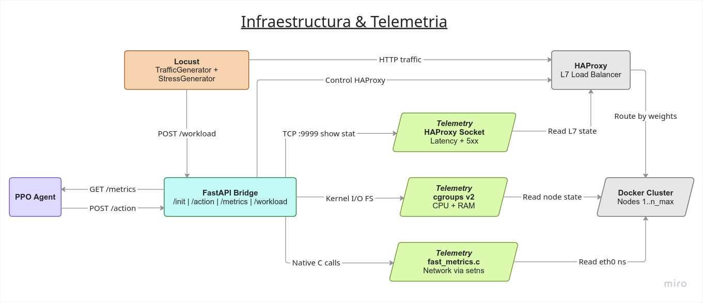
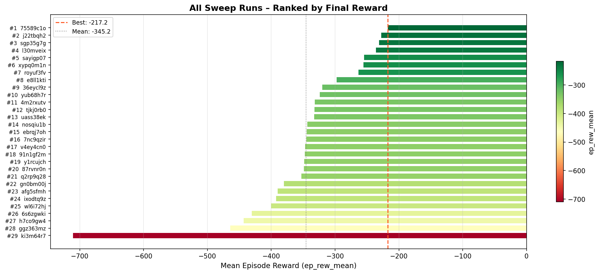
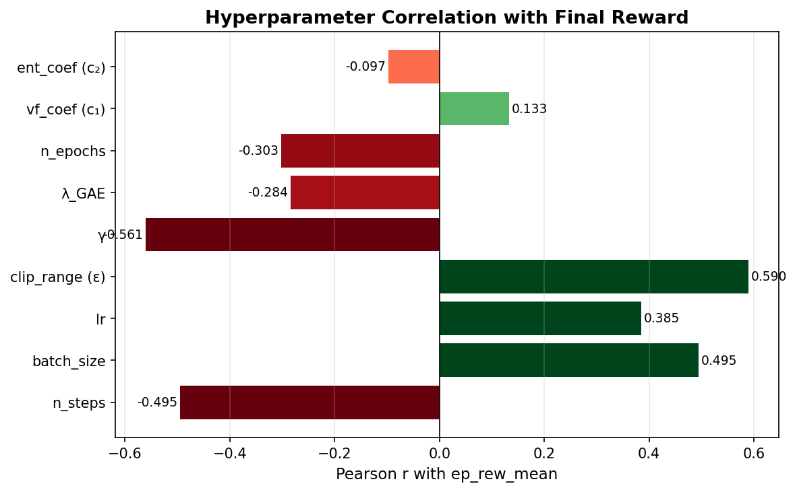
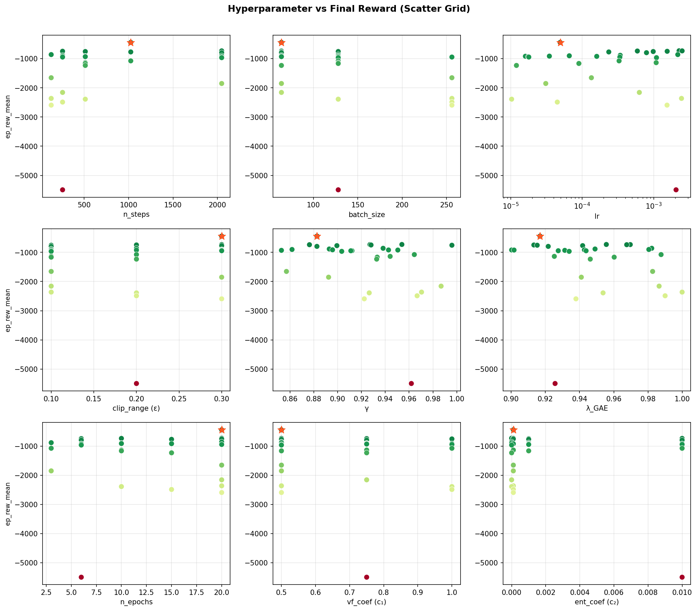
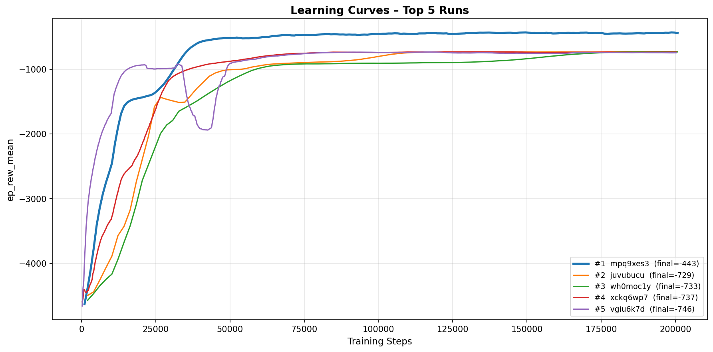
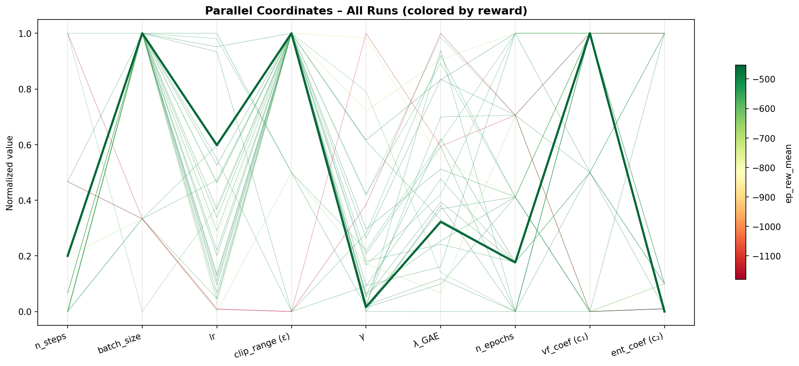
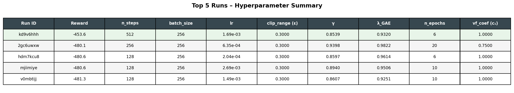

# 1. Introducción

En el despliegue de microservicios y aplicaciones modernas, la eficiencia operativa depende de la capacidad del sistema para adaptarse a la demanda variable. Docker se ha consolidado como una herramienta fundamental para la contenerización y gestión de entornos de desarrollo y producción debido a su simplicidad y portabilidad. Sin embargo, un reto crítico dentro de estos entornos es el autoescalado y el balanceo de cargas. El autoescalado es la capacidad de ajustar dinámicamente el número de contenedores en ejecución para responder a picos de tráfico o carga de procesamiento. Por su parte, el balanceo de cargas consiste en la distribución eficiente del tráfico entrante entre los servidores o nodos disponibles.

En la industria, se suelen emplear algoritmos estándar para resolver estos problemas. _Round Robin_, _Weighted Round Robin_ y _Least Connections_ son soluciones muy comunes en el ámbito tecnológico para lidiar con el balanceo de cargas. Por otro lado, el escalado de servicios suele basarse en la definición de umbrales estáticos que condicionan el aumento o la retracción de los recursos. Ante las limitaciones de estos enfoques rígidos, este proyecto propone la incorporación de modelos de aprendizaje automático (_Machine Learning_) para buscar una mejora sobre las soluciones tradicionales. Para ello, se ha empleado un modelo de aprendizaje por refuerzo, el cual permite al agente aprender a optimizar sus acciones en un entorno cambiante, maximizando las recompensas obtenidas. De esta forma, el agente toma decisiones para aumentar o reducir la cantidad de contenedores disponibles y balancear la carga entre ellos, evitando así la saturación de los servicios.

Este tipo de problemas cuenta con la dificultad inherente de tener que obtener, en tiempo real, métricas correspondientes a los contenedores, tales como el uso de CPU, memoria RAM, latencia de red y la tasa de errores. Para simular y evaluar este proceso, se ha utilizado la biblioteca Gymnasium de OpenAI, creando un entorno personalizado que integra el vector de observaciones del sistema, el espacio de acciones del orquestador y una función de recompensa diseñada específicamente para este ecosistema.

 

# 2. Marco teórico

### 2.1 Escalado automático y Balanceo de Cargas en arquitecturas de microservicios

Si bien el escalado automático está estrechamente relacionado con el balanceo de cargas, no son el mismo concepto, aunque a menudo operan en conjunto. Ambos procesos afectan la asignación de recursos de un sistema para lidiar con la carga de trabajo, velando siempre por la optimización y evitando tanto las sobrecargas como los estados pasivos (desperdicio de recursos).

 

#### 2.1.1 Auto Scaler (Autoescalador)

El _auto-scaling_, conocido comúnmente como "escalado automático", es una característica de la computación en la nube que asigna dinámicamente los recursos computacionales en función de la demanda del sistema. Se utiliza para garantizar que las aplicaciones cuenten con los recursos necesarios para mantener una disponibilidad constante y alcanzar los objetivos de rendimiento, promoviendo además un uso eficiente del hardware y minimizando los costos operativos (IBM)[https://www.ibm.com/mx-es/think/topics/autoscaling].

Existen varias estrategias de escalado: horizontal, vertical, dinámico, predictivo y programado. Sin embargo, este proyecto se enfocará principalmente en dos enfoques: el escalado horizontal y el escalado dinámico.

El **escalado horizontal** (también conocido como _scale-out/scale-in_) es la acción de instanciar o eliminar más nodos, contenedores o máquinas virtuales a un entorno de computación. A diferencia del escalado vertical (que implica añadir más recursos de hardware como RAM o CPU a un servidor ya existente), el escalado horizontal es una solución enfocada en la replicación y la arquitectura distribuida, ideal para contenedores Docker.

El **escalado dinámico** es una política que reacciona a las necesidades de recursos a medida que ocurren, ajustando la asignación en función de la utilización en tiempo real. Con esta política, los sistemas pueden activar instancias adicionales de forma automática cuando se alcanza un umbral específico de estrés, como un alto porcentaje de uso de la CPU o un incremento brusco en la latencia de las peticiones.

 

#### 2.1.2 Load Balancer (Balanceador de Carga)

El _Load Balancing_ es la práctica de distribuir el trabajo computacional entre dos o más computadoras. En el mundo de la infraestructura de redes, se utiliza principalmente para dividir el tráfico entrante (como peticiones HTTP) entre varios servidores. De esta forma, se busca reducir el estrés sobre cada nodo individual, haciendo que el clúster sea más eficiente, aumente su rendimiento general, reduzca la latencia y minimice la tasa de errores provocada por la saturación de los servicios [https://www.cloudflare.com/learning/performance/what-is-load-balancing/].

La acción de balancear la carga la lleva a cabo una herramienta o aplicación denominada _Load Balancer_ (LB), la cual puede ser un dispositivo físico en la red o, como es tendencia actual, un componente basado completamente en software (como HAProxy o Nginx). El funcionamiento en ambos casos es idéntico: cuando llega una petición de un usuario, el LB decide a qué servidor activo enviarla, repitiendo este proceso para cada conexión nueva. Para determinar el destino de cada petición, el LB se rige por algoritmos que pueden clasificarse en estáticos o dinámicos.

Los **Load Balancers estáticos** distribuyen la carga de trabajo de forma predeterminada sin tomar en consideración el estado real de los servidores. Por ejemplo, un nodo puede estar procesando una carga del 80% de su CPU, mientras que su vecino tiene solo un 20% ocupado; sin embargo, un LB estático ignorará estas métricas. En este grupo destaca el algoritmo _Round Robin_, el cual es un método de distribución que envía las peticiones de forma equitativa y secuencial al siguiente servidor en la lista.

Los **Load Balancers dinámicos**, en cambio, monitorean continuamente la telemetría y el rendimiento de los servidores (como el uso de CPU, memoria o el tiempo de respuesta) antes de enrutar el tráfico. Estos algoritmos buscan inteligentemente las instancias menos saturadas o con conexiones más rápidas para asignarles el trabajo, garantizando así una distribución adaptativa que responde a los cuellos de botella del sistema en tiempo real.

 

### 2.2 Aprendizaje por Refuerzo (Reinforcement Learning)

El Aprendizaje por Refuerzo (RL) constituye un paradigma del aprendizaje automático en el que un agente aprende a mapear situaciones a acciones con el objetivo de maximizar una señal de recompensa numérica acumulada a lo largo del tiempo (Sutton & Barto, 2018). A diferencia del aprendizaje supervisado, donde el sistema recibe ejemplos etiquetados provistos por un supervisor externo, el agente de RL no es instruido sobre qué acciones tomar, sino que debe descubrir cuáles producen mayor recompensa mediante un proceso iterativo de prueba y error (Russell & Norvig, 2010).

En el contexto del presente trabajo, estos componentes se instancian de la siguiente manera.

El **agente** constituye la entidad lógica responsable de observar el estado del sistema y seleccionar las acciones de escalado a ejecutar. Su dominio de actuación es el **entorno (environment)**, conformado por el cluster de contenedores y la infraestructura Docker sobre la que operan los servicios.

Para tomar decisiones, el agente percibe el **estado ($S$)** del entorno, una representación cuantitativa de la situación actual del sistema, compuesta por métricas como el porcentaje de uso de CPU y memoria reportadas por la API de Docker. A partir de dicha representacion, selecciona una de las **acciones ($A$)** disponibles: Incrementar el numero de réplicas, reducirlo, mantener la configuracion actual o balancear la carga entre los nodos activos.

Tras ejecutar cada acción, el agente recibe una **recompensa ($R$)** que retroalimenta al agente. Un valor negativo pero cercano a cero indica una gestión eficiente de los recursos mientras que, un valor lejano a cero refleja condiciones indeseables como la saturación del servicio o la subutilización del hardware. Este mecanismo de retroalimentación es el que permite al agente ajustar su comportamiento sin requerir ejemplos supervisados (Sutton & Barto, 2018).

El nucleo de nuestro agente es su **política ($\pi$)**, ésta representa la estrategia o "mapeo" que el agente sigue para determinar qué acción tomar ante un estado determinado. El objetivo del entrenamiento es encontrar una política óptima ($\pi^*$) que maximice la recompensa acumulada esperada bajo cualquier escenario de carga, garantizando así la estabilidad del cluster (Russell & Norvig, 2010).

Para alcanzar este nivel de optimización en entornos de alta dimensionalidad, se recurre a algoritmos avanzados como Q-Learning, Deep Q-Network (DQN) y Proximal Policy Optimization (PPO).

 

### 2.3 Proximal Policy Optimization (PPO)

Proximal Policy Optimization (PPO) es un algoritmo de aprendizaje por refuerzo encuadrado en los métodos de policy gradient.

A diferencia de los algoritmos basados en valores (como Q-Learning), PPO optimiza directamente la política del agente, mediante una red neuronal que produce una distribución de probabilidades sobre el espacio de acciones para cada estado observado.Este algoritmo pertenece a la familia de los métodos Actor-Critic, donde el aprendizaje se divide en dos estructuras complementarias:

- **Actor:** Una red neuronal encargada de generar la política $\pi(a|s)$, determinando la probabilidad de seleccionar cada acción ante un estado dado.
- **Critic:** Una red que estima la función de valor $V(s)$, proporcionando una evaluación del estado actual que sirve para calcular la ventaja (advantage), guiando así la dirección y magnitud de las actualizaciones del actor.

La principal innovación de PPO radica en su función objetivo de proximidad (clipped surrogate objective). Está diseñada para resolver el problema de la inestabilidad en el entrenamiento, evitando que la política sufra cambios bruscos entre iteraciones.
Para ello, el algoritmo calcula un ratio de probabilidad entre la política nueva y la anterior:

$$r_t(\theta) = \frac{\pi_\theta(a_t|s_t)}{\pi_{\theta_{old}}(a_t|s_t)}$$

En lugar de maximizar este ratio sin restricciones, PPO aplica un recorte que limita el valor de $r_t(\theta)$ dentro de un rango determinado. Este proceso asegura que las actualizaciones sean pequeñas y controladas, manteniendo la nueva política "cerca" de la anterior, garantizando una convergencia más estable y robusta.

 

#### 2.3.1 Justificacion

###### Nota: Mejorar la redaccion, haciendo uso de parrafos corto y claros. Minimizar el uso de listas

Para este proyecto se ha decidido utilizar el algoritmo PPO:

- **DQN** originalmente trabaja con estados discretos, a diferencia de **PPO** tiene una mejor reaccion ante metricas continuas como uso porcentual
- La politica de recorte para que los cambios no sean tan abruptos permiten que las acciones del cluster no oscilen levantando y dando de baja muchos contenedores continuamente
- Mientras que **DQN** se limita a estimar el valor de una accion, **PPO**, utiliza una arquitectura Actor-Critic, lo cual permite que el agente aprenda no solo a maximizar el rendimiento, sino a reducir la varianza, lo que se traduce en un escalado mucho más predecible y menos errático.

 

### 2.4 Modelado Matemático del Entorno Simulado

#### 2.4.1 Teoría de Colas (M/M/1)

Para garantizar que el preentrenamiento del agente en la Fase 1 fuese representativo de un clúster real, las dinámicas de estrés del contenedor se modelaron basándose en la Teoría de Colas, adoptando el modelo M/M/1 (llegadas Markovianas, tiempo de servicio Markoviano, 1 servidor) .

La tasa de llegada de peticiones λ al nodo i se determinó multiplicando la carga total de usuarios por el peso de ruteo asignado por el orquestador. Definiendo la capacidad máxima de procesamiento del nodo como μ, se obtuvo el factor de utilización del sistema ρ:

$$\rho = \frac{\lambda}{\mu}$$

[3]

_Donde:_

- **$\lambda$ (Lambda):** Es la tasa de llegada de peticiones (carga de usuarios asignada al nodo).
- **$\mu$ (Mu):** Es la tasa de servicio (capacidad máxima de peticiones que el nodo puede procesar por segundo).

El uso de CPU se consideró directamente proporcional al factor ρ, al cual se le inyectó un ruido Gaussiano N(0,σ2) para emular la interferencia natural de los procesos del Sistema Operativo host.

Por otro lado, la latencia (Tiempo de Respuesta Esperado E[T]) se calculó utilizando el comportamiento asintótico característico de los sistemas informáticos, donde la cola de espera crece exponencialmente a medida que la utilización se acerca al 100%:

$$E[T] = \frac{S}{1 - \rho} \quad \text{para} \quad \rho < 1$$

[3]

_Donde:_

- **$S$:** Es el tiempo base de servicio (la latencia natural de procesar una petición cuando el servidor está completamente vacío y no hay cola).

Finalmente, la tasa de errores de red (peticiones rechazadas o HTTP 5xx) se modeló mediante una función de activación Sigmoide desplazada:

$$E_{rate} = \frac{1}{1 + e^{-k(\rho - \rho_0)}}$$

[3]

_Donde:_

- **$k$:** Es la pendiente de la curva (determina qué tan abrupto es el colapso del contenedor).
- **$\rho_0$:** Es el punto de inflexión (el nivel de sobrecarga, por ejemplo 1.05 o 105%, donde la mitad de las peticiones empiezan a fallar irremediablemente).

Esto simuló el desbordamiento del búfer (Queue overflow), manteniendo una tasa de error de 0 mientras ρ<1.0, pero elevándose rápidamente al 100% cuando la tasa de llegada sobrepasó permanentemente la capacidad de servicio del contenedor [3].

 

#### 2.4.2 Simulación del Consumo de Memoria RAM (Ley de Little)

En los servidores de aplicaciones web modernos, el consumo de memoria volátil (RAM) presenta un comportamiento mixto: un piso de memoria estática requerido por el entorno de ejecución y un consumo dinámico proporcional a la cantidad de conexiones activas que el contenedor debe mantener.

Para modelar el consumo dinámico en el entorno simulado, se utilizó la **Ley de Little** ($L = \lambda W$), un teorema fundamental de la teoría de colas que establece que el número promedio de elementos en un sistema estable ($L$) es igual a la tasa promedio de llegada ($\lambda$) multiplicada por el tiempo promedio que un elemento pasa en el sistema ($W$). Simplificando la ecuación para el modelo M/M/1 implementado en el entorno, el número de peticiones concurrentes en la memoria del servidor se modeló como:

$$L = \frac{\rho}{1 - \rho} \quad \text{para} \quad \rho < 1$$

[6]

El uso total de la RAM ($RAM_{usg}$) se definió como la suma de la huella de memoria base del contenedor ($RAM_{base}$) más el costo en memoria individual de cada petición ($RAM_{req}$) multiplicado por el número de peticiones concurrentes ($L$), agregando un factor de ruido estocástico para simular el comportamiento del _Garbage Collector_:

$$RAM_{usg} = RAM_{base} + (L \times RAM_{req}) + \mathcal{N}(0, \sigma^2)$$

[5]

_Donde:_

- **$L$:** Es el número de peticiones concurrentes dentro del contenedor (procesándose + en cola).
- **$RAM_{base}$:** Representa la memoria ocupada por el sistema operativo y el entorno de ejecución (Python/Flask) sin tráfico.
- **$RAM_{req}$:** Es el consumo de memoria adicional por cada petición activa en el sistema.

Esta integración permite que el agente PPO aprenda que un aumento en la utilización ($\rho$) no solo afecta la latencia, sino que dispara exponencialmente el consumo de RAM, permitiéndole anticipar riesgos de saturación o fallos por falta de memoria (_Out of Memory_). En la fase de entrenamiento real, estas métricas se extraen directamente de los _cgroups_ de Docker para validar la precisión del modelo simulado.

 

# 3. Diseño Experimental

## 3.1 Métricas de Desempeño

Para evaluar la efectividad del autoscaler y el comportamiento del algoritmo PPO, se han definido cinco métricas principales que permiten medir tanto la calidad del servicio como la eficiencia de los recursos:

**Uso de la CPU (cpu_usg):** Representa el uso de CPU consumida por cada contenedor respecto al total disponible en el intervalo de muestreo.

$$\text{cpu}_{\text{usg}} = \frac{\Delta \text{CPU}_{ns}}{\Delta t_{ns}} + \mathcal{N}(0, \sigma^2)$$

Donde:

- $\Delta \text{CPU}_{ns}$ = CPU usado en el intervalo (nanosegundos)
- $\Delta t_{ns}$ = Tiempo real transcurrido (nanosegundos)
- $\mathcal{N}(0, \sigma^2)$ = Ruido Gaussiano introducido en el entorno simulado
  para representar la variabilidad natural del sistema

Se encuentra normalizado para el rango $[0, 1]$, lo que permite comparar porcentualmente la carga computacional entre contenedores independientemente de su capacidad.

**Uso de memoria RAM (ram_usg_pct y ram_total_normalize):** Representa el consumo de memoria de cada contenedor respecto al límite configurado, normalizado en $[0, 1]$.

$$\text{ram}_{\text{usg}}^{\text{pct}} = \frac{\text{RAM}_{usada}}{\text{RAM}_{límite}}$$

Donde:

- $\text{RAM}_{\text{usada}}$ = memoria consumida por el contenedor (bytes)
- $\text{RAM}_{\text{límite}}$ = límite configurado para el contenedor
  $(1024 \times 1024 \times 1024 \text{ bytes})$

En el entorno real, esta métrica se extrae directamente de los _cgroups_ de Docker.
En el entorno simulado, se deriva del modelo de Ley de Little descrito en el Marco
Teórico, incorporando una huella base del contenedor y ruido gaussiano que aproxima
el comportamiento del recolector de basura de Python. Valores cercanos a $1$ indican
riesgo de saturación de memoria (OOM), condición que el agente debe anticipar para
evitar la caída del servicio.

**Latencia (latency):** Representa el tiempo de respuesta promedio de las
peticiones HTTP procesadas por cada contenedor, normalizado respecto a un timeout
máximo de 2000 ms.

$$\text{latency} = \frac{t_{\text{respuesta}}}{t_{\text{timeout}}}$$

Donde:

- $t_{\text{respuesta}}$ = tiempo de respuesta observado (ms)
- $t_{\text{timeout}}$ = límite máximo configurado de 2000 ms

En el entorno real, el valor de $t_{\text{respuesta}}$ se extrae directamente de
las estadísticas de _HAProxy_. En el entorno simulado, se deriva del modelo de
colas descrito en el Marco Teórico. En ambos casos el resultado queda normalizado
en $[0, 1]$.

**Ratio de Errores (error_rate):** Porcentaje de respuestas fallidas (ej. HTTP 5xx), que indica si el cluster está sobrepasado. En el entorno real, se extrae directamente de las estadísticas de _HAProxy_. En el entorno simulado, se deriva del modelo de saturación descrito en el Marco Teórico, permaneciendo en $0$ para valores de utilización $\rho < 0.9$ y creciendo hacia $1$ a medida que el nodo supera su capacidad. Se encuentra normalizado en $[0, 1]$.

**Estado (status):** Indicador binario o categórico de la disponibilidad del servicio.

$$\text{status}_i = \begin{cases} 1 & \text{si el contenedor recibe tráfico} \\ 0 & \text{si el contenedor está inactivo} \end{cases}$$

En el entorno real, el valor se determina a partir del peso asignado por _HAProxy_, un contenedor con peso mayor a $0$ es considerado activo, mientras que un peso igual a $0$ lo marca como inactivo. En el entorno simulado, un contenedor es activo o inactivo sin estados intermedios, omitiendo el caso real en que HAProxy puede mantener un contenedor encendido pero sin asignarle tráfico.

 

## 3.2 Herramientas Utilizadas

La implementación del sistema integra herramientas encargadas tanto de la gestión de la infraestructura de contenedores, el entrenamiento del agente mediante aprendizaje por refuerzo, y la validación del comportamiento bajo condiciones de carga representativas.

Para el desarrollo e implementación del sistema se utilizó **Python** como lenguaje principal. La contenerización de los servicios backend y la gestión del cluster fueron realizadas mediante **Docker**, administrado programáticamente a través de su SDK oficial, junto a **HAProxy 3.0** como balanceador de carga.

La interfaz entre el agente y la infraestructura fue definida utilizando **Gymnasium**, con el tipo `spaces.Box` es posible abstraer el cluster como un entorno de RL compatible con bibliotecas de entrenamiento. El entrenamiento del agente PPO se implementó sobre **Stable-Baselines3**, seleccionado para proveer una implementación optimizada y validada del algoritmo sobre **PyTorch**.

La integridad de las métricas fue asegurada con **Pydantic**, que valida los esquemas de los modelos `ContainerMetrics` y `AgentAction` antes de que ingresen al pipeline de entrenamiento. Finalmente, la evaluación del agente bajo condiciones realistas se realizó utilizando **Locust** como herramienta de generación de carga para simular patrones de tráfico durante la fase de fine-tuning sobre infraestructura real.

 

## 3.3 Proceso de entrenamiento

Para el entrenamiento del agente no nos basamos en datos estaticos preestablecidos si no que se opto por el uso de datos generados de manera aleatoria para mejorar los resultados del proceso de aprendizaje.

 

### 3.3.1 Generación de datos y entornos de entrenamiento

Para el desarrollo del agente, se definieron dos fuentes de datos distintas que permitieron una evolución progresiva del aprendizaje:

- _Entorno Simulado:_ En la fase inicial de entrenamiento, se utilizaron funciones matemáticas con ruido gaussiano para generar señales de carga sintéticas. Este enfoque permitió simular comportamientos estocásticos del sistema, proporcionando al agente un entorno controlado pero variable donde aprender las políticas de escalado sin depender de la infraestructura física acelerando el proceso de preentrenamiento.

- _Entorno Real con Locust:_ Una vez que el agente demostró estabilidad en la simulación, se pasó a un "cluster funcional". En esta etapa, se utilizó Locust para generar tráfico de usuarios auténtico. Esto permitió recolectar métricas de rendimiento reales extraídas de la API de Docker, enfrentando al agente a la latencia real de red y a los tiempos de respuesta del motor de contenedores.

 

## 3.4 Diseño de la función de recompensa

La función de recompensa constituye el mecanismo central que guía el aprendizaje del agente, traduciendo el estado del cluster en una señal escalar que penaliza los comportamientos indeseables [1]. Se adoptó una función de penalización pura, sin términos positivos, de modo que el agente aprenda a minimizar el daño en lugar de perseguir una recompensa absoluta. Como caso límite, si el número de contenedores activos es cero, la función retorna inmediatamente $R = -200$, garantizando que el vaciado total del cluster sea siempre la peor decisión posible independientemente de cualquier otra señal.

Para el resto de los casos, la recompensa total se compone de tres grupos de penalizaciones calculados sobre los promedios de los nodos activos:

$$R = -\left[ W_{\text{lat}} \cdot \overline{\text{lat}}^2 + W_{\text{err}} \cdot \overline{\text{err}} + W_{\text{cost}} \cdot \frac{N_{\text{active}}}{N_{\text{max}}} + W_{\text{sat}} \cdot \left(\overline{\text{cpu}_{\text{sat}}} + \overline{\text{ram}_{\text{sat}}}\right) + P_{\text{op}} \right] - \delta$$

 

### 3.4.1 Penalizaciones orientadas al usuario (_user-facing_)

Los errores HTTP y la latencia de respuesta son las únicas métricas que el cliente percibe directamente, por lo que reciben las penalizaciones más severas.

Los errores HTTP 5xx reciben el mayor peso ($W_{\text{err}} = 50.0$): una respuesta fallida representa una degradación crítica e irrecuperable del servicio desde la perspectiva del usuario. La latencia se penaliza con $W_{\text{lat}} = 2.0$ aplicado cuadráticamente sobre el promedio normalizado, lo que hace al agente progresivamente más sensible a los picos. Para evitar penalizar la latencia inherente a la red en condiciones de baja carga, se aplica un umbral de tolerancia: si la latencia promedio no supera el 10% del timeout máximo ($\overline{\text{lat}} \leq 0.1$), la penalización se anula completamente, definiendo implícitamente el nivel de SLA del sistema.

 

### 3.4.2 Penalizaciones orientadas al operador (_operator-facing_)

El costo operativo penaliza el sobreaprovisionamiento en función de la fracción de nodos activos sobre el total disponible ($W_{\text{cost}} = 1.0$), desincentivando mantener contenedores encendidos sin necesidad. La saturación de recursos penaliza el exceso de uso de CPU por encima del 80% y de RAM por encima del 85%, acumulando únicamente la diferencia que sobrepasa esos umbrales ($W_{\text{sat}} = 1.0$ para ambos). Estos pesos unitarios permiten que ambas señales actúen como guías de fondo sin solaparse con las penalizaciones de calidad de servicio.

 

### 3.4.3 Zona muerta de CPU y penalización adaptativa ($P_{\text{op}}$)

El término $P_{\text{op}}$ implementa una zona muerta que define el rango operativo eficiente del cluster. Si el uso promedio de CPU de los nodos activos cae entre el 40% y el 75%, no se aplica penalización adicional, ya que el cluster opera con el nivel de ocupación deseado. Fuera de ese rango, la penalización adopta dos formas distintas según la dirección de la desviación:

$$P_{\text{op}} = \begin{cases} W_{\text{op}} \cdot (0.40 - \overline{\text{cpu}}) \cdot \dfrac{N_{\text{active}}}{N_{\text{max}}} & \text{si } \overline{\text{cpu}} < 0.40 \\[8pt] W_{\text{prev}} \cdot (\overline{\text{cpu}} - 0.75) & \text{si } \overline{\text{cpu}} > 0.75 \\[4pt] 0 & \text{en otro caso} \end{cases}$$

Cuando la CPU promedio está por debajo del 40%, la penalización escala con la cantidad de nodos activos ($W_{\text{op}} = 2.0$), castigando proporcionalmente más al agente cuanto más contenedores ociosos mantiene encendidos. Cuando supera el 75%, se aplica una penalización preventiva suave ($W_{\text{prev}} = 2.0$) que incentiva al agente a escalar anticipadamente antes de que el sistema colapse, en lugar de reaccionar recién cuando la saturación y los errores ya son visibles.

 

### 3.4.4 Fricción de escalado ($\delta$)

El término $\delta$ penaliza cada decisión de escalar en los extremos del espacio de acción:

$$\delta = \begin{cases} W_{\text{friction}} & \text{si } a_{\text{scale}} \leq 0.3 \text{ o } a_{\text{scale}} \geq 0.7 \\ 0 & \text{en otro caso} \end{cases}$$

Con $W_{\text{friction}} = 2.0$, esta fricción tiene un peso comparable al de la latencia y la zona muerta, lo que obliga al agente a justificar cada acción de escalar con evidencia suficiente en el estado del cluster. El propósito es suprimir el comportamiento de _chattering_ (también llamado efecto serrucho), donde el agente oscila entre levantar y dar de baja contenedores en pasos consecutivos sin que la carga lo justifique. En un entorno real, este comportamiento implicaría un costo operativo elevado y una inestabilidad que el tráfico penalizaría a través de las otras señales con cierto retardo.

 

## 3.5 Infraestructura de Telemetría y Monitoreo

### 3.5.1 Arquitectura General del Sistema

El sistema se organiza en cuatro capas que operan de forma coordinada durante el entrenamiento y la evaluación del agente. Cada capa tiene una responsabilidad bien delimitada, y la comunicación entre ellas se realiza a través de interfaces explícitas que permiten reemplazar o extender cualquier componente sin afectar al resto.

**Plano de Control — El Agente PPO**

El agente PPO es el componente central del sistema. En cada paso del entorno, recibe un vector de observación que describe el estado del cluster, selecciona una acción compuesta por los pesos de ruteo para cada nodo y una decisión de escalado, y la envía al Bridge a través de una petición HTTP POST al endpoint `/action`. Una vez aplicada la acción, consulta el estado actualizado del cluster mediante GET a `/metrics`, calcula la recompensa y actualiza su política.

**Bridge — FastAPI como Middleware**

El Bridge, implementado en `bridge.py` sobre FastAPI, actúa como la capa de traducción entre el lenguaje del agente (vectores de números normalizados) y el lenguaje de la infraestructura (comandos de Docker y HAProxy). Expone cinco endpoints:

| Endpoint   | Método | Función                                               |
| ---------- | ------ | ----------------------------------------------------- |
| `/init`    | POST   | Inicializa el cluster: levanta contenedores y HAProxy |
| `/action`  | POST   | Recibe pesos y decisión de escala, los aplica         |
| `/metrics` | GET    | Devuelve métricas de todos los nodos + workload       |
| `/reset`   | GET    | Restablece el cluster al estado inicial               |
| `/cleanup` | GET    | Detiene y elimina todos los contenedores              |

Esta separación en una API REST independiente tiene una ventaja práctica concreta: el agente puede entrenarse en cualquier máquina de la red apuntando a la URL del Bridge, sin necesidad de tener Docker instalado localmente ni acceso directo a los cgroups del host.

**Cluster de Contenedores — Docker + HAProxy**

El cluster está formado por `n_max` instancias del servidor `dummy_server`, una aplicación Flask servida con Gunicorn que expone tres endpoints diseñados para generar carga controlada: `/` (respuesta trivial), `/cpu` (cálculo intensivo) y `/ram` (acumulación progresiva de memoria). Gunicorn se configura con dos workers por contenedor para aprovechar múltiples cores y producir curvas de saturación de CPU realistas, ya que el servidor de desarrollo de Flask es monohilo y no generaría la variabilidad necesaria para el entrenamiento.

Todos los contenedores se conectan a una red virtual Docker dedicada (`lbas_network`), sobre la que HAProxy opera como punto de entrada único. Su configuración se genera programáticamente al inicio del cluster a través de `init_haproxy_cfg()`, que escribe el archivo `haproxy.cfg` con un servidor por contenedor. Los pesos de ruteo se modifican en caliente durante el entrenamiento mediante la Runtime API de HAProxy, sin necesidad de recargar el proceso.

Cada contenedor se le ha asignado un límite explícito de `500_000_000` nano-CPUs (equivalente a 0.5 cores), lo que garantiza que la competencia por recursos entre nodos sea observable y medible, forzando al agente a aprender cuándo el cluster necesita más capacidad.

**Generador de Tráfico — Locust**

Locust genera el tráfico HTTP que estresa el cluster durante la fase de entrenamiento real. El generador de carga implementa la clase `StressGenerator`, que hereda de `LoadTestShape` y determina dinámicamente el número de usuarios activos en cada tick. Para garantizar que el agente aprenda a reaccionar ante patrones de tráfico variados y no se sobreajuste a un único patrón, el sistema delega la generación de carga al módulo `TrafficGenerator`, compartido entre el entorno simulado y Locust.

`TrafficGenerator` implementa ocho funciones de carga distintas seleccionadas aleatoriamente, cada una con parámetros generados al inicio de cada ciclo: doble ola gaussiana, lineal, exponencial, escalones, tendencia, estacional, diente de sierra y spike con recuperación. Cada ciclo tiene una duración aleatoria de entre 2 y 15 minutos, y sobre cada valor calculado se aplica un jitter gaussiano del 5% y una probabilidad del 2% de generar un evento extremo (corte de tráfico o pico de demanda). Esto asegura que el espacio de estados que observa el agente durante el entrenamiento sea suficientemente rico y no determinista.

El número de usuarios activos en cada momento se reporta al Bridge mediante un POST al endpoint `/workload`, que normaliza el valor y lo incluye en el vector de observación como una señal adicional de contexto. Esto le da al agente información anticipatoria sobre la carga actual antes de que sus efectos sean visibles en las métricas de CPU y latencia.

 

### 3.5.2 Infraestructura de Telemetría

La recolección de métricas en tiempo real constituye la columna vertebral del sistema, ya que la calidad de la señal de observación determina directamente la capacidad del agente para tomar decisiones correctas. Para satisfacer los requisitos de baja latencia y alta frecuencia de muestreo que impone el ciclo de entrenamiento del PPO, se diseñó una infraestructura de telemetría en tres capas, cada una especializada según el origen y la naturaleza del dato que expone.

**Capa 1 — Métricas de Hardware vía cgroups (CPU y RAM)**

Linux organiza los recursos asignados a cada contenedor Docker a través del subsistema _cgroups v2_, que expone en tiempo real el estado del hardware como archivos de texto en el sistema de ficheros virtual `/sys/fs/cgroup`. Este mecanismo elimina la necesidad de llamar al Docker Daemon para obtener métricas de bajo nivel, reduciendo la latencia de lectura a operaciones de I/O sobre memoria del kernel.

El kernel acumula de forma continua el tiempo de procesador consumido por cada contenedor en el archivo `cpu.stat`, bajo la clave `usage_usec`. Dado que este valor es un contador monótonamente creciente, el uso real en el intervalo de muestreo se obtiene calculando el delta respecto a la lectura anterior y normalizándolo contra el límite de CPU configurado por contenedor:

$$\text{cpu}_{\text{usg}}^{\text{norm}} = \min\left(1.0,\; \frac{\Delta\text{CPU}_{ns} / \Delta t_{ns}}{\text{cpu}_{\text{limit}}}\right)$$

El sistema mantiene en memoria un diccionario `last_cpu_stats` indexado por el Long ID de cada contenedor, que persiste entre pasos del entorno y permite calcular el delta sin releer el historial completo. El consumo de RAM se lee del archivo `memory.current` y se normaliza contra el límite configurado en MB, resultando en una métrica directamente interpretable como riesgo de OOM.

**Capa 2 — Métricas de Red vía Biblioteca C (`fast_metrics.c`)**

Leer los contadores de red de un contenedor desde el proceso host presenta un obstáculo fundamental: cada contenedor opera dentro de su propio _network namespace_, donde la interfaz `eth0` no existe en el namespace del host. La solución implementada se basa en la llamada al sistema `setns()`, que permite a un proceso ingresar temporalmente al namespace de red de otro proceso. La biblioteca `libfastmetrics.so`, compilada desde `fast_metrics.c`, implementa esta lógica en C para minimizar la latencia:

1. Se construye la ruta al pseudo-archivo del namespace: `/proc/<PID>/ns/net`
2. Se abre el descriptor de archivo y se invoca `setns(fd, CLONE_NEWNET)`, haciendo que el hilo actual ingrese al namespace del contenedor
3. Dentro de ese namespace, se lee `/sys/class/net/eth0/statistics/rx_bytes` directamente desde sysfs
4. El descriptor se cierra inmediatamente para no impedir la liberación del namespace cuando el contenedor termine

Este diseño sigue la recomendación de la documentación oficial de Docker para la recolección de métricas de alto rendimiento: en lugar de lanzar un nuevo proceso por cada lectura, se reutiliza el PID del contenedor, previamente cacheado al momento de la inicialización del cluster. [7]

**Capa 3 — Métricas L7 vía HAProxy Stats Socket**

Las métricas de capa de aplicación —latencia de respuesta HTTP y tasa de errores 5xx— son reportadas por HAProxy a través de su Runtime API, expuesta como un socket TCP en el puerto `9999`. Al enviar el comando `show stat`, HAProxy devuelve un CSV con el estado detallado de cada servidor backend. De esta respuesta se extraen, para cada nodo, la latencia promedio (`rtime`), el contador de errores HTTP 5xx (`hrsp_5xx`) y el peso de ruteo (`weight`), que determina el `status` binario del contenedor.

El socket se instancia, utiliza y cierra en cada llamada de forma explícita. Mantener una conexión persistente sería problemático: HAProxy puede cerrar silenciosamente conexiones inactivas, lo que provocaría un _broken pipe_ en el siguiente paso del entorno. La lectura de la respuesta se realiza en un bucle hasta que el socket retorna un chunk vacío, garantizando que respuestas largas no se lean de forma truncada y corrompan el CSV.

**Paralelización de la Recolección**

Dado que el sistema gestiona `n_max` contenedores en paralelo, una recolección secuencial implicaría que el tiempo total de un paso del entorno crecería linealmente con el número de nodos. Para evitar este problema, la función `get_metrics()` lanza un `ThreadPoolExecutor` con tantos workers como contenedores activos, ejecutando en paralelo la recolección de cgroups y red para cada nodo. Los resultados se escriben en sus posiciones exactas dentro de la lista de salida a medida que cada hilo completa su trabajo, garantizando el orden correcto sin necesidad de sincronización adicional, mientras la recolección de métricas HAProxy se realiza una única vez antes de lanzar el pool y se pasa como argumento compartido a todos los workers.

 

# 4. Análisis y discusión de resultados

En la siguiente sección se presentan los resultados obtenidos. Se realizó un apartado de optimizaición de hiperparámetros, donde se muestran los resultados obtenidos a través de gráficos y tablas. Luego se muestra la evaluación del escalamiento del agente, analizando su comportamiento ante el aumento de la complejidad del entorno y las métricas de desempeño del cluster. Finalmente, se realiza una comparativa contra baselines de la industria, incluyendo umbrales clásicos y un controlador PID, para resumir los resultados obtenidos.

 

## 4.1 Resultados de la Optimización (Hiperparámetros)

Para la optimizacion de hiperparámetros se decidió utilizar la herramienta de [**Weights & Biases Sweeps**](https://wandb.ai/site/sweeps/) , la cual permite automatizar la busqueda de hiperparámetros a través de la ejecución de múltiples experimentos en paralelo, utilizando diferentes combinaciones de valores para los hiperparámetros definidos. El método de búsqueda seleccionado en dicho estudio fue la `Optimización Bayesiana`, la cual utiliza modelos probabilisticos para guiar la búsqueda, "aprendiendo" de las corridas anteriores. Si nota que ciertos rangos de hiperparámetros están produciendo mejores resultados, el algoritmo se enfoca en explorar más a fondo esas áreas del espacio de búsqueda, lo que puede conducir a una convergencia más rápida hacia los hiperparámetros óptimos.

Se realizó la busqueda de hiperparametros a través de una serie de barridos con la optimización bayesiana sobre el espacio de hiperparámetros definido, utilizando un total de 30 ejecuciones (runs) con 10 nodos (`n_max = 10`) con diferentes combinaciones de hiperparámetros con la metrica objetivo siendo la recompensa media obtenida por episodio (`rollout/ep_rew_mean`). A continuación se presentan los hiperparametros a investigar y los rango otorgados para cada uno:

| Hiperparámetro [8]    | Descripción [8]                                                                                                       | Rango de Búsqueda / Valores            |
| --------------------- | --------------------------------------------------------------------------------------------------------------------- | -------------------------------------- |
| `learning_rate`       | Tamaño de paso para la actualización de pesos.                                                                        | Distribución log-uniforme [1e-5, 3e-3] |
| `gamma`               | Factor de descuento para recompensas futuras.                                                                         | Rango continuo [0.85, 0.999]           |
| `n_steps`             | Número de pasos ejecutados por entorno en cada actualización (tamaño de _rollout_).                                   | [128, 256, 512, 1024, 2048]            |
| `batch_size`          | Número de muestras por actualización de gradiente.                                                                    | [64, 128, 256]                         |
| `n_epochs`            | Número de veces que se reutilizan los datos recolectados durante una actualización.                                   | [3, 6, 10, 15, 20]                     |
| `clip_range`          | Parámetro de recorte (ε) para el objetivo sustituto; asegura que los cambios en la política sean pequeños.            | [0.1, 0.2, 0.3]                        |
| `ent_coef`            | Coeficiente de entropía (c2); valores más altos fomentan una mayor exploración.                                       | [0.0, 0.0001, 0.001, 0.01]             |
| `vf_coef`             | Coeficiente de la función de valor (c1); peso de la pérdida de valor en la función de pérdida total.                  | [0.5, 0.75, 1.0]                       |
| `gae_lambda`          | Factor de compensación entre sesgo y varianza para la Estimación de Ventaja Generalizada (λ_GAE).                     | Rango continuo [0.9, 1.0]              |
| `target_kl`           | Límite de divergencia KL entre actualizaciones para detener el entrenamiento temprano si los cambios son muy grandes. | Rango continuo [0.003, 0.03]           |
| `normalize_advantage` | Normalización de las ventajas.                                                                                        | [True, False]                          |

_Tabla 4.1: Definición del espacio de búsqueda de hiperparámetros._
 

### 4.1.1 Análisis de Importancia y Correlacion

_Figura 4.1: Clasificación de ejecuciones por recompensa final._

La gráfica 4.1 muestra la distribución de las recompensas medias obtenidas por episodio para cada una de las 30 ejecuciones realizadas durante el sweep de optimización de hiperparámetros. Cada barra representa una ejecución con una combinación específica de hiperparámetros, ordenada por rendimiento siendo la primera la de mejor desempeño. Se observa que 22 de las 30 ejecuciones alcanzaron una recompensa por encima de la media de -1349 puntos, lo que indica que se logró concentrar la exploración en regiones prometedeoras del espacio de busqueda luego de las primeras corridas. Sin embargo, la dispersión entre la mejor corrida (-443), el promedio de las corridas (-1349) y la peor corrida (-5500) sugiere que el espacio de hiperparámetros es altamente sensible, y que pequeñas variaciones pueden tener un impacto significativo en el desempeño del agente.

 

_Figura 4.2: Correlación de Pearson entre hiperparámetros y la recompensa media._

La gráfica 4.2 muestra la correlación de Pearson entre cada hiperparámetro y la recompensa media final por episodio. Cada barra representa el coeficiente de correlación, que varía entre -1 (correlación negativa perfecta) y 1 (correlación positiva perfecta). Se observa que `batch_size` tiene la mayor correlación negativa (r = - 0.361), lo que sugiere que lotes más grandes perjudican el aprendizaje. Lo cual es consistente con lo estudido en RL, donde lotes más pequeños generan actualizaciones de política más frecuentes y con mayor varianza, lo que puede ayudar a escapar de óptimos locales. El hiperparametro `gamma` (factor de descuento gamma) presenta la segunda mayor correlación negativa (r = -0.317), lo que indica que valores altos de gamma hacen que el agente valore demasiado las recompensas futuras, lo cual en un entorno tan dinámico y con señales ruidosas puede dificultar la convergencia.

En sentido opuesto, `n_steps` es el único hiperparametro con una correlación positiva significativa (r = 3.05), lo que nos dice que realizar más pasos por actualizacion, es decir, recolectar más experiencia antes de actualizar la política, tiende a mejorar el desempeño. Dicha experíencia es valiosa en tal ambiente donde un aumento o disminución de contenedores o variacion de carga puede tener efectos que se manifiestan con cierto retardo, por lo que acumular más pasos permite al agente captar mejor la relación entre sus acciones y las consecuencias a medio y largo plazo.

El resto de los hiperparámetros (`clip_range`, `n_epochs`, `vf_coef`, `ent_coef`, `gae_lambda`) muestran correlaciones débiles, lo que indica que su influencia individual es menor o que sus efectos dependen fuertemente de la combinación con los demás parámetros.

_Figura 4.3: Dispersión de la recompensa media en función de hiperparámetros individuales._

En la gráfica 4.3 se presenta una matriz de gráficos de dispersión que muestra la relación entre cada hiperparámetro y la recompensa media final por episodio. Cada punto representa una ejecución del sweep, con su color indicando la recompensa obtenida (de rojo para las peores recompensas a verde para las mejores y con una estrella para la mejor). En el panel de `batch_size`, practicamente todos los puntos ubicados en la franja superior (reward [-800, -1000]) corresponden a ejecuciones con `batch_size = 64`. Para `gamma`, se observa que las mejores recompensas se concentran en el rango inferior (gamma [0.85, 0.95]), mientras que valores más altos de gamma tienden a agruparse en la franja de recompensas más bajas (reward [-1000, -3000]). En el caso de `n_steps`, se aprecia que los valores más altos (`n_steps` [1024, 2048]) dan recompensas mejores con mayor frecuencia, con menor dispersión, mientras que los valores más bajos (`n_steps` [128, 256]) presentan una mayor variabilidad y una concentración de recompensas más bajas.

Es importante destacar que aunque se observa ciertas leves correlaciones lineales entre algunas variables, los hiperparamentros pueden no poseer relaciones estrictamente lineales con la recompensa, y generar efectos que no se capturan completamente en estos gráficos.

 

### 4.1.2 Estudio de Convergencia

_Figura 4.4: Curvas de aprendizaje de las 5 mejores ejecuciones._

En el gráfico 4.4 se presentan las curvas de aprendizaje de las cinco mejores ejecuciones. Cada curva muestra la recompensa media a lo largo de las iteraciones de entramiento. Vemos una la corrida #5 (línea violeta) es la primera que llega a converger pero alrededor de los 25.000 pasos exhibe un comportamiento único del grupo, con una caída abrupta de la recompensa a valores cercanos a -2000, seguida de una recuperación que la lleva a converger a niveles similares de las corridas #2, #3 y #4. Este comportamiento puede ser provocado por una actualizacion demasiado agresiva, debido a una tasa de aprendizaje (`learning_rate`) alta en combinación con un horizonte de recolección corto (`n_steps`).

Las corridas #2 y #3 muestran trayectorias similares entre sí. Ambas tienen un aprendizaje rápido en los primeros 25.000 pasos, luego una mejora más gradual hasta los 75.000 pasos donde se estabilizan teniendo una última mejora en los 100.000 y 125.000 pasos respectivamente, convergiendo a -729 y -733. Se ven distintos picos y caidas a lo largo de ambos entrenamientos pero siendo estas menos abruptas que la anterior, lo que indica que poseen tasas de entrenamiento más estables que les permitieron salir de óptimos locales.

La corrida #4 converge a los 25.000 pasos, pero a un nivel de recompensa más bajo (-737), y muestra una curva más plana con menos mejoras significativas a lo largo del entrenamiento, lo que indica que el agente pudo haber quedado atrapado en un óptimo local subóptimo.

En la mejor corrida se ve que converge antes que el resto, a los 25.000 pasos ya alcanza una rcompensa de aproximadamente -800, y continúa mejorando hasta estabilizarse en -443 hacía los 50.000 pasos. La brecha de 300 puntos entre la mejor corrida y el segundo grupo (#2, #3, #4) sugiere que la combinación de hiperparámetros utilizada corresponde a configuraciones notablemente distintas.

 

### 4.1.3 Justificación de la selección final de hiperparámetros

_Figura 4.5: Coordenadas paralelas de hiperparámetros._

El gráfico de coordenadas paralelas (gráfica 4.5) coloreado por recompensa permite visualizar la "firma" de las corridas exitosas a lo largo de todos los hiperparámetros simultáneamente. La línea correspondiente a la corrida ganadora (trazo oscuro y grueso) sigue un patrón identificable: `batch_size` mínimo (64), `learning_rate` muy bajo (~5e-5), `clip_range` máximo (0.3), `gamma` bajo (~0.88), `n_epochs` máximo (20) y `ent_coef` prácticamente nulo. Las líneas de colores verdes claros y amarillas (corridas mediocres) comparten varias de estas características pero divergen en gamma alto o tasa de aprendizaje elevada, lo que sugiere que la combinación simultánea de gamma bajo, lr bajo y muchas épocas de optimización es la condición necesaria para alcanzar el desempeño superior.

_Figura 4.6: Resumen de hiperparámetros para las 5 mejores ejecuciones._

La tabla 4.6 muestra los cinco mejores runs y los valores de sus hiperparámetros. Esto confirma un patrón compartido entre ellos: todos utilizan `batch_size = 64`, todos emplean `clip_range` de 0.2 o 0.3, y los cuatro mejores seleccionan `n_epochs` de 6 o 20. Sin embargo, la corrida ganadora se distingue del grupo por su tasa de aprendizaje (`learning_rate`) considerablemente menor (4.93e-5 frente a valores entre 5.91e-4 y 2.50e-3 en las demás) y por su `gamma` más bajo (0.8827). Esta combinación de aprendizaje lento con muchas épocas de optimización por rollout le permite al agente extraer mayor información de cada lote de experiencias sin arriesgarse a saltar fuera de regiones prometedoras del espacio de políticas. En base a este análisis, los hiperparámetros de la **corrida mpq9xes3** fueron seleccionados para el entrenamiento definitivo de la Fase 1.

 

## Evaluación del escalamiento (Runs: 3,5,10,20 nodos)

### Comportamiento del agente ante el aumento de la complejidad del entorno

### Métricas de desempeño del cluster

## Comparativa vs. baselines de la industria

### vs. Umbrales clasicos (Static thresholds)

### vs. Controlador PID

### Resumen de resultados

# Conclusiones finales

Observaciones finales sobre el tema y es muy importante indicar aquellas tareas o experimentos que quedaron sin realizar, pero que eventualmente podrían realizarse en el futuro.

## Bibliografía

\[1] Sutton, R. S., & Barto, A. G. (2018). _Reinforcement Learning: An Introduction_
(2nd ed.). The MIT Press.

\[2] Russell, S., & Norvig, P. (2010). _Artificial Intelligence: A Modern Approach_
(3rd ed.). Prentice Hall.

\[3] Harchol-Balter, M. (2013). Performance Modeling and Design of Computer Systems: Queueing Theory in Action. Cambridge University Press.

\[4] Tesauro, G., Jong, N. K., Das, R., & Bennani, M. N. (2006). A hybrid reinforcement learning approach to autonomic resource allocation. In Proceedings of the 2006 IEEE International Conference on Autonomic Computing.

\[5] Menascé, D. A., & Almeida, V. A. F. (2001). Capacity Planning for Web Services: Metrics, Models, and Methods. Prentice Hall.

\[6] Harchol-Balter, M. (2013). Performance Modeling and Design of Computer Systems: Queueing Theory in Action. Cambridge University Press.

\[7] https://docs.docker.com/engine/containers/runmetrics/#tips-for-high-performance-metric-collection

\[8] https://stable-baselines3.readthedocs.io/en/master/modules/ppo.html#hyperparameters
