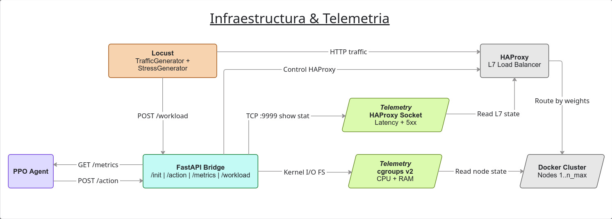
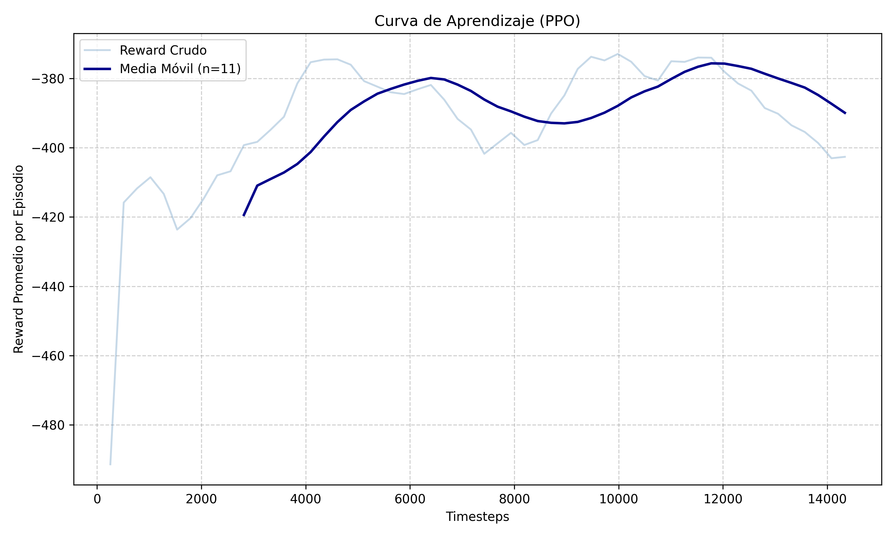
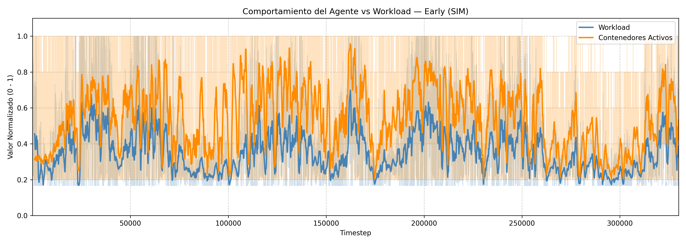
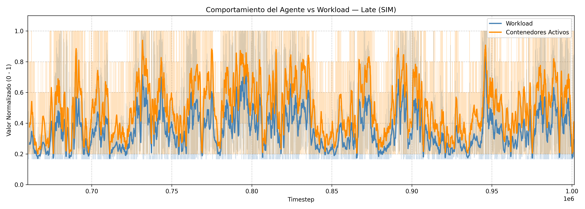
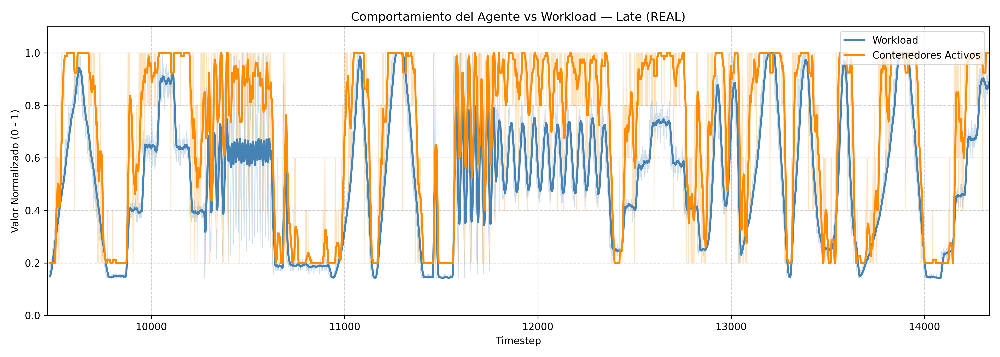
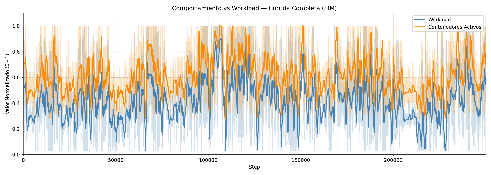
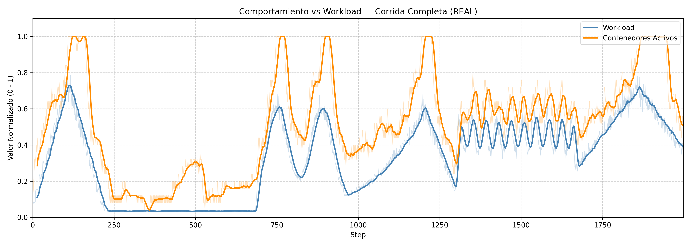
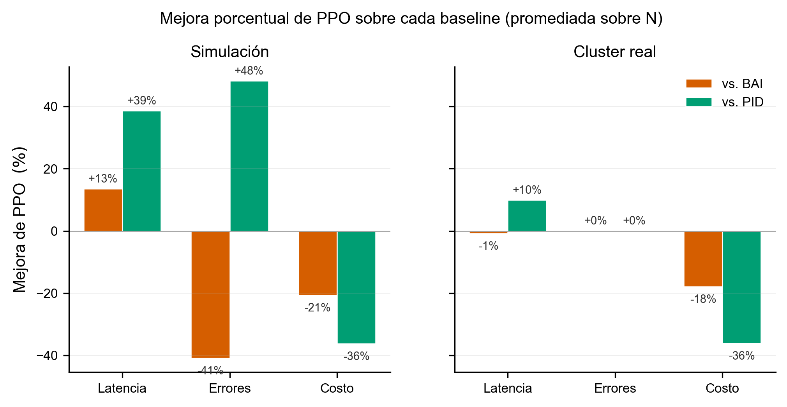

# 1. Introducción

En el despliegue de microservicios y aplicaciones modernas, la eficiencia operativa depende de la capacidad del sistema para adaptarse a la demanda variable. Docker se ha consolidado como una herramienta fundamental para la contenerización y gestión de entornos de desarrollo y producción debido a su simplicidad y portabilidad. Sin embargo, un reto crítico dentro de estos entornos es el autoescalado y el balanceo de cargas. El autoescalado es la capacidad de ajustar dinámicamente el número de contenedores en ejecución para responder a picos de tráfico o carga de procesamiento. Por su parte, el balanceo de cargas consiste en la distribución eficiente del tráfico entrante entre los servidores o nodos disponibles.

En la industria, se suelen emplear algoritmos estándar para resolver estos problemas. _Round Robin_, _Weighted Round Robin_ y _Least Connections_ son soluciones muy comunes en el ámbito tecnológico para lidiar con el balanceo de cargas. Por otro lado, el escalado de servicios suele basarse en la definición de umbrales estáticos que condicionan el aumento o la retracción de los recursos. Ante las limitaciones de estos enfoques rígidos, este proyecto propone la incorporación de modelos de aprendizaje automático (_Machine Learning_) para buscar una mejora sobre las soluciones tradicionales. Para ello, se ha empleado un modelo de aprendizaje por refuerzo, el cual permite al agente aprender a optimizar sus acciones en un entorno cambiante, maximizando las recompensas obtenidas. De esta forma, el agente toma decisiones para aumentar o reducir la cantidad de contenedores disponibles y balancear la carga entre ellos, evitando así la saturación de los servicios.

Este tipo de problemas cuenta con la dificultad inherente de tener que obtener, en tiempo real, métricas correspondientes a los contenedores, tales como el uso de CPU, memoria RAM, latencia de red y la tasa de errores. Para simular y evaluar este proceso, se ha utilizado la biblioteca Gymnasium de OpenAI, creando un entorno personalizado que integra el vector de observaciones del sistema, el espacio de acciones del orquestador y una función de recompensa diseñada específicamente para este ecosistema.

 

# 2. Marco teórico

### 2.1 Escalado automático y Balanceo de Cargas en arquitecturas de microservicios

Si bien el escalado automático está estrechamente relacionado con el balanceo de cargas, no son el mismo concepto, aunque a menudo operan en conjunto. Ambos procesos afectan la asignación de recursos de un sistema para lidiar con la carga de trabajo, velando siempre por la optimización y evitando tanto las sobrecargas como los estados pasivos (desperdicio de recursos).

 

#### 2.1.1 Auto Scaler (Autoescalador)

El _auto-scaling_, conocido comúnmente como "escalado automático", es una característica de la computación en la nube que asigna dinámicamente los recursos computacionales en función de la demanda del sistema. Se utiliza para garantizar que las aplicaciones cuenten con los recursos necesarios para mantener una disponibilidad constante y alcanzar los objetivos de rendimiento, promoviendo además un uso eficiente del hardware y minimizando los costos operativos (IBM)[https://www.ibm.com/mx-es/think/topics/autoscaling].

Existen varias estrategias de escalado: horizontal, vertical, dinámico, predictivo y programado. Sin embargo, este proyecto se enfocará principalmente en dos enfoques: el escalado horizontal y el escalado dinámico.

El **escalado horizontal** (también conocido como _scale-out/scale-in_) es la acción de instanciar o eliminar más nodos, contenedores o máquinas virtuales a un entorno de computación. A diferencia del escalado vertical (que implica añadir más recursos de hardware como RAM o CPU a un servidor ya existente), el escalado horizontal es una solución enfocada en la replicación y la arquitectura distribuida, ideal para contenedores Docker.

El **escalado dinámico** es una política que reacciona a las necesidades de recursos a medida que ocurren, ajustando la asignación en función de la utilización en tiempo real. Con esta política, los sistemas pueden activar instancias adicionales de forma automática cuando se alcanza un umbral específico de estrés, como un alto porcentaje de uso de la CPU o un incremento brusco en la latencia de las peticiones.

 

#### 2.1.2 Load Balancer (Balanceador de Carga)

El _Load Balancing_ es la práctica de distribuir el trabajo computacional entre dos o más computadoras. En el mundo de la infraestructura de redes, se utiliza principalmente para dividir el tráfico entrante (como peticiones HTTP) entre varios servidores. De esta forma, se busca reducir el estrés sobre cada nodo individual, haciendo que el clúster sea más eficiente, aumente su rendimiento general, reduzca la latencia y minimice la tasa de errores provocada por la saturación de los servicios [https://www.cloudflare.com/learning/performance/what-is-load-balancing/].

La acción de balancear la carga la lleva a cabo una herramienta o aplicación denominada _Load Balancer_ (LB), la cual puede ser un dispositivo físico en la red o, como es tendencia actual, un componente basado completamente en software (como HAProxy o Nginx). El funcionamiento en ambos casos es idéntico: cuando llega una petición de un usuario, el LB decide a qué servidor activo enviarla, repitiendo este proceso para cada conexión nueva. Para determinar el destino de cada petición, el LB se rige por algoritmos que pueden clasificarse en estáticos o dinámicos.

Los **Load Balancers estáticos** distribuyen la carga de trabajo de forma predeterminada sin tomar en consideración el estado real de los servidores. Por ejemplo, un nodo puede estar procesando una carga del 80% de su CPU, mientras que su vecino tiene solo un 20% ocupado; sin embargo, un LB estático ignorará estas métricas. En este grupo destaca el algoritmo _Round Robin_, el cual es un método de distribución que envía las peticiones de forma equitativa y secuencial al siguiente servidor en la lista.

Los **Load Balancers dinámicos**, en cambio, monitorean continuamente la telemetría y el rendimiento de los servidores (como el uso de CPU, memoria o el tiempo de respuesta) antes de enrutar el tráfico. Estos algoritmos buscan inteligentemente las instancias menos saturadas o con conexiones más rápidas para asignarles el trabajo, garantizando así una distribución adaptativa que responde a los cuellos de botella del sistema en tiempo real.

 

### 2.2 Aprendizaje por Refuerzo (Reinforcement Learning)

El Aprendizaje por Refuerzo (RL) constituye un paradigma del aprendizaje automático en el que un agente aprende a mapear situaciones a acciones con el objetivo de maximizar una señal de recompensa numérica acumulada a lo largo del tiempo (Sutton & Barto, 2018). A diferencia del aprendizaje supervisado, donde el sistema recibe ejemplos etiquetados provistos por un supervisor externo, el agente de RL no es instruido sobre qué acciones tomar, sino que debe descubrir cuáles producen mayor recompensa mediante un proceso iterativo de prueba y error (Russell & Norvig, 2010).

En el contexto del presente trabajo, estos componentes se instancian de la siguiente manera.

El **agente** constituye la entidad lógica responsable de observar el estado del sistema y seleccionar las acciones de escalado a ejecutar. Su dominio de actuación es el **entorno (environment)**, conformado por el cluster de contenedores y la infraestructura Docker sobre la que operan los servicios.

Para tomar decisiones, el agente percibe el **estado ($S$)** del entorno, una representación cuantitativa de la situación actual del sistema, compuesta por métricas como el porcentaje de uso de CPU y memoria reportadas por la API de Docker. A partir de dicha representacion, selecciona una de las **acciones ($A$)** disponibles: Incrementar el numero de réplicas, reducirlo, mantener la configuracion actual o balancear la carga entre los nodos activos.

Tras ejecutar cada acción, el agente recibe una **recompensa ($R$)** que retroalimenta al agente. Un valor negativo pero cercano a cero indica una gestión eficiente de los recursos mientras que, un valor lejano a cero refleja condiciones indeseables como la saturación del servicio o la subutilización del hardware. Este mecanismo de retroalimentación es el que permite al agente ajustar su comportamiento sin requerir ejemplos supervisados (Sutton & Barto, 2018).

El nucleo de nuestro agente es su **política ($\pi$)**, ésta representa la estrategia o "mapeo" que el agente sigue para determinar qué acción tomar ante un estado determinado. El objetivo del entrenamiento es encontrar una política óptima ($\pi^*$) que maximice la recompensa acumulada esperada bajo cualquier escenario de carga, garantizando así la estabilidad del cluster (Russell & Norvig, 2010).

Para alcanzar este nivel de optimización en entornos de alta dimensionalidad, se recurre a algoritmos avanzados como Q-Learning, Deep Q-Network (DQN) y Proximal Policy Optimization (PPO).

 

### 2.3 Proximal Policy Optimization (PPO)

Proximal Policy Optimization (PPO) es un algoritmo de aprendizaje por refuerzo encuadrado en los métodos de "policy gradient".

A diferencia de los algoritmos basados en valores (como Q-Learning), PPO optimiza directamente la política del agente, mediante una red neuronal que produce una distribución de probabilidades sobre el espacio de acciones para cada estado observado.Este algoritmo pertenece a la familia de los métodos Actor-Critic, donde el aprendizaje se divide en dos estructuras complementarias:

- **Actor:** Una red neuronal encargada de generar la política $\pi(a|s)$, determinando la probabilidad de seleccionar cada acción ante un estado dado.
- **Critic:** Una red que estima la función de valor $V(s)$, proporcionando una evaluación del estado actual que sirve para calcular la ventaja (advantage), guiando así la dirección y magnitud de las actualizaciones del actor.

La principal innovación de PPO radica en su función objetivo de proximidad (clipped surrogate objective). Está diseñada para resolver el problema de la inestabilidad en el entrenamiento, evitando que la política sufra cambios bruscos entre iteraciones.
Para ello, el algoritmo calcula un ratio de probabilidad entre la política nueva y la anterior:

$$r_t(\theta) = \frac{\pi_\theta(a_t|s_t)}{\pi_{\theta_{old}}(a_t|s_t)}$$

En lugar de maximizar este ratio sin restricciones, PPO aplica un recorte que limita el valor de $r_t(\theta)$ dentro de un rango determinado. Este proceso asegura que las actualizaciones sean pequeñas y controladas, manteniendo la nueva política "cerca" de la anterior, garantizando una convergencia más estable y robusta.

 

#### 2.3.1 Justificacion

Para este proyecto se ha decidido utilizar el algoritmo PPO debido a las siguientes razones:

El espacio de acción del sistema es continuo. Los pesos de ruteo y la decisión de escalado son valores reales en $[0, 1]$. DQN fue diseñado para espacios discretos, por lo que aplicarlo directamente requeriría discretizar el espacio, perdiendo precisión en el ruteo.

A diferencia de DQN, que solo estima el valor de una acción, PPO utiliza una arquitectura Actor-Critic donde el crítico evalúa qué tan bueno es el estado actual. Esto reduce la varianza de las actualizaciones y se traduce en un escalado más predecible.

Por ultimo, el mecanismo de recorte que utiliza PPO evita que la politica del gradiente cambie abruptamente entre iteraciones. Esto impide que el agente oscile levantando y dando de baja un gran numero de contenedores de manera continua sin que la carga lo justifique 

 

### 2.4 Modelado Matemático del Entorno Simulado

#### 2.4.1 Teoría de Colas (M/M/1)

Para garantizar que el preentrenamiento del agente en la Fase 1 fuese representativo de un clúster real, las dinámicas de estrés del contenedor se modelaron basándose en la Teoría de Colas, adoptando el modelo M/M/1 (llegadas Markovianas, tiempo de servicio Markoviano, 1 servidor) .

La tasa de llegada de peticiones λ al nodo i se determinó multiplicando la carga total de usuarios por el peso de ruteo asignado por el orquestador. Definiendo la capacidad máxima de procesamiento del nodo como μ (fijado en μ = 15), se obtuvo el factor de utilización del sistema ρ:

$$\rho = \frac{\lambda}{\mu}$$

[3]

_Donde:_

- **$\lambda$ (Lambda):** Es la tasa de llegada de peticiones (carga de usuarios asignada al nodo).
- **$\mu$ (Mu):** Es la tasa de servicio (capacidad máxima de peticiones que el nodo puede procesar por segundo).

El uso de CPU se consideró directamente proporcional al factor ρ, al cual se le inyectó un ruido Gaussiano N(0,σ2) para emular la interferencia natural de los procesos del Sistema Operativo host.

Por otro lado, la latencia (Tiempo de Respuesta Esperado E[T]) se calculó utilizando el comportamiento asintótico característico de los sistemas informáticos, donde la cola de espera crece exponencialmente a medida que la utilización se acerca al 100%:

$$E[T] = \frac{S}{1 - \rho} \quad \text{para} \quad \rho < 1$$

[3]

_Donde:_

- **$S$:** Es el tiempo base de servicio (la latencia natural de procesar una petición cuando el servidor está completamente vacío y no hay cola).

Para emular la variabilidad inherente de la infraestructura de red, se superpusoun término de jitter estocástico al tiempo de respuesta teórico:

$$E[T]_{obs} = \frac{S}{1 - \rho} + J, \quad J \sim \mathcal{N}(0,\, \sigma_J^2)$$

_Donde:_

- **$J$:** Modela las fluctuaciones en los tiempos de enrutamiento de paquetes, la variabilidad en las colas de los switches de red y otros factores no deterministas de la infraestructura, con $\sigma_J$ = 50 milisegundos.

Finalmente, la tasa de errores de red (peticiones rechazadas o HTTP 5xx) se modeló mediante una función de activación Sigmoide desplazada:

$$E_{rate} = \frac{1}{1 + e^{-k(\rho - \rho_0)}}$$

[3]

_Donde:_

- **$k$:** Es la pendiente de la curva (determina qué tan abrupto es el colapso del contenedor). Se tomo k = 15 para simular el comportamiento real de un servidor que colapsa de forma abrupta al desbordarse su búfer de conexiones.
- **$\rho_0$:** Es el punto de inflexión (el nivel de sobrecarga, por ejemplo 1.05 o 105%, donde la mitad de las peticiones empiezan a fallar irremediablemente).

Esto simuló el desbordamiento del búfer (Queue overflow), manteniendo una tasa de error de 0 mientras ρ<1.0, pero elevándose rápidamente al 100% cuando la tasa de llegada sobrepasó permanentemente la capacidad de servicio del contenedor [3].

 

#### 2.4.2 Simulación del Consumo de Memoria RAM (Ley de Little)

En los servidores de aplicaciones web modernos, el consumo de memoria volátil (RAM) presenta un comportamiento mixto: un piso de memoria estática requerido por el entorno de ejecución y un consumo dinámico proporcional a la cantidad de conexiones activas que el contenedor debe mantener.

Para modelar el consumo dinámico en el entorno simulado, se utilizó la **Ley de Little** ($L = \lambda W$), un teorema fundamental de la teoría de colas que establece que el número promedio de elementos en un sistema estable ($L$) es igual a la tasa promedio de llegada ($\lambda$) multiplicada por el tiempo promedio que un elemento pasa en el sistema ($W$). Simplificando la ecuación para el modelo M/M/1 implementado en el entorno, el número de peticiones concurrentes en la memoria del servidor se modeló como:

$$L = \frac{\rho}{1 - \rho} \quad \text{para} \quad \rho < 1$$

[3]

El uso total de la RAM ($RAM_{usg}$) se definió como la suma de la huella de memoria base del contenedor ($RAM_{base}$) más el costo en memoria individual de cada petición ($RAM_{req}$) multiplicado por el número de peticiones concurrentes ($L$), agregando un factor de ruido estocástico para simular el comportamiento del _Garbage Collector_:

$$RAM_{usg} = RAM_{base} + (L \times RAM_{req}) + \mathcal{N}(0, \sigma^2)$$

[5]

_Donde:_

- **$L$:** Es el número de peticiones concurrentes dentro del contenedor (procesándose + en cola).
- **$RAM_{base}$:** Representa la memoria ocupada por el sistema operativo y el entorno de ejecución (Python/Flask) sin tráfico.
- **$RAM_{req}$:** Es el consumo de memoria adicional por cada petición activa en el sistema.

Para valores de ρ ≥ 0.95, la fórmula M/M/1 estándar presenta inestabilidad, tendiendo a infinito cuando ρ → 1. Con el fin de preservar la estabilidad del entorno de simulación sin eliminar la señal de penalización para el agente, se adoptó una función por partes para garantizar la continuidad en el punto de transición:

$$L = \begin{cases}
\dfrac{\rho}{1 - \rho} & \text{si } \rho < 0.95 \\
\dfrac{0.95}{0.05} + (\rho - 0.95) \cdot 200 & \text{si } \rho \geq 0.95
\end{cases}$$

La continuidad en ρ = 0.95 queda garantizada dado que ambas ramas producen L = 19. La pendiente de 200 asegura que el consumo de RAM continúa creciendo agresivamente en la zona de saturación, preservando el incentivo correcto para que el agente aprenda a evitar la sobrecarga, sin que los valores numéricos diverjan dentro del entorno de entrenamiento. Se prioriza la estabilidad del simulador sobre la exactitud en una región de operación que el agente debería aprender a evitar por completo y no debería visitar de forma frecuente.

Esta integración permite que el agente PPO aprenda que un aumento en la utilización ($\rho$) no solo afecta la latencia, sino que dispara exponencialmente el consumo de RAM, permitiéndole anticipar riesgos de saturación o fallos por falta de memoria (_Out of Memory_). En la fase de entrenamiento real, estas métricas se extraen directamente de los _cgroups_ de Docker para validar la precisión del modelo simulado.

 

# 3. Diseño Experimental

## 3.1 Métricas de Desempeño

Para evaluar la efectividad del autoscaler y el comportamiento del algoritmo PPO, se han definido cinco métricas principales que permiten medir la calidad del servicio y la eficiencia de los recursos:

**Uso de la CPU (cpu_usg):** Representa la carga computacional de cada contenedor, normalizada en el rango $[0,1]$. Su cálculo difiere según el entorno operativo para mantener la equivalencia de la señal:

<u>_En el entorno real (Docker):_</u> Se calcula a partir de los registros cgroups del kernel, midiendo el incremento de tiempo de CPU consumido respecto al tiempo transcurrido, y dividiéndolo por la cantidad de nucleos de cpu asignada al contenedor ($Límite_{CPU}$):

$$\text{cpu\\_usg}_{\text{real}} = \min\left(1.0, \frac{\Delta \text{CPU}_{ns} / \Delta t_{ns}}{\text{Límite}_{\text{CPU}}}\right)$$

Donde:

- $\Delta \text{CPU}_{ns} = \text{CPU usada en el intervalo (nanosegundos)}$
- $\Delta t_{ns} = \text{Tiempo real transcurrido (nanosegundos)}$

<u>_En el entorno simulado:_</u> Se deriva directamente de la utilización teórica del sistema M/M/1 ($\rho = \lambda / \mu$), a la cual se le inyecta ruido gaussiano para emular la variabilidad natural de los procesos y el scheduler del sistema operativo:

$$\text{cpu\\_usg}_{\text{sim}} = \min(1.0, \max(0.0, \rho + \mathcal{N}(0, \sigma^2)))$$

Esta normalización en ambos entornos permite al agente comparar métricas porcentuales directamente y transferir su política de escalado de la simulación a la realidad independientemente de la capacidad física del hardware subyacente.

**Uso de memoria RAM (ram_usg_pct y ram_total_normalize):** Representa el consumo de memoria de cada contenedor respecto al límite configurado, normalizado en $[0, 1]$.

$$\text{ram}_{\text{usg}}^{\text{pct}} = \frac{\text{RAM}_{usada}}{\text{RAM}_{límite}}$$

Donde:

- $\text{RAM}_{\text{usada}}$ = memoria consumida por el contenedor (bytes)
- $\text{RAM}_{\text{límite}}$ = límite configurado para el contenedor
  $(512 \times 1024 \times 1024 \text{ bytes})$

En el entorno real, esta métrica se extrae directamente de los _cgroups_ de Docker. En el entorno simulado, se deriva del modelo de Ley de Little descrito en el Marco Teórico, incorporando una huella base del contenedor y ruido gaussiano que aproxima el comportamiento del recolector de basura de Python. Valores cercanos a $1$ indican riesgo de saturación de memoria (OOM), condición que el agente debe anticipar para evitar la caída del servicio.

**Latencia (latency):** Representa el tiempo de respuesta promedio de las
peticiones HTTP procesadas por cada contenedor, normalizado respecto a un timeout máximo de 1000 ms.

$$\text{latency} = \frac{t_{\text{respuesta}}}{t_{\text{timeout}}}$$

Donde:

- $t_{\text{respuesta}}$ = tiempo de respuesta observado (ms)
- $t_{\text{timeout}}$ = límite máximo configurado de 1000 ms

En el entorno real, el valor de $t_{\text{respuesta}}$ se extrae directamente de
las estadísticas de _HAProxy_. En el entorno simulado, se deriva del modelo de
colas descrito en el Marco Teórico. En ambos casos el resultado queda normalizado
en $[0, 1]$.

**Ratio de Errores (error_rate):** Porcentaje de respuestas fallidas (ej. HTTP 5xx), que indica si el cluster está sobrepasado. En el entorno real, se extrae directamente de las estadísticas de _HAProxy_. En el entorno simulado, se deriva del modelo de saturación descrito en el Marco Teórico, permaneciendo en $0$ para valores de utilización $\rho < 0.9$ y creciendo hacia $1$ a medida que el nodo supera su capacidad. Se encuentra normalizado en $[0, 1]$.

**Estado (status):** Indicador binario o categórico de la disponibilidad del servicio.

$$\text{status}_i = \begin{cases} 1 & \text{si el contenedor recibe tráfico} \\ 0 & \text{si el contenedor está inactivo} \end{cases}$$

En el entorno real, el valor se determina a partir del peso asignado por _HAProxy_, un contenedor con peso mayor a $0$ es considerado activo, mientras que un peso igual a $0$ lo marca como inactivo. En el entorno simulado, un contenedor es activo o inactivo sin estados intermedios, omitiendo el caso real en que HAProxy puede mantener un contenedor encendido pero sin asignarle tráfico.

**Profundidad de Cola (queue_depth):** Representa el número de peticiones en espera acumuladas en el buffer del balanceador debido a que la tasa de llegada excede temporalmente la capacidad del cluster.

$$
\text{queue\\_depth}_i = \begin{cases}
  \min\left(1.0, \dfrac{Q_{\text{backend}}}{N_{\text{max}} \times \text{MAX\\_QUEUE\\_DEPTH}}\right) & \text{si el nodo } i \text{ está activo} \\
  0.0 & \text{si el nodo está inactivo}
\end{cases}
$$

Donde:

- $Q_{\text{backend}}$ es la métrica de cola pendiente en tiempo real. En el entorno simulado, se deriva de las colas M/M/1 ($L_q = L - \rho$). En el entorno real con Docker, se extrae mediante la Runtime API de HAProxy
- $\text{MAX\\_QUEUE\\_DEPTH}$ es el factor de normalización configurado en $3.0$ peticiones.
- $N_{\text{max}}$ es la cantidad máxima de nodos.

Al normalizar utilizando la capacidad total fija de la flota ($N_{\text{max}} \times \text{MAX\\_QUEUE\\_DEPTH}$), se evita el "sesgo de escalado": si la normalización dependiera dinámicamente del número de nodos activos, encender un nodo reduciría artificialmente el valor de la métrica enviando una señal errónea al agente. Esta cola se replica como una señal idéntica en el vector de observación de todos los contenedores activos, actuando como un mecanismo de _backpressure_ estable que permite al agente detectar la congestión de forma anticipada antes de que se produzcan timeouts o errores de red.

 

## 3.2 Herramientas Utilizadas

La implementación del sistema integra herramientas encargadas tanto de la gestión de la infraestructura de contenedores, el entrenamiento del agente mediante aprendizaje por refuerzo, y la validación del comportamiento bajo condiciones de carga representativas.

Para el desarrollo e implementación del sistema se utilizó **Python** como lenguaje principal. La contenerización de los servicios backend y la gestión del cluster fueron realizadas mediante **Docker**, administrado programáticamente a través de su SDK oficial, junto a **HAProxy 3.0** como balanceador de carga.

La interfaz entre el agente y la infraestructura fue definida utilizando **Gymnasium**, con el tipo `spaces.Box` es posible abstraer el cluster como un entorno de RL compatible con bibliotecas de entrenamiento. El entrenamiento del agente PPO se implementó sobre **Stable-Baselines3**, seleccionado para proveer una implementación optimizada y validada del algoritmo sobre **PyTorch**.

La integridad de las métricas fue asegurada con **Pydantic**, que valida los esquemas de los modelos `ContainerMetrics` y `AgentAction` antes de que ingresen al pipeline de entrenamiento. Finalmente, la evaluación del agente bajo condiciones realistas se realizó utilizando **Locust** como herramienta de generación de carga para simular patrones de tráfico durante la fase de fine-tuning sobre infraestructura real.

 

## 3.3 Proceso de entrenamiento

Para el entrenamiento del agente no se utilizaron datos estaticos preestablecidos, si no que se implementó un pipeline de aprendizaje basado en la interacción con dos entornos distintos, aplicando transferencia de aprendizaje para cerrar la brecha entre los datos teoricos y la infraestructura física de la cual se dispone.

 

### 3.3.1 Arquitectura de Entornos y Vectorización

Para garantizar la estabilidad numérica de la red neuronal durante el entrenamiento con métricas de distintas magnitudes, los entornos se encapsularon utilizando _DummyVecEnv_ y procesados a través de _VecNormalize_. Esta capa normaliza de manera continuamente las observaciones y las recompensas mediante un promedio móvil, recortando valores atípicos.

La recolección de experiencias se dividió en dos fases:

- _Entorno Simulado:_ Se generaron señales de carga sintéticas mediante funciones matemáticas y ruido gaussiano. Este enfoque permitió a nuestro agente simular comportamientos estocásticos del sistema, proporcionando al agente un entorno controlado pero variable donde aprender las políticas de escalado sin depender de la infraestructura física, acelerando el proceso de preentrenamiento.

- _Entorno Real con Locust:_ Una vez que demostró estabilidad en la simulación, el agente fue expuesto a un "cluster funcional". En esta etapa, se utilizó Locust para generar tráfico de usuarios auténtico. Las métricas del estado se extrajeron combinando los cgroups del kernel de Linux (CPU/RAM) y las estadísticas L7 del socket de HAProxy (latencia, errores, profundidad de cola).

 

## 3.3.2 Fine Tuning

Al traspasar el modelo del entrenamiento simulado (Fase 1) al real (Fase 2), se requiere conservar el conocimiento previo del agente. Para esto, ademas de los pesos de la red, se importaron las normalizaciones aplicadas a las recompensas y observaciones del entorno. Al mantener este componente en modo activo, se permitió que los promedios móviles de las métricas se adaptaran progresivamente a las variaciones de escala del entorno físico sin corromper la política inicial.

Debido a la variabilidad del entorno fisico, se ajustaron los hiperparámetros de entrenamiento para la Fase 2:

- Se redujo la tasa de aprendizaje implementando una progresión lineal con un valor máximo de $1.0 \times 10^{-4}$. Evitando que el ruido natural del tráfico real destruya las reglas de escalado que ya aprendidas.

- La cantidad de interacciones requeridas antes de que el agente actualice su política se redujo de $2048$ a $256$ pasos. Dado que ejecutar una acción en el entorno real consume mucho mas tiempo, acortar este ciclo permite al agente evaluar los resultados y corregir decisiones mucho más rápido a partir de trayectorias más cortas.

## 3.3.3 Optimización de Hiperparámetros

Para definir los parámetros iniciales de la red en la Fase 1, se ejecutó una optimización Bayesiana utilizando la plataforma Weights & Biases (W&B). Esta técnica permitió explorar eficientemente el espacio de hiperparámetros maximizando la métrica de recompensa promedio por episodio sin depender de búsquedas exhaustivas por fuerza bruta.

## 3.4 Diseño de la función de recompensa

La función de recompensa constituye el mecanismo central que guía el aprendizaje del agente, traduciendo el estado del cluster en una señal escalar que penaliza los comportamientos indeseables [1]. Se adoptó una función de penalización pura, sin términos positivos, de modo que el agente aprenda a minimizar el daño en lugar de perseguir una recompensa absoluta. Como caso límite, si el número de contenedores activos es cero, la función retorna inmediatamente $R = -200$, garantizando que el vaciado total del cluster sea siempre la peor decisión posible independientemente de cualquier otra señal.

Para el resto de los casos, la penalizacion total se compone de la sumatoria de grupos de penalizaciones calculadas sobre los promedios de los nodos activos:

$$R = - (\mathcal{P}_{\text{lat}} + \mathcal{P}_{\text{err}} + \mathcal{P}_{\text{cost}} + \mathcal{P}_{\text{ram}} + \mathcal{P}_{\text{queue}} + \mathcal{P}_{\text{cpu}}) - \delta$$

 

### 3.4.1 Penalizaciones orientadas al usuario (_user-facing_)

Los errores HTTP y la latencia de respuesta son las únicas métricas que el cliente percibe directamente, por lo que reciben las penalizaciones más severas.

Los errores HTTP 5xx reciben el mayor peso ($W_{\text{err}} = 50.0$): una respuesta fallida representa una degradación crítica e irrecuperable del servicio desde la perspectiva del usuario. La latencia se penaliza con $W_{\text{lat}} = 10.0$ aplicado cuadráticamente sobre la métrica individual de cada nodo, promediando posteriormente los castigos, lo que hace al agente progresivamente más sensible a los picos locales.

Para evitar penalizar la latencia inherente a la red en condiciones de baja carga, se aplica un umbral de tolerancia: si la latencia del nodo individual no supera el 10% del timeout máximo (${\text{lat}_i} \leq 0.1$, equivalente a 100ms), la penalización para dicho nodo se anula, definiendo implícitamente el nivel de SLA del sistema.

 

### 3.4.2 Penalizaciones orientadas al operador (_operator-facing_)

El costo operativo penaliza el sobreaprovisionamiento en función de la fracción de nodos activos sobre el total disponible ($W_{\text{cost}} = 5.0$), desincentivando mantener contenedores encendidos sin necesidad. La saturación de recursos penaliza tanto el exceso de uso de CPU como de RAM por encima del 85%, acumulando únicamente la diferencia que sobrepasa esos umbrales ($W_{\text{sat}} = 15.0$ para ambos). Estos pesos permiten que ambas señales actúen como guías de fondo sin solaparse con las penalizaciones de calidad de servicio.

 

### 3.4.3 Penalización de Memoria RAM ($\mathcal{P}_{\text{ram}}$)

Castiga la saturación de memoria RAM por encima de una frontera crítica del 85% para anticipar fallos del sistema por falta de memoria (Out Of Memory):

$$\mathcal{P}_{\text{ram}} = \frac{1}{N_{\text{active}}} \sum_{i \in \text{activos}} g(\text{ram\\_pct}_i)$$

$$
g(\text{ram\\_pct}_i) = \begin{cases}
  W_{\text{sat}} \cdot (\text{ram\\_pct}_i - 0.85) & \text{si } \text{ram\\_pct}_i > 0.85 \\
  0.0 & \text{en otro caso}
\end{cases}
$$

- Donde $W_{\text{sat}} = 15.0$.

### 3.4.4 Penalización de Cola / Backpressure ($\mathcal{P}_{\text{queue}}$)

Introduce la profundidad de cola global del balanceador como penalización directa. Esta métrica actúa como señal de advertencia temprana (backpressure) antes de que la saturación resulte en errores o latencia excesiva:

$$\mathcal{P}_{\text{queue}} = W_{\text{queue}} \cdot \left( \frac{1}{N_{\text{active}}} \sum_{i \in \text{activos}} \text{queue\\_depth}_i \right)$$

- Donde $W_{\text{queue}} = 15.0$ . Dado que la cola es fleet-wide (compartida), el valor de $\text{queue\\_depth}_i$ es idéntico para todos los nodos activos en un paso.

### 3.4.5 Zona Muerta de CPU y Penalizaciones Graduadas ($\mathcal{P}_{\text{cpu}}$)

Se define una zona de operación eficiente para la CPU entre el 40% y el 85%. Las desviaciones fuera de este rango se penalizan de forma progresiva según el comportamiento de cada nodo:

$$\mathcal{P}_{\text{cpu}} = \frac{1}{N_{\text{active}}} \sum_{i \in \text{activos}} h(\text{cpu}_i)$$

$$
h(\text{cpu}_i) = \begin{cases}
  W_{\text{idle}} \cdot (0.40 - \text{cpu}_i) & \text{si } \text{cpu}_i < 0.40 \\
  W_{\text{prev}} \cdot (\text{cpu}_i - 0.85) & \text{si } 0.85 <  \text{cpu}_i \leq 0.92 \\
  W_{\text{prev}} \cdot (\text{cpu}_i - 0.85) + W_{\text{sat}} \cdot (\text{cpu}_i - 0.92) & \text{si } \text{cpu}_i > 0.92 \\
  0.0 & \text{en otro caso}
\end{cases}
$$

_Donde:_

- Castigo por ocio (Underprovisioning): $W_{\text{idle}} = 4.0$ (penaliza mantener recursos encendidos con uso de CPU inferior al 40%).
- Castigo preventivo (Overutilization): $W_{\text{prev}} = 5.0$ (empuja al agente a escalar cuando se supera el 85% de CPU antes de que ocurran fallas).
- Castigo por saturación extrema: $W_{\text{sat}} = 15.0$ (añade una penalización severa a partir del 92% de uso de CPU).

### 3.4.6 Fricción de escalado ($\delta$)

El término $\delta$ penaliza las decisiones de escalar únicamente cuando contradicen la tendencia de escalado previa, evaluando los extremos del espacio de acción:

$$\delta = \begin{cases} W_{\text{friction}} & \text{si } (a_{\text{scale}} \leq 0.3 \text{ o } a_{\text{scale}} \geq 0.7) \text{ e invierte la dirección anterior} \\ 0 & \text{en otro caso} \end{cases}$$

Con $W_{\text{friction}} = 1.0$, esta fricción tiene un peso comparable al de la latencia y la zona muerta, lo que obliga al agente a justificar cada cambio de dirección con evidencia suficiente en el estado del cluster. El propósito es suprimir el comportamiento de "chattering" (también llamado efecto serrucho), donde el agente oscila entre levantar y dar de baja contenedores en pasos consecutivos sin que la carga lo justifique. En un entorno real, este comportamiento implicaría un costo operativo elevado y una inestabilidad que el tráfico penalizaría a través de las otras señales con cierto retardo.

## 3.5 Infraestructura de Telemetría y Monitoreo

### 3.5.1 Arquitectura General del Sistema

El sistema se organiza en cuatro capas que operan de forma coordinada durante el entrenamiento y la evaluación del agente. Cada capa tiene una responsabilidad bien delimitada, y la comunicación entre ellas se realiza a través de interfaces explícitas que permiten reemplazar o extender cualquier componente sin afectar al resto.

**Plano de Control - El Agente PPO**

El agente PPO es el componente central del sistema. En cada paso del entorno, recibe un vector de observación que describe el estado del cluster, selecciona una acción compuesta por los pesos de ruteo para cada nodo y una decisión de escalado, y la envía al Bridge a través de una petición HTTP POST al endpoint `/action`. Una vez aplicada la acción, consulta el estado actualizado del cluster mediante GET a `/metrics`, calcula la recompensa y actualiza su política.

**Bridge - FastAPI como Middleware**

El Bridge, implementado en `bridge.py` sobre FastAPI, actúa como la capa de traducción entre el lenguaje del agente (vectores de números normalizados) y el lenguaje de la infraestructura (comandos de Docker y HAProxy). Expone seis endpoints:

| Endpoint    | Método | Función                                                                                |
| ----------- | ------ | -------------------------------------------------------------------------------------- |
| `/init`     | POST   | Inicializa el cluster: levanta contenedores y HAProxy                                  |
| `/action`   | POST   | Recibe pesos y decisión de escala, los aplica                                          |
| `/metrics`  | GET    | Devuelve métricas de todos los nodos + workload                                        |
| `/workload` | POST   | Locust reporta el número de usuarios activos; se normaliza e incluye en la observación |
| `/reset`    | GET    | Restablece el cluster al estado inicial                                                |
| `/cleanup`  | POST   | Detiene y elimina todos los contenedores                                               |

Esta separación en una API REST independiente tiene una ventaja práctica concreta: el agente puede entrenarse en cualquier máquina de la red apuntando a la URL del Bridge, sin necesidad de tener Docker instalado localmente ni acceso directo a los cgroups del host.

**Cluster de Contenedores - Docker + HAProxy**

El cluster está formado por `n_max` instancias del servidor `dummy_server`, una aplicación Flask servida con Gunicorn que expone tres endpoints diseñados para generar carga controlada: `/` (respuesta trivial), `/cpu` (cálculo intensivo) y `/ram` (acumulación progresiva de memoria). Gunicorn se configura con cuatro workers por contenedor para sostener varias peticiones de forma concurrente y producir curvas de saturación de CPU realistas, ya que el servidor de desarrollo de Flask es monohilo y no generaría la variabilidad necesaria para el entrenamiento.

Todos los contenedores se conectan a una red virtual Docker dedicada (`lbas_network`), sobre la que HAProxy opera como punto de entrada único. Su configuración se genera al inicio del cluster a través de `init_haproxy_cfg()`, que escribe el archivo `haproxy.cfg` con un servidor por contenedor. Los pesos de ruteo se modifican en caliente durante el entrenamiento mediante la Runtime API de HAProxy, sin necesidad de recargar el proceso.

Cada contenedor se le ha asignado un límite explícito de `500_000_000` nano-CPUs (equivalente a 0.5 core), lo que garantiza que la competencia por recursos entre nodos sea observable y medible, forzando al agente a aprender cuándo el cluster necesita más capacidad.

**Generador de Tráfico - Locust**

Locust cumple la función de estresar el cluster con tráfico HTTP realista durante la fase de entrenamiento real, ajustando dinámicamente el número de usuarios activos a lo largo del tiempo. Su objetivo es exponer al agente a una carga que cambia constantemente para que no se sobreajuste a un patrón de tráfico concreto, sino que aprenda una política robusta ante condiciones diversas. Para lograrlo, la generación de la señal de carga no se fija en Locust sino que se delega a un componente común, `TrafficGenerator`, compartido entre el entorno simulado y el real; de este modo tanto el preentrenamiento como el fine-tuning enfrentan al agente a la misma variedad de regímenes de tráfico.

Durante el entrenamiento, `TrafficGenerator` selecciona aleatoriamente entre ocho funciones de carga, cada una con parámetros sorteados al inicio de cada ciclo: doble ola gaussiana, lineal, exponencial, escalones, tendencia, estacional, diente de sierra y spike con recuperación. Para la fase de evaluación se incorporan tres patrones adicionales, concebidos como casos límite de estrés: carga sostenida cerca del máximo, oscilación rápida entre carga mínima y máxima, y una caída abrupta seguida de recuperación progresiva (flash crash). Cada ciclo tiene una duración aleatoria de entre 2 y 15 minutos y sobre cada valor se aplica un jitter gaussiano del 5%. Además, para que la carga evolucione de forma realista y no a saltos, la escala de cada ciclo varía respecto del anterior mediante un recorrido aleatorio (random walk) y las transiciones entre ciclos se suavizan. Esto asegura que el espacio de estados observado por el agente durante el entrenamiento sea rico y no determinista, pero sin discontinuidades imposibles de seguir para un actuador que escala de a un nodo por paso.

El número de usuarios activos en cada momento se reporta al Bridge mediante un POST al endpoint `/workload`, que normaliza el valor y lo incluye en el vector de observación como una señal adicional de contexto. Esto le da al agente información anticipatoria sobre la carga actual antes de que sus efectos sean visibles en las métricas de CPU y latencia.

 

### 3.5.2 Infraestructura de Telemetría

La recolección de métricas en tiempo real constituye los cimientos del sistema, ya que la calidad de la señal de observación determina directamente la capacidad del agente para tomar decisiones correctas. Para satisfacer los requisitos de baja latencia y alta frecuencia de muestreo que impone el ciclo de entrenamiento del PPO, se diseñó una infraestructura de telemetría en dos capas, cada una especializada según el origen y la naturaleza del dato que expone.

**Capa 1 - Métricas de Hardware vía cgroups (CPU y RAM)**

Linux organiza los recursos asignados a cada contenedor Docker a través del subsistema _cgroups v2_, que expone en tiempo real el estado del hardware como archivos de texto en el sistema de ficheros virtual `/sys/fs/cgroup`. Este mecanismo elimina la necesidad de llamar al Docker Daemon para obtener métricas de bajo nivel, reduciendo la latencia de lectura a operaciones de I/O sobre memoria del kernel.

El kernel acumula de forma continua el tiempo de procesador consumido por cada contenedor en el archivo `cpu.stat`, bajo la clave `usage_usec`. Dado que este valor es un contador monótonamente creciente, el uso real en el intervalo de muestreo se obtiene calculando el delta respecto a la lectura anterior y normalizándolo contra el límite de CPU configurado por contenedor:

$$\text{cpu}_{\text{usg}}^{\text{norm}} = \min\left(1.0,\; \frac{\Delta\text{CPU}_{ns} / \Delta t_{ns}}{\text{cpu}_{\text{limit}}}\right)$$

El sistema mantiene en memoria un diccionario `last_cpu_stats` indexado por el Long ID de cada contenedor, que persiste entre pasos del entorno y permite calcular el delta sin releer el historial completo. El consumo de RAM se lee del archivo `memory.current` y se normaliza contra el límite de RAM configurado, resultando en una métrica directamente interpretable como riesgo de OOM (Out of Memory).

**Capa 2 - Métricas L7 vía HAProxy Stats Socket**

Las métricas de capa de aplicación -latencia de respuesta HTTP, tasa de errores 5xx y profundidad de cola- son reportadas por HAProxy a través de su Runtime API, expuesta como un socket TCP en el puerto `9999`. Al enviar el comando `show stat`, HAProxy devuelve un CSV con el estado detallado de cada servidor backend. De esta respuesta se extraen, para cada nodo, la latencia promedio (`rtime`), el contador de errores HTTP 5xx (`hrsp_5xx`) y el peso de ruteo (`weight`), que determina el `status` binario del contenedor. Además, se obtiene del backend la profundidad de la cola pendiente (`qcur`) -la cola compartida que el algoritmo `leastconn` acumula a nivel de backend-, que se difunde a cada nodo activo como señal anticipada de saturación (backpressure).

El socket se instancia, utiliza y cierra en cada llamada de forma explícita. Mantener una conexión persistente sería problemático: HAProxy puede cerrar silenciosamente conexiones inactivas, lo que provocaría un _broken pipe_ en el siguiente paso del entorno. La lectura de la respuesta se realiza en un bucle hasta que el socket retorna un chunk vacío, garantizando que respuestas largas no se lean de forma truncada y corrompan el CSV.

**Paralelización de la Recolección**

Dado que el sistema gestiona `n_max` contenedores en paralelo, una recolección secuencial implicaría que el tiempo total de un paso del entorno crecería linealmente con el número de nodos. Para evitar este problema, la función `get_metrics()` lanza un `ThreadPoolExecutor` con tantos workers como contenedores activos, ejecutando en paralelo la recolección de métricas de cgroups para cada nodo. Los resultados se escriben en sus posiciones exactas dentro de la lista de salida a medida que cada hilo completa su trabajo, garantizando el orden correcto sin necesidad de sincronización adicional, mientras la recolección de métricas HAProxy se realiza una única vez antes de lanzar el pool y se pasa como argumento compartido a todos los workers.

 

# 4. Análisis y discusión de resultados

La sección se organiza en tres apartados. El primero presenta los resultados de la optimización bayesiana de hiperparámetros. El segundo analiza el comportamiento del agente ante distintos tamaños de cluster, y el tercero compara el desempeño del agente PPO contra dos baselines de la industria: un escalador por umbrales estáticos (BAI) y un controlador PID, ambos ejecutados sobre el mismo entorno y el mismo `TrafficGenerator`, garantizando que las diferencias observadas sean atribuibles a la política de control y no al estímulo externo.

 

## 4.1 Resultados de la Optimización (Hiperparámetros)

Para la optimizacion de hiperparámetros se decidió utilizar la herramienta de [**Weights & Biases Sweeps**](https://wandb.ai/site/sweeps/) , la cual permite automatizar la busqueda de hiperparámetros a través de la ejecución de múltiples experimentos en paralelo, utilizando diferentes combinaciones de valores para los hiperparámetros definidos. El método de búsqueda seleccionado en dicho estudio fue la `Optimización Bayesiana`, la cual utiliza modelos probabilisticos para guiar la búsqueda, "aprendiendo" de las corridas anteriores. Si nota que ciertos rangos de hiperparámetros están produciendo mejores resultados, el algoritmo se enfoca en explorar más a fondo esas áreas del espacio de búsqueda, lo que puede conducir a una convergencia más rápida hacia los hiperparámetros óptimos.

Se realizó la busqueda de hiperparametros a través de una serie de barridos con la optimización bayesiana sobre el espacio de hiperparámetros definido, utilizando un total de 30 ejecuciones (runs) con 10 nodos (`n_max = 10`) con diferentes combinaciones de hiperparámetros con la metrica objetivo siendo la recompensa media obtenida por episodio (`rollout/ep_rew_mean`). A continuación se presentan los hiperparametros a investigar y los rango otorgados para cada uno:

| Hiperparámetro [8]    | Descripción [8]                                                                                                       | Rango de Búsqueda / Valores            |
| --------------------- | --------------------------------------------------------------------------------------------------------------------- | -------------------------------------- |
| `learning_rate`       | Tamaño de paso para la actualización de pesos.                                                                        | Distribución log-uniforme [1e-5, 3e-3] |
| `gamma`               | Factor de descuento para recompensas futuras.                                                                         | Rango continuo [0.85, 0.999]           |
| `n_steps`             | Número de pasos ejecutados por entorno en cada actualización (tamaño de _rollout_).                                   | [128, 256, 512, 1024, 2048]            |
| `batch_size`          | Número de muestras por actualización de gradiente.                                                                    | [64, 128, 256]                         |
| `n_epochs`            | Número de veces que se reutilizan los datos recolectados durante una actualización.                                   | [3, 6, 10, 15, 20]                     |
| `clip_range`          | Parámetro de recorte (ε) para el objetivo sustituto; asegura que los cambios en la política sean pequeños.            | [0.1, 0.2, 0.3]                        |
| `ent_coef`            | Coeficiente de entropía (c2); valores más altos fomentan una mayor exploración.                                       | [0.0, 0.0001, 0.001, 0.01]             |
| `vf_coef`             | Coeficiente de la función de valor (c1); peso de la pérdida de valor en la función de pérdida total.                  | [0.5, 0.75, 1.0]                       |
| `gae_lambda`          | Factor de compensación entre sesgo y varianza para la Estimación de Ventaja Generalizada (λ_GAE).                     | Rango continuo [0.9, 1.0]              |
| `target_kl`           | Límite de divergencia KL entre actualizaciones para detener el entrenamiento temprano si los cambios son muy grandes. | Rango continuo [0.003, 0.03]           |
| `normalize_advantage` | Normalización de las ventajas.                                                                                        | [True, False]                          |

_Tabla 4.1: Definición del espacio de búsqueda de hiperparámetros._
 

### 4.1.1 Análisis de Importancia y Correlacion

_Figura 4.1.1: Clasificación de todas las ejecuciones por recompensa final._

La gráfica 4.1.1 muestra la distribución de las recompensas medias obtenidas por episodio para cada una de las 30 ejecuciones realizadas durante el sweep de optimización de hiperparámetros. Cada barra representa una ejecución con una combinación específica de hiperparámetros, ordenada por su recompensa final de forma descendente. La mejor corrida (#1, `kd9v6hhh`) alcanzó una recompensa de -453.6 y la media del conjunto completo se ubicó en -569.9 puntos. En el extremo inferior se identifican dos casos atípicos, las corridas #29 (`4vwduvow`) y #30 (`yfro59ao`), con recompensas cercanas a -1150 y -1180 respectivamente, muy por debajo del resto del grupo. Al excluir ambos outliers la media del conjunto restante asciende a aproximadamente -527 puntos. Se observa que se logró encontrar un rango de regiones productivas del espacio de hiperparámetros, la mayoría de las corridas se concentran en una banda estrecha, con alrededor de 23 de las 28 restantes (≈82%) por encima de -550 puntos, lo que indica que la mayoría de las combinaciones exploradas lograron un desempeño razonable y homogéneo. Esto confirma que el agente aprendió a gestionar el cluster sin saturación sostenida ni sobreaprovisionamiento crónico bajo una amplia variedad de configuraciones.

 

_Figura 4.2: Correlación de Pearson entre hiperparámetros y la recompensa media._

La gráfica 4.2 muestra la correlación de Pearson entre cada hiperparámetro y la recompensa media final por episodio. Cada barra representa el coeficiente de correlación, que varía entre -1 (correlación negativa perfecta) y 1 (correlación positiva perfecta). Se observa que `gamma` (factor de descuento) tiene la mayor correlación negativa (r = -0.561), lo que sugiere que valores más cercanos a 1.0 perjudican el aprendizaje. Lo cual es consistente con lo que se esperaba en un ambiente tan ruidoso y cambiante, donde un agente que valore demasiado las recompensas futuras puede quedar atrapado en políticas subóptimas que no se adapten rapidamente a los cambios de carga. Le siguen en correlación negativa `n_steps` (r = -0.495), `n_epochs` (número de épocas, r = -0.303) y `gae_lambda` (λ_GAE, r = -0.284): horizontes de recolección largos, reutilizar los datos durante demasiadas épocas y una ventana de ventaja amplia tienden a degradar el desempeño, favoreciendo el sobreajuste y una convergencia más lenta sobre señales tan ruidosas como las de nuestro entorno. En conjunto, se ve que los hiperparámetros que favorecen a que el agente sea más dinámico, con una forma más ligera de aprendizaje, permiten una mejor generalización y adaptación a las condiciones cambiantes del entorno.

En sentido contrario, el `clip_range` es el hiperparámetro con mayor correlación positiva (r = 0.590), seguido de cerca por el `batch_size` (r = 0.495) y la `learning_rate` (tasa de aprendizaje) (r = 0.385). Los tres hallazgos apuntan en la misma dirección: en este entorno, el agente se beneficia de actualizaciones amplias pero estables. Un `clip_range` mayor permite que la política evolucione con mayor libertad en cada iteración, un `batch_size` mayor reduce la varianza de la estimación del gradiente, y una tasa de aprendizaje más elevada acelera la asimilación de nueva información.

El resto de los hiperparámetros (`vf_coef` con r = 0.133 y `ent_coef` con r = -0.097) muestran correlaciones débiles, lo que indica que su influencia individual es menor o que sus efectos dependen fuertemente de la combinación con los demás parámetros.

_Figura 4.3: Dispersión de la recompensa media en función de hiperparámetros individuales._

En la gráfica 4.3 se presenta una matriz de gráficos de dispersión que muestra la relación entre cada hiperparámetro y la recompensa media final por episodio. Cada punto representa una ejecución del sweep, con su color indicando la recompensa obtenida (de rojo para las peores recompensas a verde para las mejores y con una estrella para la mejor). En el panel de `gamma` se observa una tendencia negativa: las recompensas más altas se agrupan en la franja baja (0.85-0.90), donde se ubica la mejor corrida, y caen a medida que aumenta el valor de `gamma` hacia 1.0, zona donde aparecen los dos outliers. De manera inversa, la tasa de aprendizaje y el `batch_size` muestran tendencias positivas, con las mejores corridas desplazadas hacia valores altos (la tasa de aprendizaje en el orden de ~1e-3 y `batch_size` = 256). El panel de `n_steps` confirma su correlación negativa: el valor mínimo (128) domina la franja superior, mientras que el máximo (2048) concentra los peores casos, incluidos ambos outliers. El panel de `n_epochs` repite el patrón, con las corridas de 3 a 5 épocas en la parte alta y los valores 15 y 20 entre los peores. En el caso de `clip_range`, el valor 0.30 reúne a la mejor corrida y a un grupo compacto de altas recompensas, mientras que 0.10 se muestra más disperso. El resto de los hiperparámetros (`gae_lambda`, `vf_coef`, `ent_coef`) no muestran patrones claros de relación con la recompensa, lo que es consistente con las correlaciones débiles observadas en el análisis cuantitativo.

Es importante destacar que aunque se observa ciertas leves correlaciones lineales entre algunas variables, los hiperparamentros pueden no poseer relaciones estrictamente lineales con la recompensa, y generar efectos que no se capturan completamente en estos gráficos.

 

### 4.1.2 Estudio de Convergencia

_Figura 4.4: Curvas de aprendizaje de las 5 mejores ejecuciones._

En el gráfico 4.4 se presentan las curvas de aprendizaje de las cinco mejores ejecuciones. Cada curva muestra la recompensa media a lo largo de las iteraciones de entramiento. Las curvas de aprendizaje de las cinco mejores corridas presentan un comportamiento notablemente homogéneo. Todas parten de valores cercanos a −4500, mejoran de forma abrupta durante los primeros 10.000 pasos y comienzan a converger antes de los 25.000 pasos. A partir de ese punto, las cinco curvas convergen al mismo rango de recompensa y permanecen prácticamente solapadas durante los 175.000 pasos restantes. La diferencia entre la mejor corrida (−217) y la quinta (−255) es de apenas 38 puntos, lo que sugiere que la Optimización Bayesiana identificó una región bien definida del espacio de hiperparámetros donde el desempeño es consistente y robusto. La velocidad de convergencia es consistente con el uso de tasas de aprendizaje más altas y horizontes de recolección más cortos, que producen actualizaciones más frecuentes y permiten al agente adaptar su política con mayor agilidad.

 

### 4.1.3 Justificación de la selección final de hiperparámetros

_Figura 4.5: Coordenadas paralelas de hiperparámetros._

El gráfico de coordenadas paralelas muestra que las líneas correspondientes a las corridas con mejor desempeño (tonos verde oscuro) comparten una trayectoria característica: `n_steps` mínimo, `batch_size` bajo, `clip_range` máximo, `gamma` bajo, `n_epochs` mínimo y coeficientes de entropía y valor reducidos. Las corridas con peor desempeño (tonos rojos y amarillos) divergen principalmente en `gamma` alto y `clip_range` bajo, los dos factores con mayor peso en el análisis de correlación.

_Figura 4.6: Resumen de hiperparámetros para las 5 mejores ejecuciones._

La Figura 4.6 detalla las configuraciones específicas responsables de los cinco mejores desempeños obtenidos durante la búsqueda. Los datos tabulados reafirman las tendencias visualizadas previamente con una consistencia notable: la totalidad de las mejores ejecuciones convergen unánimemente en la utilización de un horizonte de memoria muy corto (`n_steps` = 128) y valores de descuento fuertemente acotados (`gamma` $\in$ [0.85, 0.89]). Asimismo, destaca una preferencia predominante por lotes pequeños (cuatro de cinco emplean `batch_size` = 64) y tasas de aprendizaje (`learning_rate`) operando en un rango moderado-alto (entre $1.13 \times 10^{-3}$ y $2.03 \times 10^{-3}$). Por lo mencionado entonces, se procedió a seleccionar la configuración exacta correspondiente a la ejecución líder (**75589c1o**) como la arquitectura base de hiperparámetros para llevar a cabo el entrenamiento definitivo del agente en la Fase 1.

 

## 4.2 Resultados del entrenamiento del agente

Antes de evaluar al agente PPO contra los baselines y bajo distintos tamaños de cluster, esta sección documenta el proceso de entrenamiento propiamente dicho. El objetivo es demostrar que la política aprendida converge de forma estable en simulación, que el conocimiento se transfiere al entorno real durante el fine-tuning sin sufrir un colapso de desempeño, y que el comportamiento del agente respecto al workload evoluciona desde una política exploratoria errática hacia una política que sigue la curva de demanda con un margen acotado de sobreaprovisionamiento.

 

### 4.2.1 Convergencia en Fase 1 (simulación)

La Fase 1 entrena al agente PPO sobre el modelo matemático M/M/1 descrito en la Sección 2.4, durante aproximadamente $1 \times 10^{6}$ pasos para cada configuración de cluster. Sobre este entorno se ejecutó la misma arquitectura de hiperparámetros para los cinco tamaños de cluster considerados (`n_max` $\in \{5, 10, 15, 20, 25\}$), de modo que la única variable controlada entre corridas es la dimensionalidad del espacio de observación y de acción.

_Figura 4.7: Curvas de aprendizaje superpuestas de Fase 1 para los cinco tamaños de cluster. Recompensa media por episodio suavizada con una ventana móvil de 10 puntos._

La Figura 4.7 muestra las cinco curvas de aprendizaje superpuestas. El piso del que parte cada corrida es marcadamente distinto y crece de forma monótona con `n_max`: el cluster de 5 nodos arranca en torno a $-3.080$ unidades de recompensa, mientras que el de 25 nodos comienza cerca de $-6.890$. Esta brecha inicial es coherente con la estructura de la función de penalización, dado que tanto el término de costo operativo ($\mathcal{P}_{\text{cost}}$) como el espacio de acción crecen linealmente con el número de nodos: el agente debe explorar simultáneamente un espacio de pesos de ruteo de mayor cardinalidad y enfrentar penalizaciones absolutas más severas durante esa exploración inicial.

A pesar de la diferencia en el punto de partida, las cinco curvas exhiben un patrón de convergencia muy similar. Durante los primeros $1 \times 10^{5}$ pasos, la recompensa mejora de forma abrupta para todos los tamaños, recuperando entre un $80\%$ y un $86\%$ de la distancia hacia el plateau final. A partir de los $2 \times 10^{5}$ pasos las curvas entran en un régimen estacionario y permanecen oscilando en una banda relativamente angosta durante los pasos restantes. Esta estabilidad es consistente con el efecto de la zona muerta de CPU y de la fricción de escalado descritos en la Sección 3.4: una vez que la política se sitúa dentro del rango de operación eficiente, las penalizaciones acotan los incentivos a explorar acciones más agresivas y la varianza de la recompensa se reduce.

En el régimen estacionario, la recompensa media final degrada gradualmente con el tamaño del cluster: $-473$ para $N=5$, $-555$ para $N=10$, $-624$ para $N=15$, $-907$ para $N=20$ y $-954$ para $N=25$. Esta degradación se debe al crecimiento natural de la penalización promedio ya que con más nodos disponibles, el agente arrastra una contribución no nula de $\mathcal{P}_{\text{cost}}$ aun manteniendo CPU dentro de la banda eficiente. Las métricas internas confirman este punto: el uso medio de CPU al cierre del entrenamiento se mantiene entre el $40\%$ y el $48\%$ para todas las configuraciones, la latencia normalizada bajo $0.15$ y la tasa de error promedio bajo el $4\%$ incluso para $N=25$. Es decir, el agente sostiene una calidad de servicio comparable a través de todos los tamaños y la pérdida de recompensa es atribuible al costo de mantener una flota más grande, no a una pérdida de control sobre el cluster.

 

### 4.2.2 Fine-tuning en Fase 2 (cluster real)

La Fase 2 reanuda el entrenamiento sobre la infraestructura física descrita en la Sección 3.5, partiendo del checkpoint final de Fase 1 y conservando la normalización de observaciones y recompensas mediante `VecNormalize`. El presupuesto de pasos se redujo dos órdenes de magnitud (de $\sim 1 \times 10^{6}$ a aproximadamente $1.4 \times 10^{4}$) y los hiperparámetros se ajustaron conforme a lo detallado en la Sección 3.3.2: tasa de aprendizaje máxima de $1 \times 10^{-4}$ con decaimiento lineal y horizonte de recolección reducido a $256$ pasos. El objetivo de esta fase no es reaprender la política desde cero, sino corregir la brecha sim-to-real residual, principalmente derivada de la latencia real introducida por HAProxy, el comportamiento estocástico del scheduler de Linux y la dinámica del recolector de basura de Python.

_Figura 4.8: Curva de aprendizaje del fine-tuning sobre el cluster real para $N=5$ nodos._

El comportamiento de la curva de Fase 2 (Figura 4.8, mostrada para $N=5$ como caso representativo) confirma que la transferencia de conocimiento opera según lo esperado. El agente arranca con una recompensa promedio cercana a $-440$, es decir, dentro del mismo rango asintótico al que había convergido la Fase 1, lo que indica que la política preentrenada es competitiva sobre el entorno real desde el primer paso. La curva no atraviesa una región de degradación profunda al cambiar de dominio, sino que oscila dentro de una banda angosta de aproximadamente $40$ unidades de recompensa durante toda la corrida. Para $N=5$, la recompensa final promedio se ubica en $-399$, mejorando ligeramente el punto de partida.

Para tamaños de cluster mayores, el patrón cualitativo es el mismo. El cuadro siguiente resume el inicio y el cierre del fine-tuning para los cinco tamaños evaluados:

| $N$ | $\overline{R}_{\text{ep}}$ inicial | $\overline{R}_{\text{ep}}$ final | $\overline{\text{cpu}}$ | $\overline{\text{lat}}$ | $\overline{e}$ |
| --: | ---------------------------------: | -------------------------------: | ----------------------: | ----------------------: | -------------: |
|   5 |                             $-440$ |                           $-399$ |                  $0.53$ |                  $0.12$ |        $0.000$ |
|  10 |                             $-435$ |                           $-491$ |                  $0.47$ |                  $0.12$ |        $0.000$ |
|  15 |                             $-185$ |                           $-426$ |                  $0.35$ |                  $0.09$ |        $0.000$ |
|  20 |                             $-293$ |                           $-395$ |                  $0.50$ |                  $0.16$ |        $0.000$ |
|  25 |                             $-357$ |                           $-407$ |                  $0.51$ |                  $0.14$ |        $0.000$ |

_Tabla 4.2: Estado inicial y final del fine-tuning de Fase 2 para cada tamaño de cluster._

Dos observaciones merecen destacarse. En primer lugar, la tasa de errores promedio sobre el entorno real es nula al cierre del fine-tuning para los cinco tamaños, mientras que el uso de CPU permanece dentro de la zona eficiente definida por la función de recompensa ($0.40 \leq \overline{\text{cpu}} \leq 0.53$). Esto evidencia que el agente no recurre a sobreaprovisionar para evitar las penalizaciones por error, sino que aprende a regular la utilización dentro de la banda objetivo. En segundo lugar, los casos de $N=15$ y $N=20$ muestran que la recompensa final puede ubicarse por debajo del valor inicial, situación que no implica una pérdida de competencia del agente: las primeras ventanas de evaluación coinciden con tramos de baja carga del generador de tráfico (`workload_mean` inicial entre $0.33$ y $0.45$), mientras que las últimas atraviesan picos sostenidos que activan las penalizaciones por costo y latencia. Esta variabilidad temporal es la misma que motiva la utilización de `VecNormalize` en modo activo, y se discute en mayor detalle en la Sección 4.2.3.

 

### 4.2.3 Comportamiento durante el entrenamiento

Las curvas de recompensa documentan que la política converge, pero no muestran de manera directa cómo el agente regula la flota frente a la demanda. Para evidenciar la evolución cualitativa de la política, las Figuras 4.9 y 4.10 superponen el workload normalizado reportado por Locust (azul) y el número de contenedores activos elegido por el agente (naranja, normalizado por `n_max`) en tres ventanas temporales del entrenamiento: temprana (`early`), intermedia (`middle`) y tardía (`late`).

_Figura 4.9: Comportamiento del agente vs. workload en Fase 1 (simulación) para $N=5$ nodos. Arriba: ventana temprana del entrenamiento (`early`). Abajo: ventana tardía (`late`)._

En la ventana temprana de Fase 1 (Figura 4.9 superior), el agente todavía está explorando el espacio de acción. La señal de contenedores activos exhibe un patrón ruidoso que oscila entre los extremos del rango disponible, sin una correspondencia clara con la curva de workload. Esto es esperable: a esa altura del entrenamiento la red de política aún no ha aprendido a asociar las características del estado (CPU, RAM, cola) con la acción adecuada, y la fricción de escalado todavía no es suficiente para suprimir la oscilación porque las penalizaciones de calidad de servicio dominan el gradiente.

Hacia la ventana tardía del mismo entrenamiento (Figura 4.9 inferior), el comportamiento es cualitativamente distinto. La señal naranja sigue a la curva azul con una correlación visiblemente más alta y se mantiene por encima del workload con un margen acotado, comportamiento esperado dado que el agente debe sobreaprovisionar ligeramente para anticipar picos antes de que la cola se acumule. Las desviaciones más pronunciadas coinciden con cambios bruscos del workload, lo que es coherente con un agente que prioriza la respuesta rápida frente a oscilaciones de la demanda y acepta un costo operativo marginal a cambio de evitar errores 5xx.

_Figura 4.10: Comportamiento del agente vs. workload en Fase 2 (cluster real) para $N=5$ nodos, ventana tardía del fine-tuning._

La Figura 4.10 muestra la misma comparación al cierre de la Fase 2 sobre el cluster real. El seguimiento del workload mantiene la estructura aprendida en Fase 1, pero ahora el agente se enfrenta a una dinámica más severa: el workload presenta caídas abruptas a valores cercanos a cero (mínimos del generador de tráfico) y picos sostenidos cerca del máximo. La respuesta del agente preserva la forma de la curva azul con un retraso muy corto, demostrando que la política transferida es capaz de operar el cluster real sin requerir reentrenamiento desde cero. Las oscilaciones de alta frecuencia visibles entre los pasos $11.000$ y $12.000$ corresponden a un patrón de carga del tipo diente de sierra del `TrafficGenerator`, y la flota responde con un escalado equivalente sin entrar en el efecto chattering que la fricción de escalado ($\delta$) busca suprimir.

En conjunto, las tres ventanas confirman el patrón esperado del aprendizaje por refuerzo en este dominio: una política inicial exploratoria, una transición progresiva hacia un seguimiento del workload con margen de sobreaprovisionamiento, y una conservación de esa estructura tras el cambio de dominio. La validez de este comportamiento bajo cargas más exigentes y para tamaños mayores de cluster se aborda en las Secciones 4.3 y 4.4.

 

## 4.3 Evaluación del escalamiento (5, 10, 15, 20, 25 nodos)

Una vez verificada la convergencia del agente en Fase 1 y la estabilidad del fine-tuning en Fase 2, la siguiente pregunta es si la política aprendida se sostiene al variar el tamaño del cluster. Para responderla se evaluó el modelo final (`ppo_lb_production_ready_N_nodes.zip`) sobre los mismos cinco tamaños considerados durante el entrenamiento, en ambos entornos: simulación con $250.000$ pasos y cluster real con $2.000$ pasos. La elección de estos presupuestos sigue la convención del pipeline de testing del proyecto y permite que cada evaluación cubra varios ciclos del `TrafficGenerator`.

 

### 4.3.1 Comportamiento del agente ante el aumento de la complejidad del entorno

A medida que crece `n_max`, la complejidad del problema escala en dos dimensiones distintas. Por un lado, la dimensionalidad del vector de observación crece linealmente ($6 \cdot n_{\max} + 1$, es decir, $31$ entradas para $N=5$ y $151$ para $N=25$). Por otro, el espacio de acción del actor crece también de forma lineal ($n_{\max} + 1$ componentes continuas, $6$ para $N=5$ y $26$ para $N=25$). Esta segunda dimensión es la que más afecta la dificultad efectiva: con más pesos de ruteo, el agente debe aprender a distribuir el tráfico entre un conjunto más amplio de candidatos sin caer en distribuciones degeneradas que dejen nodos sin uso o saturen unos pocos.

_Figura 4.11: Comportamiento del agente PPO durante la evaluación en simulación. Arriba: $N=5$. Abajo: $N=25$. El agente mantiene un seguimiento estable del workload incluso al multiplicar por cinco la dimensionalidad del problema._

La Figura 4.11 contrasta los dos extremos del rango evaluado en simulación. En ambos casos, la señal de contenedores activos (naranja) acompaña la curva de workload (azul) con un margen positivo y reacciona a las oscilaciones de la demanda con un retraso comparable, lo que indica que la estructura aprendida es invariante al tamaño del cluster. Sin embargo, la dispersión del margen de sobreaprovisionamiento crece visiblemente con $N$: la corrida de $25$ nodos exhibe una banda de oscilación más ancha tanto en el workload (entrada del modelo) como en la flota activa (salida), lo que se traduce en una tasa de error promedio significativamente mayor ($16{,}9\%$ frente a $1{,}0\%$ en $N=5$, ver Tabla 4.3). El agente conserva la lógica de la política pero pierde precisión, un patrón coherente con el incremento de la dimensionalidad del actor.

_Figura 4.12: Comportamiento del agente PPO en el cluster real para $N=25$ nodos durante toda la corrida de evaluación._

Sobre el cluster real (Figura 4.12) el comportamiento es notablemente más limpio. El régimen de workload alcanzado durante los $2.000$ pasos de evaluación es más moderado (`workload_mean` $\approx 0{,}33$ frente a $0{,}41$ en simulación) y permite al agente mantener una tasa de error nula incluso para $N=25$. La señal naranja exhibe el típico margen positivo aprendido en Fase 2 y reacciona con rapidez a las transiciones entre ciclos del `TrafficGenerator` -los tres picos del workload entre los pasos $700$ y $1.300$ se reflejan en un escalado al $100\%$ de la flota, y los valles posteriores en una reducción coordinada-. Las oscilaciones de alta frecuencia visibles entre los pasos $1.300$ y $1.900$ corresponden a un patrón de tipo diente de sierra del generador de tráfico, frente al cual el agente responde con un seguimiento ajustado que valida la efectividad del término de fricción $\delta$ para evitar el efecto chattering descrito en la Sección 3.4.6.

 

### 4.3.2 Métricas de desempeño del cluster

Las observaciones cualitativas de la sección anterior se cuantifican en la Tabla 4.3, que reporta los promedios temporales de las principales métricas del cluster durante la evaluación del agente PPO para los cinco tamaños considerados, separados por entorno.

| $N$ | Entorno | $\overline{R}$ | $\overline{\text{cpu}}$ | $\overline{\text{ram}}$ | $\overline{\text{lat}}$ | $\overline{e}$ | $\overline{\text{queue}}$ | $\overline{a}$ | Costo ($\overline{a}/N$) |
| --: | :------ | -------------: | ----------------------: | ----------------------: | ----------------------: | -------------: | ------------------------: | -------------: | -----------------------: |
|   5 | Sim     |       $-5{,}5$ |                $0{,}48$ |                $0{,}17$ |                $0{,}11$ |      $0{,}010$ |                  $0{,}12$ |        $3{,}1$ |                 $0{,}63$ |
|  10 | Sim     |       $-6{,}5$ |                $0{,}46$ |                $0{,}18$ |                $0{,}11$ |      $0{,}046$ |                  $0{,}13$ |        $6{,}7$ |                 $0{,}67$ |
|  15 | Sim     |       $-6{,}1$ |                $0{,}44$ |                $0{,}18$ |                $0{,}11$ |      $0{,}075$ |                  $0{,}12$ |        $8{,}9$ |                 $0{,}60$ |
|  20 | Sim     |       $-5{,}3$ |                $0{,}36$ |                $0{,}16$ |                $0{,}09$ |      $0{,}030$ |                  $0{,}09$ |       $12{,}1$ |                 $0{,}60$ |
|  25 | Sim     |       $-7{,}1$ |                $0{,}44$ |                $0{,}18$ |                $0{,}12$ |      $0{,}169$ |                  $0{,}16$ |       $15{,}3$ |                 $0{,}61$ |
|   5 | Real    |       $-3{,}3$ |                $0{,}48$ |                $0{,}48$ |                $0{,}14$ |      $0{,}000$ |                  $0{,}02$ |        $2{,}1$ |                 $0{,}43$ |
|  10 | Real    |       $-4{,}5$ |                $0{,}49$ |                $0{,}48$ |                $0{,}12$ |      $0{,}000$ |                  $0{,}03$ |        $6{,}3$ |                 $0{,}63$ |
|  15 | Real    |       $-3{,}5$ |                $0{,}32$ |                $0{,}48$ |                $0{,}09$ |      $0{,}000$ |                  $0{,}00$ |        $7{,}8$ |                 $0{,}52$ |
|  20 | Real    |       $-5{,}1$ |                $0{,}40$ |                $0{,}46$ |                $0{,}16$ |      $0{,}000$ |                  $0{,}04$ |       $11{,}7$ |                 $0{,}58$ |
|  25 | Real    |       $-3{,}5$ |                $0{,}44$ |                $0{,}48$ |                $0{,}10$ |      $0{,}000$ |                  $0{,}00$ |       $13{,}0$ |                 $0{,}52$ |

_Tabla 4.3: Métricas de desempeño promedio del agente PPO durante la evaluación, para los cinco tamaños de cluster en ambos entornos._

Tres lecturas importantes se desprenden de esta tabla. En primer lugar, el uso de CPU se mantiene en todos los casos dentro de la zona muerta definida por la función de recompensa en la seccion 3.4.5, lo que confirma que el agente prioriza operar en un régimen eficiente independientemente del tamaño del cluster. La latencia se mantiene también acotada (siempre por debajo de $0{,}16$, equivalente a $160\,\text{ms}$ contra el _timeout_ máximo de $1,000\,\text{ms}$), muy lejos del limite para una degradación crítica del servicio.

En segundo lugar, la tasa de error en simulación no crece de manera monotona con $N$; tras un mínimo en $N=20$ ($3{,}0\%$), el valor se dispara para $N=25$ ($16{,}9\%$). Esto refleja la dificultad que tiene el actor para mantener una distribución de pesos equilibrada cuando el espacio de acción tiene $26$ componentes; el agente no falla en la decisión de escalado ya que el número promedio de nodos activos es coherente con el workload, sino en el ruteo fino entre los nodos, lo que produce saturaciones puntuales en algunos de ellos. La hipótesis de que se trata de un efecto del ruteo y no del escalado se ve respaldada por el hecho de que la profundidad de cola promedio no crece proporcionalmente ($\overline{\text{queue}} = 0{,}16$ en $N=25$ contra $0{,}12$ en $N=5$).

Y finalmente, el factor de costo ($\overline{a}/N$) se mantiene en una banda estrecha alrededor de $0{,}60$ en simulación, lo que muestra que el agente aprovecha el cluster con una intensidad comparable a través de los tamaños evaluados. En el entorno real, el costo medio cae a $0{,}43{-}0{,}63$, consecuencia directa de un régimen de workload más bajo: con menos demanda por unidad de tiempo, el agente mantiene menos nodos activos, lo que es exactamente el comportamiento deseado por la función de recompensa. El caso de $N=10$ rompe ligeramente este patrón en simulación ($\overline{a}/N = 0{,}67$), un valor que refleja la combinación de un workload sostenido alto ($\overline{w} = 0{,}45$) y un margen de seguridad conservador aprendido por el agente al inicio del rango de escalado.

En síntesis, la política PPO escala de forma controlada con el tamaño del cluster; mantiene la utilización dentro del intervalo de funcionamiento eficiente definido, no degrada el costo relativo y solo exhibe pérdida de precisión en el ruteo fino para el cluster de mayor tamaño.

 

## 4.4 Comparativa contra baselines de la industria

Con el proposito de evaluar el desempeño relativo del agente PPO frente a estrategias clásicas de autoescalado, se ejecutaron los mismos pipelines de evaluación descritos en la Sección 4.3 utilizando dos controladores como referencia. El primero es un escalador por umbrales estáticos (BAI, _Baseline by AI_, denominado así por su rol como referencia metodológica), que añade o elimina nodos cuando la utilización promedio cruza umbrales fijos calibrados a partir de la zona muerta de CPU definida en la función de recompensa. El segundo es un controlador PID convencional que regula el número de contenedores activos buscando minimizar el error cuadrático entre la utilización observada del procesador y un valor de consigna.

Ambos controladores comparten el mismo entorno y el mismo `TrafficGenerator` que el agente PPO para garantizar que las diferencias observadas son atribuibles a la política de control y no al estímulo externo.

Cabe señalar que la evaluación en entorno real se ejecutó durante un horizonte de $2.000$ pasos, frente a los $250.000$ de la simulación. Esta asimetría implica que las métricas absolutas de ambos entornos no son directamente comparables y deben interpretarse en términos relativos.

#### Resumen de Métricas PPO

| Tamaño ($N$) | Failed Requests (Total) | Average CPU Usage | Average Memory Usage | Scaling Events (Chattering) | SLA Violations (>1000ms) | Cost Efficiency |
| :--- | :--- | :--- | :--- | :--- | :--- | :--- |
| **5** | 2.438 | 47,96% | 17,04% | 45.468 | 0,78% | 9,7 usr/nodo |
| **10** | 11.386 | 45,59% | 17,49% | 98.972 | 1,83% | 9,4 usr/nodo |
| **15** | 18.712 | 44,04% | 17,49% | 114.022 | 1,80% | 9,0 usr/nodo |
| **20** | 7.618 | 36,32% | 16,33% | 178.009 | 0,41% | 7,3 usr/nodo |
| **25** | 42.172 | 43,65% | 17,81% | 157.495 | 2,39% | 8,8 usr/nodo |

_Tabla 4.4: Métricas de estado del cluster del agente PPO durante la evaluación del entorno simulado_

 

| Tamaño ($N$) | Failed Requests (Total) | Average CPU Usage | Average Memory Usage | Scaling Events (Chattering) | SLA Violations (>1000ms) | Cost Efficiency |
| :--- | :--- | :--- | :--- | :--- | :--- | :--- |
| **5** | 0 | 47,51% | 47,54% | 842 | 0,00% | 10,5 usr/nodo |
| **10** | 0 | 48,75% | 48,37% | 1.370 | 0,00% | 10,9 usr/nodo |
| **15** | 0 | 32,43% | 47,86% | 1.064 | 0,00% | 6,8 usr/nodo |
| **20** | 0 | 39,48% | 45,68% | 1.516 | 0,00% | 6,7 usr/nodo |
| **25** | 0 | 44,00% | 47,81% | 1.333 | 0,00% | 8,0 usr/nodo |

_Tabla 4.5: Métricas de estado del cluster del agente PPO durante la evaluación del entorno real_

 

### 4.4.1 vs. Umbrales clásicos (Static thresholds / BAI)

#### Resumen de Métricas BAI

| Tamaño ($N$) | Failed Requests (Total) | Average CPU Usage | Average Memory Usage | Scaling Events (Chattering) | SLA Violations (>1000ms) | Cost Efficiency |
| :--- | :--- | :--- | :--- | :--- | :--- | :--- |
| **5** | 1.578 | 49,86% | 17,07% | 8.809 | 0,64% | 10,0 usr/nodo |
| **10** | 8.570 | 51,42% | 17,84% | 17.852 | 1,53% | 10,5 usr/nodo |
| **15** | 9.336 | 50,88% | 17,61% | 16.588 | 1,25% | 10,3 usr/nodo |
| **20** | 25.672 | 51,16% | 18,35% | 24.672 | 2,25% | 10,6 usr/nodo |
| **25** | 22.550 | 51,50% | 17,98% | 23.828 | 1,74% | 10,5 usr/nodo |

_Tabla 4.6: Métricas de estado del cluster del agente BAI durante la evaluación del entorno simulado_

 

| Tamaño ($N$) | Failed Requests (Total) | Average CPU Usage | Average Memory Usage | Scaling Events (Chattering) | SLA Violations (>1000ms) | Cost Efficiency |
| :--- | :--- | :--- | :--- | :--- | :--- | :--- |
| **5** | 0 | 45,95% | 47,99% | 482 | 0,00% | 9,7 usr/nodo |
| **10** | 0 | 50,05% | 48,11% | 395 | 0,00% | 8,9 usr/nodo |
| **15** | 0 | 56,39% | 47,66% | 458 | 0,00% | 8,9 usr/nodo |
| **20** | 0 | 47,72% | 47,96% | 180 | 0,00% | 10,0 usr/nodo |
| **25** | 0 | 52,07% | 48,42% | 436 | 0,00% | 10,7 usr/nodo |

_Tabla 4.7: Métricas de estado del cluster del agente BAI durante la evaluación del entorno real_

El controlador BAI implementa la política más simple: define dos umbrales de utilización de CPU, uno superior y otro inferior, y agrega o quita un nodo cuando la utilización promedio del cluster cruza alguno de ellos durante una ventana de observación. Su atractivo reside en la simplicidad y en la facilidad de auditoría e implementacion.

En base al analisis de los experimentos realizados dentro del entorno simulado, se puede determinar que bajo la carga estocastica del modelado M/M/1, el controlador BAI supera al agente PPO en varias dimensiones operativas. Esto expone cómo la naturaleza del ruido de gaussiano afecto directamente a la política aprendida por el agente en comparacion a un algoritmo estático.

En terminos de calidad de servicio, el controlador BAI domina la comparativa hasta configuraciones de 15 nodos logrando una menor cantidad de peticiones fallidas, tendencia que se invierte en el caso de 20 nodos donde la rigidez de este genera un aumento significativo, en el cual, la politica anticipatoria del agente le permite limitar las peticiones fallidas. Sin embargo este comportamiento no se mantiene constante y al aumentar a 25 nodos, debido a la complejidad para manejar el espacio, la politica de ruteo del agente colapsa en un pico de 42.172 errores frente a los 22.550 del BAI. estas metricas derivan en un comportamiento de chattering descontrolado del agente evidenciando un problema en el ruteo del trafico del agente.

Finalmente, el controlador estático resulta superior en eficiencia de recursos. Al no intentar micro-gestionar fluctuaciones, BAI sostiene la CPU en la zona óptima ($\sim 50\%$) con una rentabilidad de $10{,}4 \text{ usr/nodo}$. PPO, condicionado por las altas penalizaciones de error simuladas, adopta una postura conservadora de sobreaprovisionamiento preventivo, reduciendo su régimen medio de CPU ($36{,}3\% - 47{,}9\%$) y limitando su eficiencia a un máximo de $9{,}7 \text{ usr/nodo}$.

En el entorno real, el agente PPO mantiene su comportamiento altamente reactivo; Para $N=20$ ejecuta $1.516$ eventos de escalado, oscilando en el $75\%$ de los pasos, una tasa prácticamente idéntica a la observada en simulación ($71\%$). A diferencia del entorno simulado, la inercia física del cluster amortigua esta volatilidad sin colapso del servicio. En contraste, BAI reafirma su estabilidad estructural oscilando en apenas el $9\%$ de los pasos ($180$ eventos en $N=20$), lo que le permite sostener una rentabilidad operativa superior al no cargar con márgenes de sobreaprovisionamiento preventivo.

 

### 4.4.2 vs. Controlador PID

#### Resumen de Métricas PID

| Tamaño ($N$) | Failed Requests (Total) | Average CPU Usage | Average Memory Usage | Scaling Events (Chattering) | SLA Violations (>1000ms) | Cost Efficiency |
| :--- | :--- | :--- | :--- | :--- | :--- | :--- |
| **5** | 7.812 | 60,00% | 20,38% | 42.079 | 6,35% | 12,2 usr/nodo |
| **10** | 11.360 | 60,00% | 19,67% | 25.300 | 3,98% | 12,6 usr/nodo |
| **15** | 40.580 | 60,00% | 21,23% | 39.659 | 6,21% | 13,4 usr/nodo |
| **20** | 38.068 | 60,00% | 20,44% | 34.346 | 4,91% | 12,9 usr/nodo |
| **25** | 68.757 | 60,00% | 21,27% | 41.136 | 6,14% | 13,8 usr/nodo |

_Tabla 4.8: Métricas de estado del cluster del agente PID durante la evaluación del entorno simulado_

 

| Tamaño ($N$) | Failed Requests (Total) | Average CPU Usage | Average Memory Usage | Scaling Events (Chattering) | SLA Violations (>1000ms) | Cost Efficiency |
| :--- | :--- | :--- | :--- | :--- | :--- | :--- |
| **5** | 0 | 59,97% | 49,53% | 591 | 0,00% | 13,7 usr/nodo |
| **10** | 0 | 60,14% | 48,03% | 555 | 0,05% | 11,7 usr/nodo |
| **15** | 0 | 60,00% | 48,37% | 598 | 0,00% | 13,7 usr/nodo |
| **20** | 0 | 59,99% | 48,04% | 476 | 0,00% | 12,3 usr/nodo |
| **25** | 0 | 59,85% | 47,96% | 641 | 0,00% | 11,1 usr/nodo |

_Tabla 4.9: Métricas de estado del cluster del agente PID durante la evaluación del entorno real_

 

El controlador PID en lugar de reaccionar a umbrales binarios, integra el error de utilización a lo largo del tiempo y modula la respuesta con un término derivativo que anticipa cambios bruscos. Los coeficientes utilizados en la evaluación se calibraron sobre el modelo simulado, manteniendo un valor de consigna del $60\%$ de uso de CPU.

A diferencia del controlador estático (BAI), PID resulta inferior a PPO en calidad de servicio durante la simulación, degradándose de forma severa al escalar la infraestructura. Si bien en clusters pequeños (N=10) mantienen una paridad relativa en cuanto a la cantidad de peticiones fallidas, la diferencia aumenta dasticamente en configuraciones mayores. Para N=20, PID permite 38.068 errores contra apenas 7.618 de PPO, y en N=25 colapsa con 68.757 peticiones fallidas frente a las 42.172 de la red neuronal. La causa raíz se encuentra en la gestión de recursos, el controlador logra fijar el uso medio de CPU exactamente en su valor de consigna (60,00%) en todos los escenarios, maximizando la rentabilidad del cluster. Sin embargo, al forzar este alto nivel de utilización constante, PID opera con un margen de nulo de flexibilidad frente al ruido estocástico del entorno simulado. Además, el término derivativo introduce sobre-correcciones cuando el workload cambia rápidamente, resultando en un chattering sostenido que, al no tener el caracter anticipatorio del agente PPO, termina ahogando los nodos y las colas de peticiones.

En el entorno real, el comportamiento del controlador PID expone las mismas virtudes derivadas de su diseño matemático, pero esta vez viendose beneficiado por el régimen de baja carga del experimento. Resulta notable destacar la precisión del algoritmo PID, logrando mantener la utilización de CPU oscilando muy cerca en su valor de consigna en todos los tamaños evaluados. Esta caracteristica resulta en una optimizacion sumamente eficiente de los recursos disponibles, pero con la vulnerabilidad de colapsar ante picos subitos de demanda, ya que no posee un margen operativo para lidiar con estos, esto resulta en que el agente PPO logre amortiguar mejor estos, a costo de un mayor gasto de infraestructura

 

### 4.4.3 Resumen comparativo final

_Figura 4.13: Recompensa media por agente y tamaño de cluster, separada en simulación y cluster real._

La Figura 4.13 sintetiza el desempeño agregado de los tres agentes. En el panel de simulación, el ranking es estable a lo largo de los cinco tamaños: BAI obtiene la mejor recompensa para $N \in \{5, 10, 15, 25\}$ con PPO en segunda posición, y solo en $N=20$ se invierte el orden. PID se ubica último en todos los casos, con un comportamiento que se degrada de manera particular en $N=15$ y $N=25$. El panel real muestra el patrón ya discutido: BAI lidera en cuatro de los cinco tamaños, PID iguala o supera a PPO en los tamaños mayores y PPO solo alcanza el primer puesto en $N=20$, donde su política conservadora coincide con un régimen de workload más elevado.

_Figura 4.14: Mejora porcentual promedio de PPO respecto a cada baseline en las métricas de latencia, errores y costo._

La Figura 4.14 cuantifica las ventajas relativas de PPO en los tres ejes que importan operacionalmente. Frente a PID en simulación, PPO logra un $39\%$ menos de latencia y un $48\%$ menos de errores, lo que confirma que la política aprendida es estructuralmente mejor que un controlador puramente reactivo. El costo asociado es un $36\%$ mayor, contrapartida natural del margen anticipatorio incorporado en la política. Frente a BAI en simulación el panorama es mixto: PPO mejora la latencia un $13\%$ pero acumula un $41\%$ más de errores en promedio (efecto dominado por el caso de $N=25$ ya discutido) y sostiene un costo un $21\%$ más elevado. En el clúster real, la tasa de error registrada fue nula para todas las comparativas. Este resultado se atribuye a una limitación identificada en la captura de telemetría física, combinada con un horizonte de evaluación muy limitado; una restricción impuesta por el alto costo computacional de ejecutar las pruebas sobre hardware. Al neutralizarse esta métrica debido a las condiciones del ensayo, la diferencia principal radica en el costo operativo, escenario en el cual ambos baselines superan al agente.

_Figura 4.15: Frente de Pareto entre costo operativo y tasa de errores para los tres agentes, por tamaño de cluster, en ambos entornos._

La Figura 4.15 complementa la lectura presentando explícitamente el espacio costo–error sobre el que la función de recompensa opera. En el panel de simulación, ningún agente domina al otro de manera estricta: PPO se ubica en la región de bajo error a costo elevado, BAI ocupa la posición intermedia y PID combina un costo bajo con un error alto. El frente de Pareto del problema queda compuesto por puntos de los tres agentes, lo que indica que la elección óptima depende del peso relativo que la operación asigne al SLA frente al gasto en infraestructura. En el panel real, los puntos colapsan sobre el eje $\overline{e} = 0$ y la dimensión costo es la única discriminante, lo que limita el alcance comparativo de la evaluación realizada y motiva el trabajo a futuro discutido en la Sección 4.5 y en las Conclusiones.

 

## 4.5 Discusión integrada

El análisis conjunto de la evaluación revela que el agente PPO asimiló exitosamente las restricciones operativas del clúster, pero expone vulnerabilidades arquitectónicas severas frente a estrategias de control clásicas. Los resultados se estructuran en torno a tres ejes fundamentales: la validación del diseño, las limitaciones estructurales de la política, y el impacto del entorno físico. 

En lo relativo al diseño, la transferencia de aprendizaje (Sim-to-Real) y la definición de la zona de recompensa demostraron ser efectivas. La zona muerta de CPU configurada entre el $40\%$ y el $85\%$ forzó con éxito a la red neuronal a operar sistemáticamente dentro de esa banda, ayudando al agente a converger rapidamente con una politica de contro, evitando la sobreaprovisión extrema y la saturación. Asimismo, la Fase 2 validó que la política preentrenada en un modelo puramente matemático (Teoría de Colas M/M/1) puede adaptarse a la infraestructura de contenedores conservando su capacidad de seguimiento de carga, logrando procesar el tráfico inyectado sin requerir un entrenamiento desde cero. No obstante, la evaluación empírica destapó dos fallos arquitectónicos. El primero es la falta de eficacia del término de fricción ($\delta$) para suprimir el efecto chattering dada su configuracion actual. Al normalizar la cantidad de eventos de escalado por el total de iteraciones, se constató que PPO modifica el tamaño de la flota en más del $70\%$ de los pasos, independientemente de si opera en simulación o sobre el clúster real. Esto se debe a que las altas penalizaciones impuestas a los errores de red dentro de la funcion de recompensa, obligaron a la red neuronal a adoptar un comportamiento muy reactivo frente al ruido estocástico de la demanda. El segundo fallo se manifiesta al escalar el tamaño de la flota. Al obligar al agente a emitir valores continuos simultáneos cada vez mayores para el ruteo, la precisión del balanceo colapsa. El agente estima correctamente la capacidad global requerida, pero falla en la distribución propia del tráfico dentro de la estructura, provocando un severo desbalance en la distribucion de carga que dispararon la tasa de errores en simulación. Finalmente, la comparativa contra los baselines expuso el compromiso (trade-off) operativo del sistema. Frente a controladores clásicos como PID y BAI, el agente PPO exhibió un perfil más conservador y altamente reactivo. Al utilizar promedios temporales e integrales de error, los baselines lograron filtrar el ruido de alta frecuencia y operar con gran estabilidad (menos del $10\%$ de eventos de escalado por paso), maximizando así la rentabilidad operativa. Por su parte, el agente PPO demostró una sólida capacidad de adaptación preventiva, priorizando en todo momento la protección del SLA. No obstante, su estrategia de sobreaprovisionamiento sostenido para blindar los márgenes de seguridad conlleva un costo de infraestructura mucho mayor. Esto genera que, frente a regímenes de carga moderados donde el límite del clúster no se encuentra bajo amenaza inminente, la política preventiva del agente resulte menos económica en comparación con la rigidez de los métodos tradicionales.
 

# 5. Conclusiones finales

El presente trabajo demostró que un agente de aprendizaje por refuerzo basado en Proximal Policy Optimization puede aprender una política conjunta de balanceo de cargas y autoescalado horizontal para un cluster Docker, y que dicha política se transfiere desde un entorno simulado basado en teoría de colas hacia un cluster real sin un colapso de desempeño. Los hiperparámetros seleccionados mediante optimización Bayesiana sobre Weights & Biases permitieron una convergencia rápida y consistente de la politica en Fase 1, mientras que el fine-tuning de Fase 2 cerró la brecha sim-to-real con un presupuesto de pasos dos órdenes de magnitud menor.

La evaluación demostro que el agente asimila correctamente los límites operativos, es decir, mantiene la utilización de CPU en zonas seguras, reacciona a los incrementos de demanda con márgenes de seguridad, y sostiene métricas de latencia estables. Una revelacion llamativa del estudio fue el como influyo el hardware en el experimento. Mientras que la latencia nula del simulador matemático penalizaba severamente la volatilidad de la red neuronal, la latencia natural de los buffers de HAProxy y los tiempos de orquestación de Docker actuaron como un filtro pasa-bajas, amortiguando las decisiones erráticas del agente y evitando la degradación del servicio en el entorno real. 

Respecto a la comparativa contra los baselines de la industria (BAI y PID), los resultados expusieron un panorama delimitado en gran medida por el diseño del experimento y la estructura de la función de recompensa. El agente PPO demostró superioridad frente a controladores reactivos en la prevención de errores bajo estrés extremo en simulación, pero su política resultó penalizada en términos de eficiencia operativa y estabilidad (chattering). Las elevadas penalizaciones por violaciones de SLA en el preentrenamiento forzaron al agente a adoptar una postura de alerta, resultando en un sobreaprovisionamiento preventivo constante. 

En el clúster real, las métricas no reflejaron una ventaja del agente debido algunos factores. Un espacio de evaluacion muy acotado en el cual el régimen de carga que no expuso la principal ventaja teórica del agente; unas metricas nulas de errores en el entorno real, lo que lleva a pensar en revisar la captura de errores y como el agente computa estas, tanto asi como aumento del tamaño del entrenamiento para exponer al agente a una mayor cantidad de situaciones para su aprendizaje. Bajo estas condiciones, la rigidez económica de los controladores estáticos se impuso en el ranking. Esta observación no invalida la propuesta, sino que delimita su valor; el aprendizaje por refuerzo aporta beneficios diferenciales cuando el sistema opera cerca de la frontera de capacidad, protegiendo el servicio allí donde la inflexibilidad de los umbrales estáticos colapsa; un escenario que el banco de pruebas físico utilizado no llegó a explorar a fondo.

A partir de estas limitaciones, se identifican las siguientes direcciones como trabajo futuro:

- **Aumentar el tiempo de entrenamiento en el entorno real:** Extender la duración de la Fase 2 para exponer al agente a una mayor variedad de situaciones y picos de carga. Esto le permitirá aprender a reaccionar mejor ante patrones de tráfico inesperados en la infraestructura física.

- **Ampliar la ventana de evaluación:** Realizar pruebas con muchas más iteraciones (superando el límite actual de $2.000$ pasos). Esto permitirá someter al clúster a un estrés prolongado, obtener métricas estadísticas más fiables y evitar problemas esporádicos en la captura de errores.

- **Mejorar la distribución de carga:** Investigar nuevas formas de rutear el tráfico dependiendo de la infraestructura disponible (por ejemplo, separando la decisión de escalado de la de ruteo) para evitar los embotellamientos asimétricos al escalar la cantidad de nodos.

- **Soporte para clústeres heterogéneos:** Expandir el entorno para que el agente pueda administrar infraestructuras compuestas por nodos con diferentes capacidades de hardware (distintos límites de CPU y RAM)

- **Aplicar filtros temporales en las observaciones:** Incorporar técnicas (como promedios móviles o Frame Stacking) que le permitan a la red neuronal filtrar el ruido natural del entorno. Esto reducirá el chattering y evitará el sobreaprovisionamiento sin corromper la política del agente.

Más allá de estas líneas de extensión, el resultado central del proyecto es la viabilidad del enfoque aplicado; una política aprendida sobre un modelo matemático de colas y refinada sobre una infraestructura real puede operar un clúster Docker durante miles de pasos manteniendo la utilización dentro de la banda objetivo.

## Bibliografía

\[1] Sutton, R. S., & Barto, A. G. (2018). _Reinforcement Learning: An Introduction_
(2nd ed.). The MIT Press.

\[2] Russell, S., & Norvig, P. (2010). _Artificial Intelligence: A Modern Approach_
(3rd ed.). Prentice Hall.

\[3] Harchol-Balter, M. (2013). Performance Modeling and Design of Computer Systems: Queueing Theory in Action. Cambridge University Press.

\[4] Tesauro, G., Jong, N. K., Das, R., & Bennani, M. N. (2006). A hybrid reinforcement learning approach to autonomic resource allocation. In Proceedings of the 2006 IEEE International Conference on Autonomic Computing.

\[5] Menascé, D. A., & Almeida, V. A. F. (2001). Capacity Planning for Web Services: Metrics, Models, and Methods. Prentice Hall.

\[6] https://docs.docker.com/engine/containers/runmetrics/#tips-for-high-performance-metric-collection

\[7] https://stable-baselines3.readthedocs.io/en/master/modules/ppo.html#hyperparameters
